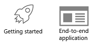

# ML.NET Samples

# Overview

[ML.NET](https://www.microsoft.com/net/learn/apps/machine-learning-and-ai/ml-dotnet) is a cross-platform open-source machine learning framework that makes machine learning accessible to .NET developers.

In this, Microsoft provides ML.NET samples that help you to get started with machine learning by using .NET, not just to run/score pre-trained models but fundamentally enabling you to create and train your own custom ML models in .NET. 

# NuGet packages to use
Until ML.NET is released as final v1.0, most of the samples in this repo will be using preview released versions (i.e. v0.6, v0.7, v0.8, etc.) available at **NuGet** by using the  released Microsoft.ML NuGet packages available here:
https://www.nuget.org/packages/Microsoft.ML/

However, a few of the samples might also be using nightly releases available at **MyGet** using this alternate NuGet feed: https://dotnet.myget.org/F/dotnet-core/api/v3/index.json. 

# Samples Gallery 

All the samples are in C# and some of them also support F#. We encourage the community to help us migrating samples to F# and newer versions of ML.NET. Pull requests are welcome!

There are two types of samples/apps in the repo:

* **Getting started samples (C# and F#)** - ML.NET code focused samples for each ML task or area, usually implemented as simple console apps.
* **End-to-end apps (C#)** - "Real world" examples of web, desktop, mobile, and other applications infused with ML solutions via [ML.NET APIs](https://docs.microsoft.com/dotnet/api/?view=ml-dotnet).

These mentioned type of sample apps are highlighted with the following icons:

The official ML.NET samples are divided in multiple categories depending on the scenario and machine learning problem/task, accessible through the following table:

-------------------------------------------------------

<table>
 <tr>
   <td>
      <h3><b>ML Task</b></h3>
  </td>
  <td>
      <h3><b>Scenario</b></h3>
  </td>
 </tr>
 <tr>
   <td>
      <h3>Two-class classification</h3>
      <!---->
  </td>
    <td>
      <h3>Sentiment analysis &nbsp;&nbsp;&nbsp;
      <a href="samples/csharp/getting-started/BinaryClassification_SentimentAnalysis">C#</a> &nbsp; &nbsp; <a href="samples/fsharp/getting-started/BinaryClassification_SentimentAnalysis">F#</a>&nbsp;&nbsp;&nbsp;</h3>
      <h3>Fraud detection &nbsp;&nbsp;&nbsp;<a href="samples/csharp/getting-started/BinaryClassification_CreditCardFraudDetection">C#</a> &nbsp;&nbsp;&nbsp;</h3>
      <h3>Survival Prediction &nbsp;&nbsp;&nbsp;<a href="samples/csharp/examples/BinaryClasification_Titanic">C#</a> &nbsp;&nbsp;&nbsp;</h3>
  </td>
 </tr>
 <tr>
   <td>
      <h3>Multi-class classification</h3>
      <!---->
  </td>
  <td>
      <h3>Issues classification &nbsp;&nbsp;&nbsp;
      <a href="samples/csharp/end-to-end-apps/github-labeler">C#</a> &nbsp;&nbsp;&nbsp;</h3>
      <h3>Iris flowers classification &nbsp;&nbsp;&nbsp;<a href="samples/csharp/getting-started/MulticlassClassification_Iris">C#</a> &nbsp; &nbsp;<a href="samples/fsharp/getting-started/MulticlassClassification_Iris">F#</a> &nbsp;&nbsp;&nbsp;</h3>
  </td>
 </tr>
 <tr>
   <td>
      <h3>Regression</h3>
      <!---->
  </td>
  <td>
      <h3>Price prediction &nbsp;&nbsp;&nbsp;
      <a href="samples/csharp/getting-started/Regression_TaxiFarePrediction">C#</a> &nbsp; &nbsp; <a href="samples/fsharp/getting-started/Regression_TaxiFarePrediction">F#</a>&nbsp;&nbsp;&nbsp;</h3>
      <h3>Sales forecast &nbsp;&nbsp;&nbsp;
      <a href="samples/csharp/end-to-end-apps/eShopDashboardML">C#</a>  &nbsp;&nbsp;&nbsp;</h3>
      <h3>Demand prediction &nbsp;&nbsp;&nbsp;
      <a href="samples/csharp/getting-started/Regression_BikeSharingDemand">C#</a> &nbsp;&nbsp;&nbsp;</h3>
  </td>
 </tr>
 <tr>
   <td>
      <h3>Recommendation</h3>
      <!---->
  </td>
  <td>
      <h3>Product recommender &nbsp;&nbsp;&nbsp;
      Coming soon  &nbsp;&nbsp;&nbsp;</h3>
      <h3>Movie recommender &nbsp;&nbsp;&nbsp;
      Coming soon  &nbsp;&nbsp;&nbsp;</h3>
  </td>
 </tr>
  <tr>
   <td>
      <h3>Clustering</h3>
      <!---->
  </td>
  <td>
      <h3>Customer segmentation &nbsp;&nbsp;&nbsp;
      <a href="samples/csharp/getting-started/Clustering_CustomerSegmentation">C#</a> &nbsp;&nbsp;&nbsp;</h3>
      <h3>Clustering Iris flowers &nbsp;&nbsp;&nbsp;
      <a href="samples/csharp/getting-started/Clustering_Iris">C#</a> &nbsp; &nbsp; <a href="samples/fsharp/getting-started/Clustering_Iris">F#</a>&nbsp;&nbsp;&nbsp;</h3>
  </td>
 </tr>
  <tr>
   <td>
      <h3>Anomaly detection</h3>
      <!---->
  </td>
  <td>
      <h3>Coming soon</h3>
  </td>
 </tr>
  <tr>
   <td>
      <h3>Ranking</h3>
      <!---->
  </td>
  <td>
      <h3>Coming soon</h3>
  </td>
 </tr>
  <tr>
   <td>
      <h3>Deep Learning</h3>
      <!---->
  </td>
  <td>
      <h3>Object detection and classification with TensorFlow model &nbsp;&nbsp;&nbsp;
      Coming soon &nbsp;&nbsp;&nbsp;</h3>
      <h3>Image style transfer with TensorFlow model &nbsp;&nbsp;&nbsp;
       - Coming soon  &nbsp;&nbsp;&nbsp;</h3>
      <h3>TensorFlow model as featurizer in ML.NET &nbsp;&nbsp;&nbsp;
      Coming soon &nbsp;&nbsp;&nbsp;</h3>
      <h3>ONNX model scoring - Coming soon</h3>
  </td>
 </tr>
 </table>

-------------------------------------------------------

## Visual Basic .NET samples

For VB.NET samples, check this external repo supported by the community (Kudos for Nukepayload2):
https://github.com/Nukepayload2/machinelearning-samples/tree/master/samples/visualbasic

In addition, if you would like to explore the examples directly referencing the source code of ML.NET, check out [scenario tests](https://github.com/dotnet/machinelearning/tree/master/test/Microsoft.ML.Tests/Scenarios) in [ML.NET repository](https://github.com/dotnet/machinelearning).

## Learn more

See [ML.NET Guide](https://docs.microsoft.com/en-us/dotnet/machine-learning/) for detailed information on tutorials, ML basics, etc.

## API reference

Check out the [ML.NET API Reference](https://docs.microsoft.com/dotnet/api/?view=ml-dotnet) to see the breadth of APIs available.

## Contributing

We welcome contributions! Please review our [contribution guide](CONTRIBUTING.md).

## Community

Please join our community on Gitter 

This project has adopted the code of conduct defined by the [Contributor Covenant](http://contributor-covenant.org/) to clarify expected behavior in our community.
For more information, see the [.NET Foundation Code of Conduct](https://dotnetfoundation.org/code-of-conduct).

## License

[ML.NET Samples](https://github.com/dotnet/machinelearning-samples) are licensed under the [MIT license](LICENSE).
