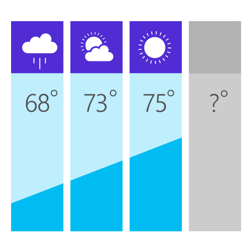
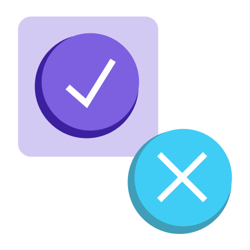
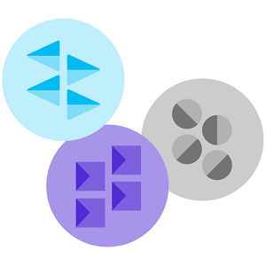
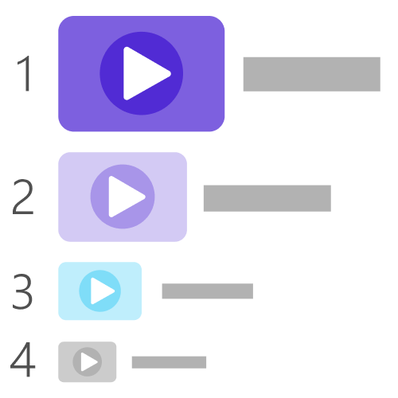

# ML.NET Samples

[ML.NET](https://www.microsoft.com/net/learn/apps/machine-learning-and-ai/ml-dotnet) is a cross-platform open-source machine learning framework that makes machine learning accessible to .NET developers. In this GitHub repo, we provide samples which will help you get started with ML.NET and how to infuse ML into existing and new .NET apps. 

There are two types of samples/apps in the repo:

*   Getting Started - ML.NET code focused samples for each ML task or area, usually implemented as simple console apps.

*   End-End apps - Real world examples of web, desktop, mobile, and other applications infused with Machine Learning using ML.NET

The official ML.NET samples are divided in multiple categories depending on the scenario and machine learning problem/task, accessible through the following table:

<table>
 <tr>
   <td width="25%">
      <h3><b>ML Task</b></h3>
  </td>
  <td>
      <h3 width="35%"><b>Description</b></h3>
  </td>
  <td>
      <h3><b>Scenarios</b></h3>
  </td>
 </tr>
 <tr>
   <td width="25%">
      <h3>Binary classification</h3>
      
  </td>
  <td width="35%">
  Task of classifying the elements of a given set into two groups, predicting which group each one belongs to.
  </td>
    <td>
      <h4>Sentiment analysis &nbsp;&nbsp;&nbsp;
      <a href="samples/csharp/getting-started/BinaryClassification_SentimentAnalysis">C#</a> &nbsp; &nbsp; <a href="samples/fsharp/getting-started/BinaryClassification_SentimentAnalysis">F#</a>&nbsp;&nbsp;&nbsp;</h4>
      <h4>Spam Detection &nbsp;&nbsp;&nbsp;
      <a href="samples/csharp/getting-started/BinaryClassification_SpamDetection">C#</a>&nbsp;&nbsp;&nbsp;</h4>
      <h4>Fraud detection &nbsp;&nbsp;&nbsp;<a href="samples/csharp/getting-started/BinaryClassification_CreditCardFraudDetection">C#</a> &nbsp;&nbsp;&nbsp;</h4>
  </td>
 </tr>
 <tr>
   <td width="25%">
      <h3>Multi-class classification</h3>
      
  </td>
  <td width="35%">
  Task of classifying instances into one of three or more classes, predicting which group each one belongs to.
  </td>
  <td>
      <h4>Issues classification &nbsp;&nbsp;&nbsp;
      <a href="samples/csharp/end-to-end-apps/MulticlassClassification-GitHubLabeler">C#</a> &nbsp;&nbsp;&nbsp;</h4>
      <h4>Iris flowers classification &nbsp;&nbsp;&nbsp;<a href="samples/csharp/getting-started/MulticlassClassification_Iris">C#</a> &nbsp; &nbsp;<a href="samples/fsharp/getting-started/MulticlassClassification_Iris">F#</a> &nbsp;&nbsp;&nbsp;</h4>
  </td>
 </tr>
 <tr>
   <td width="25%">
      <h3>Regression</h3>
      
  </td>
  <td width="35%">
  The task is to predict a numeric value with given input variable data. It is widely used for forecasting and 'how much / how many' predictions.
  </td>
  <td>
      <h4>Price prediction &nbsp;&nbsp;&nbsp;
      <a href="samples/csharp/getting-started/Regression_TaxiFarePrediction">C#</a> &nbsp; &nbsp; <a href="samples/fsharp/getting-started/Regression_TaxiFarePrediction">F#</a>&nbsp;&nbsp;&nbsp;</h4>
      <h4>Sales forecast &nbsp;&nbsp;&nbsp;
      <a href="samples/csharp/end-to-end-apps/Regression-SalesForecast">C#</a>  &nbsp;&nbsp;&nbsp;</h4>
      <h4>Demand prediction &nbsp;&nbsp;&nbsp;
      <a href="samples/csharp/getting-started/Regression_BikeSharingDemand">C#</a> &nbsp;&nbsp;&nbsp;</h4>
  </td>
 </tr>
 <tr>
   <td width="25%">
      <h3>Recommendation</h3>
      
  </td>
  <td width="35%">
  Recommender systems are typically based on content based and collaborative filtering methods. A collaborative method predicts what items/products a user might like based on his past actions/likes/ratings compared to other users. 
  </td>
  <td>
      <h4>Movie recommender &nbsp;&nbsp;&nbsp;
        <a href="samples/csharp/getting-started/MatrixFactorization_MovieRecommendation">C#</a> &nbsp;&nbsp;&nbsp;
        <a href="samples/csharp/end-to-end-apps/Recommendation-MovieRecommender">C#</a> &nbsp;&nbsp;&nbsp; </h4>
       <h4>Product recommender &nbsp;&nbsp;&nbsp;
        <a href="samples/csharp/getting-started/MatrixFactorization_ProductRecommendation">C#</a></h4>
  </td>
 </tr>
  <tr>
   <td width="25%">
      <h3>Clustering</h3>
      
  </td>
  <td width="35%">
  ML task of grouping a set of objects in such a way that objects in the same group (called a cluster) are more similar to each other than to those in other groups. It is an exploratory task. It does not classify items across particular labels.
  </td>
  <td>
      <h4>Customer segmentation &nbsp;&nbsp;&nbsp;
      <a href="samples/csharp/getting-started/Clustering_CustomerSegmentation">C#</a> &nbsp;&nbsp;&nbsp;</h4>
      <h4>Clustering Iris flowers &nbsp;&nbsp;&nbsp;
      <a href="samples/csharp/getting-started/Clustering_Iris">C#</a> &nbsp; &nbsp; <a href="samples/fsharp/getting-started/Clustering_Iris">F#</a>&nbsp;&nbsp;&nbsp;</h4>
  </td>
 </tr>
  <tr>
   <td width="25%">
      <h3>Anomaly detection</h3>
      
  </td>
  <td width="35%">
  Task's goal is the identification of rare items, events or observations which raise suspicions by differing significantly from the majority of the data.Usually problems such as bank fraud, structural defects or medical problems
  </td>
  <td>
      <h4>Coming soon</h4>
  </td>
 </tr>
  <tr>
   <td width="25%">
      <h3>Ranking</h3>
      
  </td>
  <td width="35%">
  Construction of ranking models for information retrieval systems so the items are ordered/ranked based on user's input variables such as likes/dislike, context, interests, etc.
  </td>
  <td>
      <h4>Coming soon</h4>
  </td>
 </tr>
  <tr>
   <td width="25%">
      <h3>Deep Learning</h3>
      
  </td>
  <td width="35%">
  Deep learning is a subset of machine learning. Deep learning architectures such as deep neural networks, are usually applied to fields such as computer vision (object detection, image classification, style transfer), speech recognition, natural language processing and audio recognition. 
  </td>
  <td>
      <h4>TensorFlow with ML.NET &nbsp;&nbsp;&nbsp;<a href="samples/csharp/getting-started/DeepLearning_ImageClassification_TensorFlow">C#</a> &nbsp;&nbsp;&nbsp;</h4>
      <h4>Object detection Coming soon &nbsp;&nbsp;&nbsp;</h4>
      <h4>Style Transfer  Coming soon &nbsp;&nbsp;&nbsp;</h4>
      <h4>ONNX with ML.NET - Coming soon &nbsp;&nbsp;&nbsp;</h4>
  </td>
 </tr>
 </table>

**NuGet feed configuration:** Usually you just need to use the regular NuGet feed (https://api.nuget.org/v3/index.json), however, during a few days before releasing a minor release (such as 0.8, 0.9 etc.) we'll be using Preview NuGet packages available in MyGet (such as 0.8.0-preview-27128-1), not available in the regular NuGet feed.

If that is the case, please use this MyGet feed in Visual Studio or your NuGet feed configuration:

https://dotnet.myget.org/F/dotnet-core/api/v3/index.json

-------------------------------------------------------

## Additional Community Samples

In addition to the ML.NET samples provided by Microsoft, we're also highlighting samples created by the community shocased in this separated page:
[ML.NET Community Samples](https://github.com/dotnet/machinelearning-samples/blob/master/docs/COMMUNITY-SAMPLES.md)

Those Community Samples are not maintained by Microsoft but by their owners.
If you have created any cool ML.NET sample, please, add its info into this [REQUEST issue](https://github.com/dotnet/machinelearning-samples/issues/86) and we'll publish its information in the mentioned page, eventually.

## Learn more

See [ML.NET Guide](https://docs.microsoft.com/en-us/dotnet/machine-learning/) for detailed information on tutorials, ML basics, etc.

## API reference

Check out the [ML.NET API Reference](https://docs.microsoft.com/dotnet/api/?view=ml-dotnet) to see the breadth of APIs available.

## Contributing

We welcome contributions! Please review our [contribution guide](CONTRIBUTING.md).

## Community

Please join our community on Gitter 

This project has adopted the code of conduct defined by the [Contributor Covenant](http://contributor-covenant.org/) to clarify expected behavior in our community.
For more information, see the [.NET Foundation Code of Conduct](https://dotnetfoundation.org/code-of-conduct).

## License

[ML.NET Samples](https://github.com/dotnet/machinelearning-samples) are licensed under the [MIT license](LICENSE).
