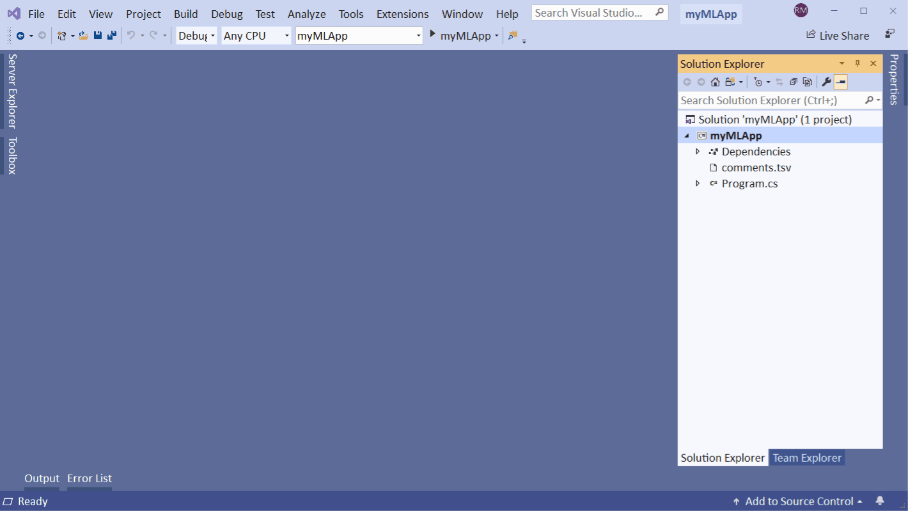
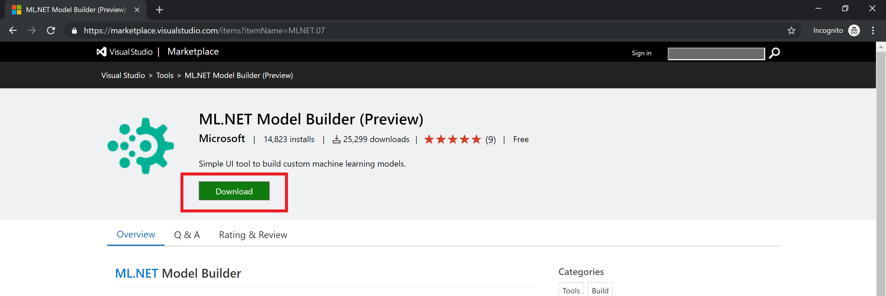
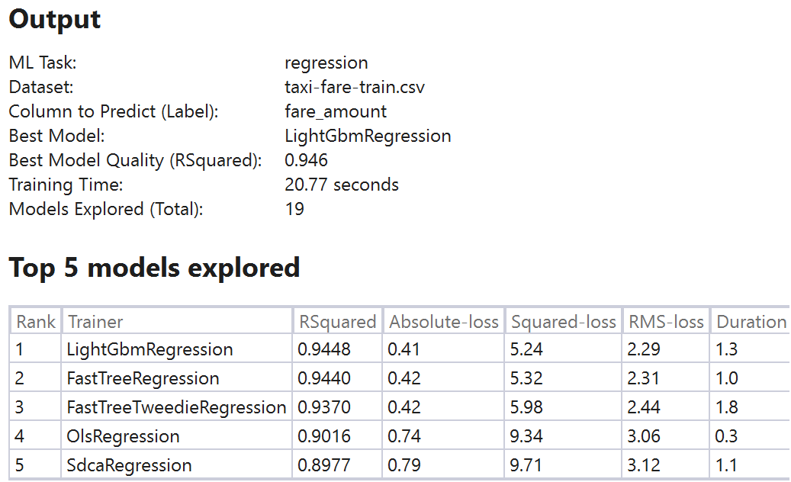
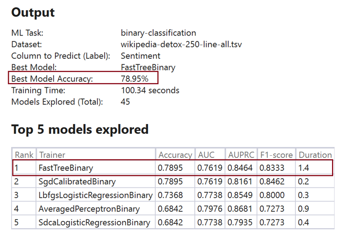
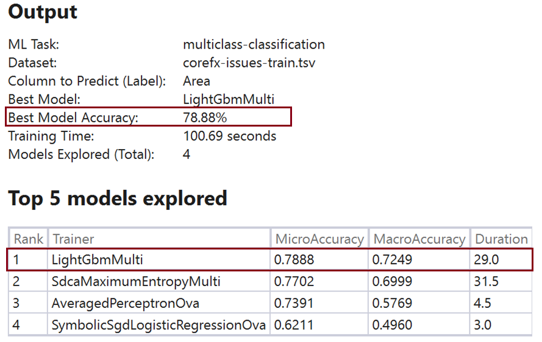

# ML.NET Model Builder Guide 

## Introduction
Model Builder is a simple UI tool that runs locally for developers to build, train and ship custom machine learning models in your applications. [Try Model Builder preview now!](https://aka.ms/mlnettemplates). 

Developers with no ML expertise can use this simple visual interface to connect to their data stored in files, SQL Server and more for training the model.

Model Builder leverages best in class automated machine learning (AutoML) to evaluate different models. It produces the best model for your scenario without any tuning required from the developer.

At the end, developers can generate code for training and consuming this model in their applications. 

This readme provides the following details for Model Builder:
* <a href="https://github.com/dotnet/machinelearning-samples/blob/master/modelbuilder/readme.md#Installation">Installation</a>
* <a href="https://github.com/dotnet/machinelearning-samples/blob/master/modelbuilder/readme.md#Scenario">Scenario</a>
* [Data](https://github.com/dotnet/machinelearning-samples/blob/master/modelbuilder/readme.md#Data)
* [Train](https://github.com/dotnet/machinelearning-samples/blob/master/modelbuilder/readme.md#Train)
* [Evaluate](https://github.com/dotnet/machinelearning-samples/blob/master/modelbuilder/readme.md#Evaluate)
* [Improve](https://github.com/dotnet/machinelearning-samples/blob/master/modelbuilder/readme.md#Improve)
* [Preview limitations](https://github.com/dotnet/machinelearning-samples/blob/master/modelbuilder/readme.md#Limitations)
* [File Issues](https://github.com/dotnet/machinelearning-samples/blob/master/modelbuilder/readme.md#Issues)

## Installation

Model Builder can be installed on Visual Studio 2017/ 2019. You can install it by clicking "Download" from the [Visual Studio Marketplace](https://aka.ms/mlnettemplates)

**Pre-requisites**
* Visual Studio 2017 15.9.12 or later or Visual Studio 2019
* All SKU's of Visual Studio
* .NET Core 2.1 SDK

## Scenario 

**Which Machine Learning scenario is right for me?**

Model Builder allows you to solve many real life scenarios by supporting a wide variety of machine learning tasks. 

If you are trying to predict a value e.g. price of a car or how many units of this product will be sold these are examples of **regression ML tasks**.

If you are trying to classify data into two or multiple categories those are examples of classification machine learning tasks e.g.
* If a sentiment is positive or negative is an example of **binary classification**
* If a sentiment is positive, negative or neutral (2 or more categories) is an example of **multi-classification task**

Model Builder currently comes with two scenario templates which provide an example each of regression (i.e. Price Prediction) and binary-classification (i.e. Sentiment Analysis).

The custom scenario template allows you to pick the ML task during the train phase hence allowing you to build your own ML scenario.

Model Builder currently supports Regression, Binary-Classification and Multi-Classification tasks. 

Pick the scenario template which makes the most sense for you!
      
## Data

**How do I get sample datasets and learn more?**

The table above in the scenario section provides a list of datasets across ML scenarios and tasks. 

You can use these datasets to get started with Model Builder

<table align="middle" width=100%> 
  <tr>
    <td align="middle"> Scenario
    </td>
    <td align="middle"> Scenario Description 
    </td>
    <td align="middle"> ML Task 
    </td>
    <td align="middle"> Dataset 
    </td>
    <td align="middle"> Column to Predict (Label)
    </td>
  </tr>
  <tr>
    <td align="middle">
    Price Prediction   
    </td>
    <td align="middle">
    Predict the price for a particular item
    </td>
    <td align="middle">
    Regression    
    </td>
    <td align="middle">
      <a href="https://github.com/dotnet/machinelearning-samples/blob/master/datasets/taxi-fare-train.csv">Link</a>
    </td>
    <td align="middle">
    fare_amount 
    </td>
    </tr> 
  <tr>
    <td align="middle">
    Sales Forecast   
    </td>
    <td align="middle">
    Forecast the sales for items this month          
    </td>
    <td align="middle">
    Regression    
    </td>
    <td align="middle">
      <a href="https://github.com/dotnet/machinelearning-samples/blob/master/samples/csharp/getting-started/AnomalyDetection_Sales/SpikeDetection/Data/product-sales.csv">Link</a>
    </td>
    <td align="middle">
    ProductSales
    </td>
  </tr> 
    <tr>
    <td align="middle">
    Sentiment Analysis  
    </td>
    <td align="middle">
    Determine the sentiment for customer reviews as positive of negative        
    </td>
    <td align="middle">
    Binary-Classification 
    </td>
    <td align="middle">
      <a href="https://github.com/dotnet/machinelearning-samples/blob/master/samples/csharp/getting-started/BinaryClassification_SentimentAnalysis/SentimentAnalysis/Data/wikiDetoxAnnotated40kRows.tsv">Link</a>
    </td>
    <td align="middle">
    Label
    </td>
  </tr> 
  <tr>
    <td align="middle">
   Spam Detection 
    </td>
    <td align="middle">
    Determine whether a particular email is a scam or not          
    </td>
    <td align="middle">
    Binary-Classification 
    </td>
    <td align="middle">
      <a href="https://archive.ics.uci.edu/ml/machine-learning-databases/00228/smsspamcollection.zip">Link</a>
    </td>
    <td align="middle">
    Label
    </td>
  </tr> 
    <tr>
    <td align="middle">
   Fraud Detection 
    </td>
    <td align="middle">
     Determine whether a particular transaction is fraud or not!         
    </td>
    <td align="middle">
    Binary-Classification 
    </td>
    <td align="middle">
      <a href="https://github.com/dotnet/machinelearning-samples/blob/master/samples/csharp/getting-started/BinaryClassification_CreditCardFraudDetection/CreditCardFraudDetection.Trainer/assets/input/creditcardfraud-dataset.zip">Link</a>
    </td>
    <td align="middle">
    Label
    </td>
  </tr> 
   <tr>
    <td align="middle">
  Issue Classification
    </td>
    <td align="middle">
   Tag different issues or tickets filed into particular area tags       
    </td>
    <td align="middle">
    Multi-Classification 
    </td>
    <td align="middle">
      <a href="https://github.com/dotnet/machinelearning-samples/blob/master/samples/csharp/end-to-end-apps/MulticlassClassification-GitHubLabeler/GitHubLabeler/Data/corefx-issues-train.tsv">Link</a>
    </td>
    <td align="middle">
    Area
    </td>
  </tr> 
 </table>
                     
By default, Model Builder will take all but the **column to predict (Label)** as input for training the model. 

The Label is what you are predicting,  The rest of the columns are Features, which are attributes that help predict the Label. Limiting to most relevant attributes or features will result in providing you the best performance for your models.

We currently support *.tsv*, *.csv*, *.txt*, and SQL as the data types you can use as datasets for Model Builder. If you have a *.txt* file, columns should be separated with ',' or ';' or '/t'. The files must have a header row.

## Train

**How long should I train for?**

Model Builder uses AutoML to explore multiple models to find you the best performing model. 

In general longer training periods will allow AutoML to explore more models with multiple trainers and settings. 

The table below summarizes the average time taken to get good performance for the datasets we tested with. 

*Dataset Size  | Dataset Type       | Avg. Time to train*
------------- | ------------------ | --------------
0 - 10 Mb     | Numeric and Text   | 10 sec
10 - 100 Mb   | Numeric and Text   | 10 min 
100 - 500 Mb  | Numeric and Text   | 30 min 
500 - 1 Gb    | Numeric and Text   | 60 min 
1 Gb+         | Numeric and Text   | 3 hour+ 

The exact time to train is a function of a few parameters like:
* The number of features or columns being used to predict
* The type of columns i.e. text vs. numeric 
* The Type of machine learning task (e.g. regression vs. classification) 

We have tested Model Builder with even 1TB dataset but building a high quality model for that size of dataset can take upto four days. 

## Evaluate 

**How do I understand my model performance?**

Model Builder by default splits the data you provide into train and test data respectively. The train data (80% split) is used to train your model and the test data (20% split) is used to evaluate your model. 

When using the Model Builder each scenario maps to a machine learning task. Each ML task has it’s own set of evaluation metrics. The table below describes these mappings of scenario and ML tasks. 

#### Regression (e.g. Price Prediction)

The default metric for regression problems is **RSquared**, the value of **RSquared** ranges between 0 and 1. 1 is the best possible value or in other words the closer the value of **RSquared** to 1 the better your model is performing. 

Other metrics reported such as absolute-loss, squared-loss and RMS loss are additional metrics which can be used to understand how your model is performing and comparing it against other regression models. 

#### Binary Classification (e.g. Sentiment Analysis)

The default metric for classification problems is **accuracy**. **Accuracy** defines the proportion of correct predictions your model is making over the test dataset. The **closer to 100% or 1.0 the better it is**. 

Other metrics reported such as AUC (Area under the curve) which measures the true positive rate vs. the false positive rate should be greater than 0.50 for models to be acceptable. 

Additional metrics like F1 score can be used to control the balance between Precision and Recall. 

#### Multi-Class Classification (e.g. Issue Classification) 
The default metric for Multi-class classification is Micro Accuracy. The closer the Micro Accuracy to 100% or 1.0 the better it is.  

Another important metric for Multi-class classification is Macro-accuracy, similar to Micro-accuracy the closer to 1.0 the better it is. A good way to think about these two is:

* Micro-accuracy -- how often does an incoming ticket get classified to the right team?

* Macro-accuracy -- for an average team, how often is an incoming ticket correct for their team?

For [more details on understanding model evaluation metrics please refer to this guide](https://aka.ms/mlnet-metrics) which provides details on each of these metrics.

## Improve 

**Train for a longer time, add more data or learn more on the web**

There are a few things you can try to improve your model performance

* Train for a longer period of time during the train phase. This will provide Automated ML to try out more trainers and find you a better model for your ML scenario

* Sometimes the amount of data or quality of data is not sufficient to train a high quality ML Model. Try adding more data for Model Builder to operate on. In case of classification tasks, you can make sure that their is good amount of data available per classification category

## Limitations
This is the first preview of Model Builder and has the following limitations. We are actively working on improving the experience in the future releases.

* We currently support *.tsv*, *.csv* and SQL as the data-types you can use as datasets for the Model Builder. The files should have a header row. For this preview Model Builder does not support *.txt files or ';' separated or ',' separated files
* Visual Studio 2017 15.9.12 or greater
* Supported Visual Studio SKUs - Enterprise, Professional, and Community 
* SQL Server has a limit of 100K rows for training
* Microsoft SQL Server Data Tools for Visual Studio 2017 is not supported.

## Issues
Please file any issues you observe with the Model Builder extension @  https://aka.ms/modelbuilderissues
