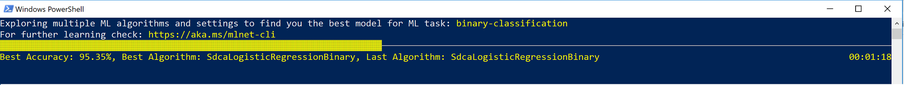

## Auto-generate model training and C# code for 'Sentiment Analysis' dataset

In this example you are going to automatically train/create a model and related C# code by simply providing a dataset (The WikiDetox dataset in this case) to the ML.NET CLI tool. 

## What is the ML.NET CLI (Command-line Interface)

*The ML.NET CLI (command-line interface) is a tool you run on any command-prompt (Windows, Mac or Linux) for generating good quality ML.NET models and C# source code based on training datasets you provide.*

The ML.NET CLI is part of ML.NET and its main purpose is to "democratize" ML.NET for .NET developers when learning ML.NET so it is very simple to generate a good quality ML.NET model (serialized model .zip file) plus the sample C# code to run/score that model. In addition, the C# code to create/train that model is also generated for you so you can research what algorithm and settings it is using for that generated "best model". 


# Run the CLI command to generate model and C# code for the Sentiment Analysis dataset

From command-prompt (either PowerShell, Bash or CMD) move to the 'Sentiment Analysis CLI" folder:

```console
> cd <YOUR_PATH>/samples/csharp/getting-started/BinaryClassification_SentimentAnalysis/CLI
```

Now run the following ML.NET CLI command:

```console
> mlnet new --ml-task binary-classification --dataset "../SentimentAnalysis/Data/wikiDetoxAnnotated40kRows.tsv" --label-column-name Label --max-exploration-time 90
```

You will get a similar command execution like the following:



When the command finishes the training explorations trying multiple algorithms and hyper-parameters, you get a summary like the following:


That command generates the following assets:

- A serialized model .zip ("best model") ready to use. 
- C# code to run/score that generated model (To make predictions in your end-user apps with that model).
- C# code with the training code used to generate that model (Learning purposes).

The first two assets (.ZIP file model and C# code to run that model) can directly be used in your end-user apps (ASP.NET Core web app, services, desktop app, etc.) to make predictions with that generated ML model.

The third asset, the training code, shows you what ML.NET API code was used by the CLI to train the generated model, so you can investigate what specific trainer/algorithm and hyper-paramenters were selected by the CLI

Go ahead and explore that generated C# projects code and compare it with the 'Sentiment Analysis' sample in this repo. The accuracy and performance coming from the model generated by the CLI should be better than the sample in the repo which has simpler ML.NET code with no additional hyper-parameters, etc.


# Next steps: Use your own dataset for creating models for your own scenarios 

You can generate those assets explained above from your own datasets without coding by yourself, so it also improves your productivity even if you already know ML.NET. Try your own dataset with the CLI!
