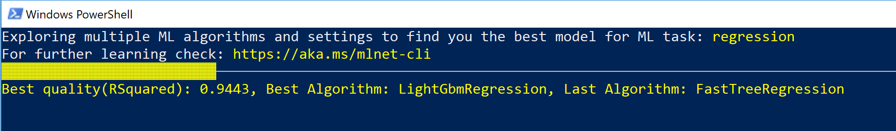
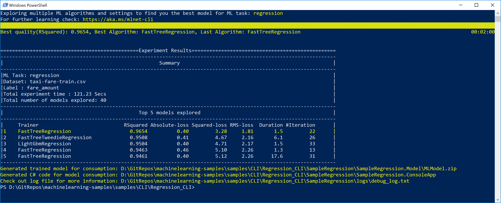

# Auto-generate model training and C# code for a Regression task (Price/fare prediction scenario)

In this example you are going to automatically train/create a model and related C# code by simply providing a dataset (The 'Taxi fare' dataset in this case) to the ML.NET CLI tool. 

*Note:* This CLI example is related to the [Taxi Fare Prediction ML.NET sample](/samples/csharp/getting-started/Regression_TaxiFarePrediction) but in this case the C# code is auto-generated by the CLI tool. You don't need to start coding in C# from scratch.
    
## What is the ML.NET CLI (Command-line Interface)

*The ML.NET **CLI** (command-line interface) is a tool you run on any command-prompt (Windows, Mac or Linux) for generating good quality ML.NET models and C# source code based on training datasets you provide.*

The ML.NET CLI is part of ML.NET and its main purpose is to "democratize" ML.NET for .NET developers when learning ML.NET so it is very simple to generate a good quality ML.NET model (serialized model .zip file) plus the sample C# code to run/score that model. In addition, the C# code to create/train that model is also generated for you so you can research what algorithm and settings it is using for that generated "best model". 


## Run the CLI command to generate the ML model and C# code for the Taxi Fare dataset

From command-prompt (either PowerShell, Bash or CMD) move to the 'Regression CLI sample' folder:

```console
> cd <YOUR_PATH>samples/CLI/Regression_CLI
```

Now run the following ML.NET CLI command:

```console
> mlnet auto-train --task regression --dataset taxi-fare-train.csv --test-dataset taxi-fare-test.csv --label-column-name fare_amount --max-exploration-time 120
```

You will get a similar command execution like the following:



This process is performing multiple training explorations trying multiple trainers/algorithms and multiple hyper-parameters with different combinations of configuration per each model.

**IMPORTANT:** Note that in this case you are exploring multiple trainings with the CLI looking for "best models" only for 2 minutes. That's enough when you are just learning the CLI usage and the generated C# code for the model. But when trying to optimize the model to achieve high quality you might need to run the CLI 'auto-train' command for many more minutes or even hours depending on the size of the dataset. 

As a rule of thumb, a high quality model might need hundreds of iterations (hundreds of models explored automatically performed by the CLI).

When the command finishes the training explorations, you get a summary like the following:



For undestanding the **'quality metrics'** read this doc: [Model evaluation metrics in ML.NET](https://docs.microsoft.com/dotnet/machine-learning/resources/metrics?#metrics-for-regression).

That command **generates** the following assets in a **new folder** (if no --name parameter was specified, its name is **'SampleRegression'**):

- A serialized **"best model"** (MLModel.zip) ready to use. 
- Sample **C# code** to **run/score** that generated model (To make predictions in your end-user apps with that model).
- Sample **C# code** with the **training code** used to generate that model (For learning purposes or direct training with the API).

The first two assets (.ZIP file model and C# code to run that model) can directly be used in your end-user apps (ASP.NET Core web app, services, desktop app, etc.) to make predictions with that generated ML model.

The third asset, the training code, shows you what ML.NET API code was used by the CLI to train the generated model, so you can investigate what specific trainer/algorithm and hyper-paramenters were selected by the CLI.

Go ahead and explore that generated C# projects code and compare it with the [Taxi Fare Prediction ML.NET sample](/samples/csharp/getting-started/Regression_TaxiFarePrediction)  in this repo. The accuracy and performance coming from the model generated by the CLI should be better than the sample in the repo which has simpler ML.NET code with no additional hyper-parameters, etc.

For instance, the configuration for the trainer/algorithm used in the [Taxi Fare Prediction ML.NET sample](/samples/csharp/getting-started/Regression_TaxiFarePrediction) (`Sdca`) is simplified for making easier to learn ML.NET (but might not be the most optimal model), so it is like the following code, with no hyper-parameters:


```csharp
var trainer = mlContext.Regression.Trainers.Sdca(labelColumnName: "Label", featureColumnName: "Features");
```

On the other hand, in a 2 minutes exploration time with the CLI, the selected algorithm/trainer chosen in this test (`FastTree`) was the following code which includes quite a few hyper-parameters, **all that code generated for you!**:

```csharp
var trainer = mlContext.Regression.Trainers.FastTree(new FastTreeRegressionTrainer.Options() 
                                                            { NumberOfLeaves = 9,
                                                                MinimumExampleCountPerLeaf = 1, 
                                                                NumberOfTrees = 100, 
                                                                LearningRate = 0.3745629f, 
                                                                Shrinkage = 1.800473f, 
                                                                LabelColumnName = "fare_amount", 
                                                                FeatureColumnName = "Features" });
```

If you run the CLI for longer time exploring additional algorithms/trainers, the algorithm configuration would probably change and improve.

Finding those hyper-parameters by yourself could be a very long and tedious trial process. With the CLI and AutoML this is very much simplified for you.

# Next steps: Use your own dataset for creating models for your own scenarios 

You can generate those assets explained above from your own datasets without coding by yourself, so it also improves your productivity even if you already know ML.NET. Try your own dataset with the CLI!

# See also

Step-by-step CLI tutorial, getting started from scratch (Note that the tutorial focuses on a binary-classification ML task, not a Regression task, but the CLI commands are pretty similar):

 [Tutorial: Auto generate a binary classifier using the CLI](https://docs.microsoft.com/dotnet/machine-learning/tutorials/mlnet-cli)
