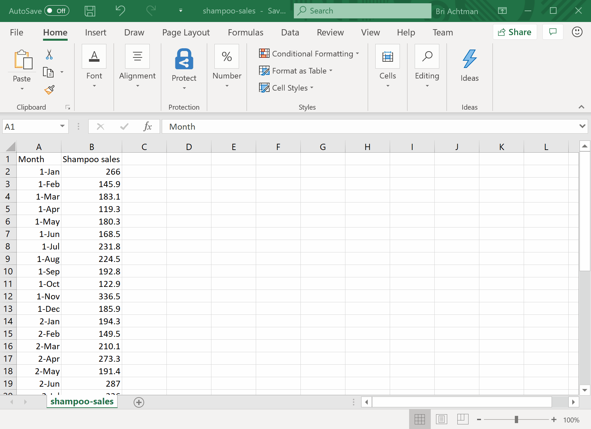

# Spike Detection and Change Point Detection of Product Sales E2E 

| ML.NET version | API type          | Status                        | App Type    | Data type | Scenario            | ML Task                   | Algorithms                  |
|----------------|-------------------|-------------------------------|-------------|-----------|---------------------|---------------------------|-----------------------------|
| v1.4         | Dynamic API | Up-to-date | WinForms app | .csv files | Spike and Change Point Detection of Product Sales | Anomaly Detection | IID Spike Detection and IID Change point Detection |



## Overview
Product Sales Spike Detection is a simple application which builds and consumes time series anomaly detection models to detect [spikes](#spike-detection) and [change points](#change-point-detection) in product sales.

This is an end-to-end sample which shows how you can use [ML.NET](https://www.microsoft.com/net/learn/apps/machine-learning-and-ai/ml-dotnet) and spike and change point detection in a WinForms application.

Note: This app is written in .NET Framework, so you must manually restore the nuget packages before running the app.

## App Features
* WinForms App:
    1. Prompts the user to input a dataset file for spike detection or change point detection (in this case we have provided `product-sales.csv` that you can use)
    2. Prompts the user to indicate if the data in the file is separated by commas or tabs
    3. Prompts the user to indicate if they want to see spikes or change points in the data
    4. Displays the data in a table format so that the user can inspect the data columns
    5. Displays the data as a time series line graph
    6. Loads the trained spike detection and change point detection models
    7. Uses the trained models to detect and display the anomalies both in a textual format, as markers in the line graph, and as highlighted rows in the data table

* Time Series Spike Detection Console App
    1. Builds and trains a time series spike detection model using the Product Sales dataset for both spike detection and change point detection.
    2. Uses confidence level and p-value as algorithm hyperparameters.
    * Uses [IidSpikeDetector](https://docs.microsoft.com/dotnet/api/microsoft.ml.transforms.timeseries.iidspikedetector?view=ml-dotnet) and [IidChangePointDetector](https://docs.microsoft.com/dotnet/api/microsoft.ml.transforms.timeseries.iidchangepointdetector?view=ml-dotnet).

## Dataset
We have created sample dataset for Product sales. The dataset `product-sales.csv` can be found [here](./SpikeDetectionE2EApp/Data/product-sales.csv)

Format of **Product Sales DataSet** looks like below.

| Month  | ProductSales |
|--------|--------------|
| 1-Jan  | 271          |
| 2-Jan  | 150.9        |
| .....  | .....        |
| 1-Feb  | 199.3        |
| ...    | ....         |

The data format in Product Sales dataset is referenced from **shampoo-sales dataset** and the license for shampoo-sales dataset is available [here](./Data/SHAMPOO-SALES-LICENSE.txt).

## Problem
This problem is focused on finding spikes and change points in product sales over a 3 month period, which can then be helpful in analyzing trends or abnormal behavior in sales.

To solve this problem, we will build an ML model that takes as inputs:
* Date-Month
* Number of product sales

and will generate an alert if/where a spike or change point in product sales is detected.

## ML task - Time Series Anomaly Detection
Anomaly detection is the process of detecting outliers in the data. Anomaly detection in time series refers to detecting time stamps, or points on a given input time series, at which the time series behaves differently from what was expected. These deviations are typically indicative of some events of interest in the problem domain: a cyber-attack on user accounts, power outage, bursting RPS on a server, memory leak, etc.

An anomalous behavior can be either persistent over time or just a temporary burst. There are 2 types of anomalies in this context: spikes and change points.

### Spike Detection
Spikes are attributed to sudden yet temporary bursts in the values of the input time-series. In practice, they can happen due to a variety of reasons depending on the application: outages, cyber-attacks, viral web content, etc.

### Change Point Detection
Change points mark the beginning of more persistent deviations in the behavior of time-series from what was expected. In practice, these type of changes are usually triggered by some fundamental changes in the dynamics of the system. For example, in system telemetry monitoring, an introduction of a memory leak can cause a (slow) trend in the time series of memory usage after certain point in time.

## Solution
To solve this problem, in your console app you build and train two ML models on existing data (product sales) to demonstrate time series anomaly detection. You then use the model in the WinForms app, where the Prediction output columns provide the Alerts where the models predicted the anomalies (spikes or change points in product sales) to be in the dataset.

The process of building and training models is the same for spike detection and change point detection; the main difference is the algorithm that you use (`IidSpikeDetector` vs. `IidChangePointDetector`).

### 1. Build model

Building a model in the console app includes:

* Creating empty IDataView with just schema of dataset.

* Creating an Estimator by applying Transformer (e.g. `IidSpikeDetector` or `IidChangePointDetector`) and setting parameters (in this case confidence level and p-value).

The initial code for Spike Detection is similar to the following:

```CSharp
CreateEmptyDataView();

//Create ML Context object
MLContext mlcontext = new MLContext();

//STEP 1: Create Estimator   
var estimator = mlContext.Transforms.DetectIidSpike(outputColumnName: nameof(ProductSalesPrediction.Prediction), inputColumnName: nameof(ProductSalesData.numSales), confidence: 95, pvalueHistoryLength: size / 4);

```

### 2. Transform model
**In IID Spike detection or IID change point detection, we don't need to do training, we just need to do transformation**. So the model is created using
`Fit()` API by passing empty IDataView object.

```CSharp
//STEP 2:The Transformed Model.
//In IID Spike detection, we don't need to do training, we just need to do transformation. 
//As you are not training the model, there is no need to load IDataView with real data, you just need schema of data.
//So create empty data view and pass to Fit() method. 
ITransformer tansformedModel = estimator.Fit(CreateEmptyDataView());
```

### 3. Consume model & view predictions
In the WinForms app, you load and use the transformed model to predict anomalies in the data and then view the detected anomalies from the model by accessing the output column:

* Load the data to predict from (`product-sales.csv`) to an IDataView and create predictions.

```CSharp
var mlcontext = new MLContext();

ITransformer tansformedModel;

// Load model
using (FileStream stream = new FileStream(modelPath, FileMode.Open, FileAccess.Read, FileShare.Read))
{
    tansformedModel = mlcontext.Model.Load(stream,out var modelInputSchema);
}

// Apply data transformation to create predictions
IDataView transformedData = tansformedModel.Transform(dataView);

var predictions = mlcontext.Data.CreateEnumerable<ProductSalesPrediction>(transformedData, reuseRowObject: false);

```

Each Prediction in `predictions` returns back a vector containing three values:
* 0 = Alert (0 for no alert, 1 for an alert)
* 1 = Score (value where the anomaly is detected e.g. number of sales)
* 2 = P-value (value used to measure how likely an anomoly is to be true vs. background noise)
