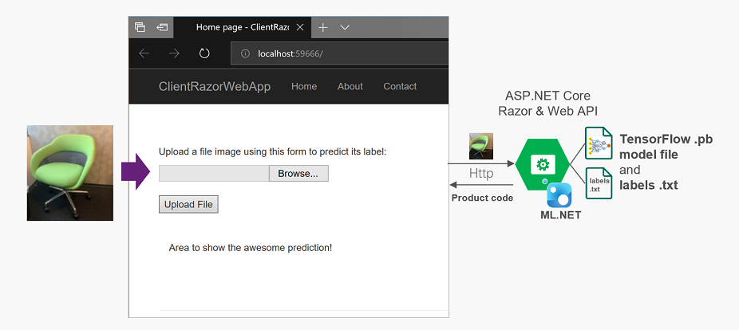

# Image Classification - Asp.Net core Web/service Sample

| ML.NET version | API type          | Status                        | App Type    | Data type | Scenario            | ML Task                   | Algorithms                  |
|----------------|-------------------|-------------------------------|-------------|-----------|---------------------|---------------------------|-----------------------------|
| v1.4           | Dynamic API | up-to-date | Console app | Images and text labels | Images classification | TensorFlow model  | DeepLearning model |

## Problem
The problem is how to run/score a TensorFlow model in a web app/service while using in-memory images. 

## Solution
The model (`model.pb`) is trained using TensorFlow as disscussed in the blogpost [Run with ML.NET C# code a TensorFlow model exported from Azure Cognitive Services Custom Vision](https://devblogs.microsoft.com/cesardelatorre/run-with-ml-net-c-code-a-tensorflow-model-exported-from-azure-cognitive-services-custom-vision/).

See the below architecture that shows how to run/score TensorFlow model in ASP.NET Core Razor web app/service:

The difference between the [getting started sample](https://github.com/dotnet/machinelearning-samples/tree/master/samples/csharp/getting-started/DeepLearning_ImageClassification_TensorFlow) and this end-to-end sample is that the images are loaded from  **file** in getting started sample whereas the images are loaded from **in-memory** in this end-to-end sample.

**Note:**  this sample is trained using Custom images and it predicts the only specific images that are in [TestImages](./TestImages) Folder.

## Fine-Tuning for Your Custom Model

If you are using a custom trained TensorFlow model and getting low scores, you may need to [resize your input images](https://lutzroeder.github.io/netron/) and fine-tune some of the values in the [ImageSettings struct](https://github.com/dotnet/machinelearning-samples/blob/aaa490461b3d313d1dcd828eaf0bf4ced6609a16/samples/csharp/end-to-end-apps/DeepLearning_ImageClassification_TensorFlow/TensorFlowImageClassification/ML/TensorFlowModelConfigurator.cs#L22), such as the image size (imageHeight and imageWidth) and offset (mean). As you adjust these values, take note of how they affect scoring.

You can review the [Run with ML.NET C# code a TensorFlow model exported from Azure Cognitive Services Custom Vision
](https://devblogs.microsoft.com/cesardelatorre/run-with-ml-net-c-code-a-tensorflow-model-exported-from-azure-cognitive-services-custom-vision/) blogpost if you have any questions about meeting the needs of your model to get accurate predictions.
