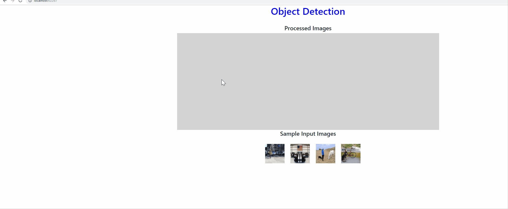
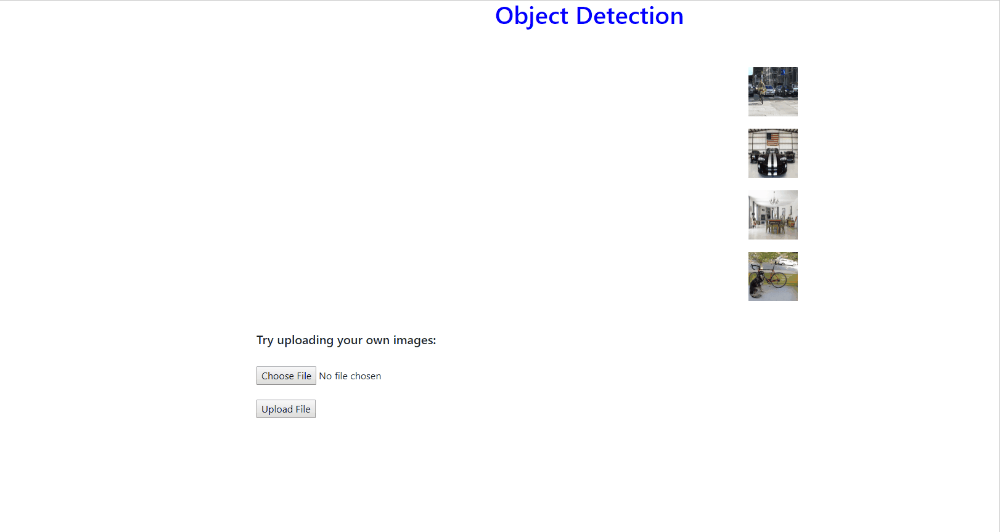
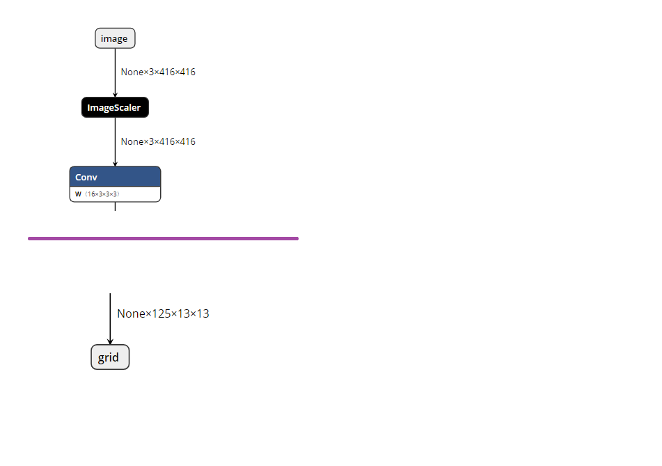

# Object Detection End-to-End

| ML.NET version | API type          | Status                        | App Type    | Data type | Scenario            | ML Task                   | Algorithms                  |
|----------------|-------------------|-------------------------------|-------------|-----------|---------------------|---------------------------|-----------------------------|
| v1.1.0           | Dynamic API | Up-to-date | End-End app | image files | Object Detection | Deep Learning  | Tiny Yolo2 ONNX model |

## Problem 
Object detection is one of the classical problems in computer vision: Recognize what objects are inside a given image and also where they are in the image. For these cases, you can either use pre-trained models or train your own model to classify images specific to your custom domain. 

How the app works?

When the app runs it shows the images list on the bottom at **Sample Input Images** section.select any image to process. After the image is processed, it is shown under **Processed Images** section  with the bounding boxes around detected objects as shown below.



Alternatively you can try uploading your own images as shown below.


 
## DataSet
There are two data sources: the `tsv` file and the image files.  The [tsv file](./OnnxObjectDetectionE2EAPP/TestImages/tags.tsv) contains two columns: the first one is defined as `ImagePath` and the second one is the `Label` corresponding to the image. As you can observe, the file does not have a header row, and looks like this:


The images are located in the [TestImages](./OnnxObjectDetectionE2EAPP/TestImages) folder. These images have been downloaded from internet.

For example, below are urls from which the iamges downloaded from:  

https://github.com/simo23/tinyYOLOv2/blob/master/dog.jpg

https://github.com/simo23/tinyYOLOv2/blob/master/person.jpg


## Pre-trained model
There are multiple models which are pre-trained for identifying multiple objects in the images. here we are using the pretrained model, **Tiny Yolo2** in  **ONNX** format. This model is a real-time neural network for object detection that detects 20 different classes. It is made up of 9 convolutional layers and 6 max-pooling layers and is a smaller version of the more complex full [YOLOv2](https://pjreddie.com/darknet/yolov2/) network.

The Open Neural Network eXchange i.e [ONNX](http://onnx.ai/) is an open format to represent deep learning models. With ONNX, developers can move models between state-of-the-art tools and choose the combination that is best for them. ONNX is developed and supported by a community of partners.

The model is downloaded from the [ONNX Model Zoo](https://github.com/onnx/models/tree/master/tiny_yolov2) which is a is a collection of pre-trained, state-of-the-art models in the ONNX format.

The Tiny YOLO2 model was trained on the [Pascal VOC](http://host.robots.ox.ac.uk/pascal/VOC/) dataset. Below are the model's prerequisites. 

**Model input and output**

**Input**

Input image of the shape (3x416x416)  

**Output**

Output is a (1x125x13x13) array   

**Pre-processing steps**

Resize the input image to a (3x416x416) array of type float32.

**Post-processing steps**

The output is a (125x13x13) tensor where 13x13 is the number of grid cells that the image gets divided into. Each grid cell corresponds to 125 channels, made up of the 5 bounding boxes predicted by the grid cell and the 25 data elements that describe each bounding box (5x25=125). For more information on how to derive the final bounding boxes and their corresponding confidence scores, refer to this [post](http://machinethink.net/blog/object-detection-with-yolo/).


##  Solution
The sample contains Razor Webapp which contains both **Razor UI pages** and **API controller** classes to process images. 

The difference between the [getting started object detection sample](https://github.com/dotnet/machinelearning-samples/tree/master/samples/csharp/getting-started/DeepLearning_ObjectDetection_Onnx) and this end-to-end sample is we load the images from file in getting started sample where as we load the images from **in-memory** in end-to-end sample.

##  Code Walkthrough

### ML.NET: Configure the model

Define the schema of data in a class type and refer that type while loading data into IDataView using TextLoader. Here the class type is **ImageInputData**. ML.Net supports Bitmap type for images.

```csharp
public class ImageInputData
    {
        [ImageType(416, 416)]
        public Bitmap Image { get; set; }
    }
```


The first step is to create an empty dataview as we just need schema of data while configuring up model.

```csharp
var dataView = CreateEmptyDataView();
```

The second step is to define the estimator pipeline. Usually, when dealing with deep neural networks, you must adapt the images to the format expected by the network. This is the reason images are resized and then transformed (mainly, pixel values are normalized across all R,G,B channels).

```csharp
var pipeline = _mlContext.Transforms.ResizeImages(resizing: ImageResizingEstimator.ResizingKind.Fill, outputColumnName: "image", imageWidth: ImageSettings.imageWidth, imageHeight: ImageSettings.imageHeight, inputColumnName: nameof(ImageInputData.Image))
                            .Append(_mlContext.Transforms.ExtractPixels(outputColumnName: "image"))
                            .Append(_mlContext.Transforms.ApplyOnnxModel(modelFile: onnxModelFilePath, outputColumnNames: new[] { TinyYoloModelSettings.ModelOutput }, inputColumnNames: new[] { TinyYoloModelSettings.ModelInput }));


```
You also need to check the neural network, and check the names of the input / output nodes. In order to inspect the model, you can use tools like [Netron](https://github.com/lutzroeder/netron), which is automatically installed with [Visual Studio Tools for AI](https://visualstudio.microsoft.com/downloads/ai-tools-vs/). 
These names are used later in the definition of the estimation pipe: in the case of the inception network, the input tensor is named 'image' and the output is named 'grid'

Define the **input** and **output** parameters of the Tiny Yolo2 Onnx Model.

```
    public struct TinyYoloModelSettings
        {
            // for checking TIny yolo2 Model input and  output  parameter names,
            //you can use tools like Netron, 
            // which is installed by Visual Studio AI Tools

            // input tensor name
            public const string ModelInput = "image";

            // output tensor name
            public const string ModelOutput = "grid";
        }
```



Create the model by fitting the dataview. 

```
  var model = pipeline.Fit(dataView);
```

#Detect objects in the image:

After the model is configured, we need to save the model, load the saved model and the pass the image to the model to detect objects.
When obtaining the prediction, we get an array of floats in the property `PredictedLabels`. The array is a float array of size **21125**. This is the output of model i,e 125x13x13 as discussed earlier. This output is interpreted by YoloMlPraser class and returns a number of bounding boxes for each image. Again these boxes are filtered so that we retrieve only 5 bounding boxes which have better confidence(how much certain that a box contains the obejct) for each object of the image. 
```
 var probs = model.Predict(imageInputData).PredictedLabels;
 IList<YoloBoundingBox> boundingBoxes = _parser.ParseOutputs(probs);
 filteredBoxes = _parser.NonMaxSuppress(boundingBoxes, 5, .5F);
```

#Draw bounding boxes around detected objects in Image.

The final step is we draw the bounding boxes around the objects using Paint API and return the image to the browser and it is displayed on the browser

var img = _objectDetectionService.PaintImages(imageFilePath);

using (MemoryStream m = new MemoryStream())
{
   img.Save(m, img.RawFormat);
   byte[] imageBytes = m.ToArray();

   // Convert byte[] to Base64 String
   base64String = Convert.ToBase64String(imageBytes);
   var result = new Result { imageString = base64String };
   return result;
}

**Note** The Tiny Yolo2 model is not having much accuracy compare to full YOLO2 model. As this is a sample program we are using Tiny version of Yolo model i.e Tiny_Yolo2


