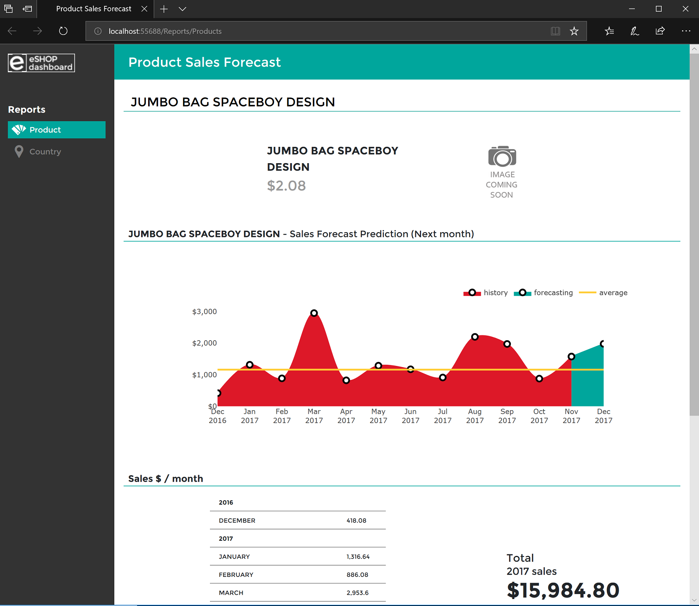

# eShopDashboardML - Sales forecasting

| ML.NET version | API type    | Status     | App Type                             | Data type                 | Scenario       | ML Task                 | Algorithms                                           |
|----------------|-------------|------------|--------------------------------------|---------------------------|----------------|-------------------------|------------------------------------------------------|
| v1.4         | Dynamic API | Up-to-date | ASP.NET Core web app and Console app | SQL Server and .csv files | Sales forecast | Regression, Time Series | FastTreeTweedie Regression, Single Spectrum Analysis |

eShopDashboardML is a web app with Sales Forecast predictions (per product) using [Microsoft Machine Learning .NET (ML.NET)](https://github.com/dotnet/machinelearning).

## Overview

This end-to-end sample app highlights the usage of ML.NET API by showing the following topics:

1. How to train, build and generate ML models:
   - Implemented as a [console app](src/eShopForecastModelsTrainer) using .NET Core.
2. How to predict upcoming months of sales forecasts by using the trained ML model:
   - Implemented as a single, monolithic [web app](src/eShopDashboard) using [ASP.NET Core Razor](https://docs.microsoft.com/aspnet/core/tutorials/razor-pages/).

The app is also using a SQL Server database for regular product catalog and orders info, as many typical web apps using SQL Server. In this case, since it is an example, it is, by default, using a localdb SQL database so there's no need to setup a real SQL Server. The localdb database will be created, along with sample populated data, the first time you run the web app.

If you want to use a real SQL Server or Azure SQL Database, you just need to change the connection string in the app.

When you run the app, it opens the webpage with a search box says "Type a product." You can type for any product, i.e. "bottle." Then a list of products related to keyword "bottle" will show in autocomplete suggestions. Once you select any product, then the sales forecast of that product will be shown as below.

Here's a sample screenshot of the web app and one of the forecast predictions:



## Setup

Learn how to set up the sample's environment in Visual Studio along with further explanations on the code:

- [Setting up eShopDashboard in Visual Studio and running the web app](docs/Setting-up-eShopDashboard-in-Visual-Studio-and-running-it.md)

- [Create and Train your ML models](docs/Create-and-train-the-models-%5BOptional%5D.md)
  - This step is optional as the web app is already configured to use a pre-trained model. But you can create your own trained model and swap the pre-trained model with your own.

## ML.NET Code Overview

### Problem

This problem is centered around product forecasting based on previous sales.

### DataSet

To solve this problem, two independent ML models are built that take the following datasets as input:  

| Data Set            | Columns                                                            |
|---------------------|--------------------------------------------------------------------|
| **products stats**  | next, productId, year, month, units, avg, count, max, min, prev    |

[Explanation of Dataset](docs/Details-of-Dataset.md) - Goto this link for detailed information on dataset.

### ML Task - Forecasting with Regression and Forecasting with Time Series

The sample shows two different ML tasks and algorithms that can be used for forecasting:

- **Regression** using FastTreeTweedie Regression
- **Time Series** using Single Spectrum Analysis (SSA)

**Regression** is a supervised machine learning task that is used to predict the value of the **next** period (in this case, the sales prediction) from a set of related features/variables. **Regression** works best with linear data.

**Time Series** is an estimation technique that can be used to forecast **multiple** periods in the future. **Time Series** works well in scenarios that involve non-linear data where trends are difficult to distinguish.  This is because the SSA algorithm, which is used by **Time Series**, performs calculations to automatically identify seasonal/periodic patterns while filtering out meaningless noise in the data.  With a **Time Series** model, it's important to regularly update the state of the model with new observed data points to ensure the accuracy as new predictions are performed.  For this reason, a **Time Series** model is stateful.

### Solution

To solve this problem, first we will build the ML models by training each model on existing data. Next, we will evaluate how good it is. Finally, we will consume the model to predict sales.

Note that the **Regression** sample implements a model to forecast linear data.  Specifically, the model predicts the product's demand forecast for the next period (month).

The **Time Series** sample currently implements the product's demand forecast for the next **two** periods (months). The **Time Series** sample uses the same products as in the **Regression** sample so that you can compare the forecasts from the two algorithms.

When learning/researching the samples, you can focus choose to focus specifically on regression or time series.


#### Load the Dataset

Both the **Regression** and **Time Series** samples start by loading data using **TextLoader**. To use **TextLoader**, we must specify the type of the class that represents the data schema. Our class type is **ProductData**.

```csharp
 public class ProductData
    {
        // The index of column in LoadColumn(int index) should be matched with the position of columns in the underlying data file.
        // The next column is used by the Regression algorithm as the Label (e.g. the value that is being predicted by the Regression model).
        [LoadColumn(0)]
        public float next;

        [LoadColumn(1)]
        public string productId;

        [LoadColumn(2)]
        public float year;

        [LoadColumn(3)]
        public float month;

        [LoadColumn(4)]
        public float units;

        [LoadColumn(5)]
        public float avg;

        [LoadColumn(6)]
        public float count;

        [LoadColumn(7)]
        public float max;

        [LoadColumn(8)]
        public float min;

        [LoadColumn(9)]
        public float prev;
    }
```

Load the dataset into the **DataView**.

```csharp
var trainingDataView = mlContext.Data.LoadFromTextFile<ProductData>(dataPath, hasHeader: true, separatorChar:',');
```

In the following steps, we will build the pipeline transformations, specify which trainer/algorithm to use, evaluate the models, and test their predictions. This is where the steps start to differ between the [**Regression**](#regression) and [**Time Series**](#time-series) samples - the remainder of this walkthrough looks at each of these algorithms separately.

### Regression

#### 1. Regression: Create the Pipeline

This step shows how to create the pipeline that will later be used for building and training the **Regression** model.

Specifically, we do the following transformations:

- Concatenate current features to a new column named **NumFeatures**.
- Transform **productId** using [one-hot encoding](https://en.wikipedia.org/wiki/One-hot).
- Concatenate all generated features in one column named **Features**.
- Copy **next** column to rename it to **Label**.
- Specify the **Fast Tree Tweedie** trainer as the algorithm to apply to the model.

You can load the dataset either before or after designing the pipeline. Although this step is just configuration, it is lazy and won't be loaded until training the model in the next step.

[Model build and train](./src/eShopForecastModelsTrainer/RegressionTrainer/RegressionModelHelper.cs)

```csharp
var trainer = mlContext.Regression.Trainers.FastTreeTweedie(labelColumnName: "Label", featureColumnName: "Features");

var trainingPipeline = mlContext.Transforms.Concatenate(outputColumnName: "NumFeatures", nameof(ProductData.year), nameof(ProductData.month), nameof(ProductData.units), nameof(ProductData.avg), nameof(ProductData.count), 
    nameof(ProductData.max), nameof(ProductData.min), nameof(ProductData.prev) )
        .Append(mlContext.Transforms.Categorical.OneHotEncoding(outputColumnName: "CatFeatures", inputColumnName: nameof(ProductData.productId)))
        .Append(mlContext.Transforms.Concatenate(outputColumnName: "Features", "NumFeatures", "CatFeatures"))
        .Append(mlContext.Transforms.CopyColumns(outputColumnName: "Label", inputColumnName: nameof(ProductData.next)))
        .Append(trainer);
```

#### 2. Regression: Evaluate the Model

In this case, the **Regression** model is evaluated before training the model with a cross-validation approach. This is to obtain metrics that indicate the accuracy of the model.

```csharp
var crossValidationResults = mlContext.Regression.CrossValidate(data:trainingDataView, estimator:trainingPipeline, numberOfFolds: 6, labelColumnName: "Label");

ConsoleHelper.PrintRegressionFoldsAverageMetrics(trainer.ToString(), crossValidationResults);
```

#### 3. Regression: Train the Model

After building the pipeline, we train the **Regression** forecast model by fitting or using the training data with the selected algorithm. In this step, the model is built, trained and returned as an object:

```csharp
var model = trainingPipeline.Fit(trainingDataView);
```

#### 4. Regression: Save the Model

Once the **Regression** model is created and evaluated, you can save it into a **.zip** file which can be consumed by any end-user application with the following code:

```csharp
using (var file = File.OpenWrite(outputModelPath))
    mlContext.Model.Save(model, trainingDataView.Schema, file);
```

#### 5. Regression: Test the Prediction

To create a prediction, load the **Regression** model from the **.zip** file.

This sample uses the last month of a product's sample data to predict the unit sales in the next month.

```csharp
ITransformer trainedModel;
using (var stream = File.OpenRead(outputModelPath))
{
    trainedModel = mlContext.Model.Load(stream,out var modelInputSchema);
}

var predictionEngine = mlContext.Model.CreatePredictionEngine<ProductData, ProductUnitRegressionPrediction>(trainedModel);

Console.WriteLine("** Testing Product **");

// Predict the nextperiod/month forecast to the one provided
ProductUnitRegressionPrediction prediction = predictionEngine.Predict(SampleProductData.MonthlyData[0]);
Console.WriteLine($"Product: {SampleProductData.MonthlyData[0].productId}, month: {SampleProductData.MonthlyData[0].month + 1}, year: {SampleProductData.MonthlyData[0].year} - Real value (units): {SampleProductData.MonthlyData[0].next}, Forecast Prediction (units): {prediction.Score}");

// Predicts the nextperiod/month forecast to the one provided
prediction = predictionEngine.Predict(SampleProductData.MonthlyData[1]);
Console.WriteLine($"Product: {SampleProductData.MonthlyData[1].productId}, month: {SampleProductData.MonthlyData[1].month + 1}, year: {SampleProductData.MonthlyData[1].year} - Forecast Prediction (units): {prediction.Score}");
```

### Time Series

#### 1. Time Series: Create the Pipeline

This step shows how to create the pipeline that will later be used for training the **Time Series** model.

Specifically, the **Single Spectrum Analysis (SSA)** trainer is the algorithm that is used. Read further to understand the parameters required for this algorithm.  It's important to note that ML.NET enforces constraints for the values of **windowSize**, **seriesLength**, and **trainsize**:
- **windowSize** must be at least 2.
- **trainSize** must be greater than twice the window size.
- **seriesLength** must be greater than the window size.

Here are descriptions of the parameters:

- **outputColumnName**: This is the name of the column that will be used to store predictions. The column must be a vector of type **Single**. In a later step, we define a class named **ProductUnitTimeSeriesPrediction** that contains this output column.
- **inputColumnName**: This is the name of the column that is being predicted/forecasted. The column contains a value of a datapoint in the time series and must be of type **Single**. In our sample, we are predicting/forecasting product **units** which is our input column.
- **windowSize**:  This is the most important parameter that you can use to tune the accuracy of the model for your scenario.  Specifically, this parameter is used to define a window of time that is used by the algorithm to decompose the time series data into seasonal/periodic and noise components. Typically, you should start with the largest window size that is representative of the seasonal/periodic business cycle for your scenario.  For example, if the business cycle is known to have both weekly and monthly (e.g. 30-day) seasonalities/periods and the data is collected daily, the window size in this case should be 30 to represent the largest window of time that exists in the business cycle.  If the same data also exhibits annual seasonality/periods (e.g. 365-day), but the scenario in which the model will be used is **not** interested in **annual** seasonality/periods, then the window size does **not** need to be 365.  In this sample, the product data is based on a 12 month cycle where data is collected monthly -- as a result, the window size used is 12.
- **seriesLength**: This parameter specifies the number of data points that are used when performing a forecast.
- **trainSize**: This parameter specifies the total number of data points in the input time series, starting from the beginning.  Note that, after a model is created, it can be saved and updated with new data points that are collected.
- **horizon**: This parameter indicates the number of time periods to predict/forecast. In this sample, we specify 2 to indicate that the next 2 months of product units will be predicated/forecasted.
- **confidenceLevel**: This parameter indicates the likelihood the real observed value will fall within the specified interval bounds. Typically, .95 is an acceptable starting point - this value should be between [0, 1).  Usually, the higher the confidence level, the wider the range that the interval bounds will be.  And conversely, the lower the confidence level, the narrower the interval bounds.
- **confidenceLowerBoundColumn**: This is the name of the column that will be used to store the **lower** confidence interval bound for each forecasted value. The **ProductUnitTimeSeriesPrediction** class also contains this output column.
- **confidenceUpperBoundColumn**: This is the name of the column that will be used to store the **upper** confidence interval bound for each forecasted value. The **ProductUnitTimeSeriesPrediction** class also contains this output column.

Specifically, we add the following trainer to the pipeline:

```csharp
// Create and add the forecast estimator to the pipeline.
IEstimator<ITransformer> forecastEstimator = mlContext.Forecasting.ForecastBySsa(
    outputColumnName: nameof(ProductUnitTimeSeriesPrediction.ForecastedProductUnits),
    inputColumnName: nameof(ProductData.units),
    windowSize: 12,
    seriesLength: productDataSeriesLength,
    trainSize: productDataSeriesLength,
    horizon: 2,
    confidenceLevel: 0.95f,
    confidenceLowerBoundColumn: nameof(ProductUnitTimeSeriesPrediction.ConfidenceLowerBound),
    confidenceUpperBoundColumn: nameof(ProductUnitTimeSeriesPrediction.ConfidenceUpperBound));
```

#### 2. Time Series: Fit the Model

Before fitting the **Time Series** model, we first must filter the loaded dataset to select the data series for the specific product that will be used for forecasting sales.

```csharp
var productId = 988;
IDataView productDataView = mlContext.Data.FilterRowsByColumn(allProductsDataView, nameof(ProductData.productId), productId, productId + 1);
```

Next, we fit the model to the data series for the specified product.

```csharp
// Fit the forecasting model to the specified product's data series.
ITransformer forecastTransformer = forecastEstimator.Fit(productDataView);
```

#### 3. Time Series: Create a CheckPoint of the Model

To save the model, we first must create the **TimeSeriesPredictionEngine** which is used for both getting predictions and saving the model.  The **Time Series** model is saved using the **CheckPoint** method which saves the model to a **.zip** file that can be consumed by any end-user application.  You may notice that this is different from the above **Regression** sample which instead used the **Save** method for saving the model. **Time Series** is different because it requires that the model's state to be continuously updated with new observed values as predictions are made. As a result, the **CheckPoint** method exists to update and save the model state on a reoccurring basis. This will be shown in further detail in a later step of this sample. For now, just remember that **Checkpoint** is used for saving and updating the **Time Series** model.

```csharp
// Create the forecast engine used for creating predictions.
TimeSeriesPredictionEngine<ProductData, ProductUnitTimeSeriesPrediction> forecastEngine = forecastTransformer.CreateTimeSeriesEngine<ProductData, ProductUnitTimeSeriesPrediction>(mlContext);

// Save the forecasting model so that it can be loaded within an end-user app.
forecastEngine.CheckPoint(mlContext, outputModelPath);
```

#### 4. Time Series: Test the Prediction

To get a prediction, load the **Time Series** model from the **.zip** file and create a new **TimeSeriesPredictionEngine**. After this, we can get a prediction.

```csharp
// Load the forecast engine that has been previously saved.
ITransformer forecaster;
using (var file = File.OpenRead(outputModelPath))
{
    forecaster = mlContext.Model.Load(file, out DataViewSchema schema);
}

// We must create a new prediction engine from the persisted model.
TimeSeriesPredictionEngine<ProductData, ProductUnitTimeSeriesPrediction> forecastEngine = forecastTransformer.CreateTimeSeriesEngine<ProductData, ProductUnitTimeSeriesPrediction>(mlContext); forecastEngine = forecaster.CreateTimeSeriesEngine<ProductData, ProductUnitTimeSeriesPrediction>(mlContext);

ProductUnitTimeSeriesPrediction originalSalesPrediction = forecastEngine.Predict();
```

The **ProductUnitTimeSeriesPrediction** type that we specified when we created the **TimeSeriesPredictionEngine** is used to store the prediction results:

```csharp
   public class ProductUnitTimeSeriesPrediction
    {
        public float[] ForecastedProductUnits { get; set; }

        public float[] ConfidenceLowerBound { get; set; }

        public float[] ConfidenceUpperBound { get; set; }
    }
```

Remember that when we created the SSA forecasting trainer using the **ForecastBySsa** method, we provided the following parameter values:

- **horizon**: 2
- **confidenceLevel**: .95f

As a result of this, when we call the **Predict** method using the loaded model, the **ForecastedProductUnits** vector will contain **two** forecasted values. Similarly, the **ConfidenceLowerBound** and **ConfidenceUpperBound** vectors will each contain **two** values based on the specified **confidenceLevel**.

You may notice that the **Predict** method has several overloads that accept the following parameters:

- **horizon**: Allows you to specify new value for **horizon** each time that you do a prediction.
- **confidenceLevel**: Allows you to specify new value for **confidenceLevel** each time that you do a prediction.
- **ProductData example**: Used to pass in a new observed **ProductData** data point for the time series via the **example** parameter.  Remember, that when calling **Predict** with new observed **ProductData** values, this updates the model state with these data points in the time series. You then need to save the updated model to disk by calling the **CheckPoint** method.

This is also seen in our sample:

```csharp
ProductUnitTimeSeriesPrediction updatedSalesPrediction = forecastEngine.Predict(newProductData, horizon: 1);

 // Save the updated forecasting model.
 forecastEngine.CheckPoint(mlContext, outputModelPath);
```

// TODO: To measure accuracy of the model, we need to compare real observed values against the forecasted values.  Refer to the following issue: https://github.com/dotnet/machinelearning/issues/4184.

## Citation

eShopDashboardML dataset is based on a public Online Retail Dataset from **UCI**: http://archive.ics.uci.edu/ml/datasets/online+retail
> Daqing Chen, Sai Liang Sain, and Kun Guo, Data mining for the online retail industry: A case study of RFM model-based customer segmentation using data mining, Journal of Database Marketing and Customer Strategy Management, Vol. 19, No. 3, pp. 197–208, 2012 (Published online before print: 27 August 2012. doi: 10.1057/dbm.2012.17).
