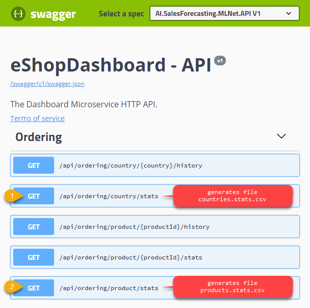
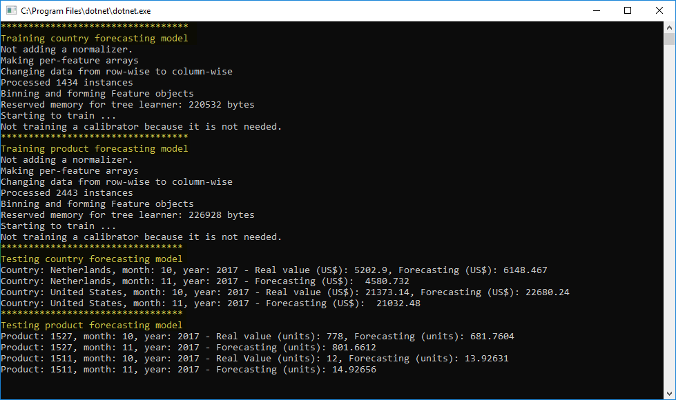

# Create and Train the models [optional]

The end-user dashboard web app comes with pre-trained model files (.ZIP files), but you can train your own models based on your own data or with the provided datasets so you learn how to build and train a custom model with ML.NET. That code is precisely what's explained in the main README.MD of this sample.

The console application project `eShopForecastModelsTrainer` can be used to generate the country and product forecasting models. You need to follow next steps in order to generate these models:

1) **Configure NuGet in VS and the ML.NET NuGet package version:** Check out [Setting up eShopDashboard in Visual Studio](./Setting-up-eShopDashboard-in-Visual-Studio-and-running-it.md)) to learn about the NuGet feed and how to set a specific  ML.NET NuGet package version.

2) **Set VS default startup project:** Set `eShopForecastModelsTrainer` as starting project in Visual Studio

3) **(Optional) - Generate your own input training data:** The `eShopForecastModelsTrainer/data` folder contains default training input .csv files. 
If you want to use your own input data to train the models (your own .csv files), you can use the data stored in the databases and generate the .csv training files using the Ordering controller API via Swagger UI. While running the application, open the Swagger endpoint in a browser (in local development, it should be hosted at a similar URL to this http://localhost:58991/swagger/ although the port might be different in your case so you might need to change it to the port used by your app's execution), and then run `api/ordering/country/stats` and `api/ordering/product/stats`, as you can see in the following screenshot:

Then copy/move those files generated from Swagger UI into the `eShopForecastModelsTrainer/data` folder, using exactly the same file names than the original/default ones.

4) **Run the training model console app:** Hit F5 in Visual Studio. At the end of the execution, the output will be similar to this screenshot:

5) **Copy the just created .ZIP model files into the end-user Dashboard web app folder for models named "ModelFiles":** When the execution finishes, you can find the built models in the bin folder. These files are named `country_month_fastTreeTweedle.zip` and `product_month_fastTreeTweedle.zip`

The model files should be copied/pasted into the dashboard web app folder Models (`eShopDashboard/Forecast/ModelFiles`) using the same file names.
