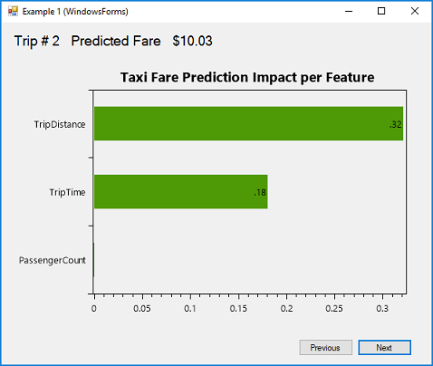
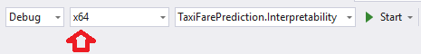

# Model Explainability for Taxi Fare Prediction Scenario (Regression)

| ML.NET version | API type          | Status                        | App Type    | Data type | Scenario            | ML Task                   | Algorithms                  |
|----------------|-------------------|-------------------------------|-------------|-----------|---------------------|---------------------------|-----------------------------|
| v1.4           | Dynamic API | Up-to-date | Console app & WinForms app | .csv files | Feature Importance | Regression | Sdca Regression |

This sample's goal is about Model Explainability and feature importance.

## Problem: Model Explainability

In certain machine learning situations, you want to see which features the model deems most important when it finds a pattern in your data (i.e. which features have the biggest impact when analyzing and making predictions about your data). ML.NET's model explainability will help us do that. This sample shows how to use the **model explainability API** in ML.NET to get a better idea of how important each feature is for each row of data when making a prediction. 

## Solution: Implementation and related sample app

This sample is based on the [Taxi Fares Prediction sample](/samples/csharp/getting-started/Regression_TaxiFarePrediction), which creates a regression-based model. You can review that sample first if you want to understand more about the ML scenario (regression) and dataset. 

In the console app in this sample, we extend that original app and focus on [Model Explainability and Feature Importance](https://medium.com/@Zelros/a-brief-history-of-machine-learning-models-explainability-f1c3301be9dc). We apply the ML.NET model explainability API when building the model training pipeline so that it gathers information about feature importance.

Additionally, we have also included a WinForms app used to show the feature importance when making sample predictions, as shown in the following screenshot:



In the above WinForms app, the `mlContext.Transforms.CalculateFeatureContribution(trainedModel.LastTransformer)` method calculates scores for each feature row within the input.

### 1. Use API to extend the model pipeline to gather feature importance information

In the 'TaxiFarePrediction' project, which builds the pipeline to train a regression-based model, you need to use the following code in order to gather feature importance information. We do this appending the feature contribution calculator in the pipeline, which will be used at prediction time for model explainability:


```CSharp
//Program.cs --> TrainModel() method

private static ITransformer TrainModel(MLContext mlContext)
{
    // Training pipeline definition code...
    // Call Fit() to train the base model...

    // Append the Feature Contribution Calculator (FCC) in the pipeline. 
    // This will be used at prediction time for explainability. 

    var fccModel = trainedModel.Append(mlContext.Transforms
                        .CalculateFeatureContribution(trainedModel.LastTransformer)
                        .Fit(dataProcessPipeline.Fit(trainingDataView).Transform(trainingDataView)));

    //Test and save the model code...
}

```

### 2. Use API to find out the the feature importance information per prediction

In the 'TaxiFarePrediction.Explainability' WinForms project, the following code extracts the feature importance per prediction:

```CSharp
//Predictor.cs --> RunMultiplePredictions() method

public List<DataStructures.TaxiFarePrediction> RunMultiplePredictions(int numberOfPredictions)
{
    // Load several samples to predict with...
    //... 

    // For each prediction, get the feature contributions information
    prediction = predictionEngine.Predict(testData);
    DataStructures.TaxiFarePrediction explainedPrediction = 
        new DataStructures.TaxiFarePrediction(prediction.FareAmount, 
                                              prediction.GetFeatureContributions(
                                                                model.GetOutputSchema(inputDataForPredictions.Schema)));

}

```


## Troubleshooting

### Error when running the explainability WinForms app from Visual Studio F5

If you get the following exception:

```
DllNotFoundException: Unable to load DLL 'CpuMathNative': The specified module could not be found.
```

**Cause:** ML.NET for this particular math operation only supports x64, and VS is attempting to use `AnyCPU`. 

**Solution:** Make sure you are running the app as x64 in VS, as shown in the following screenshot:


