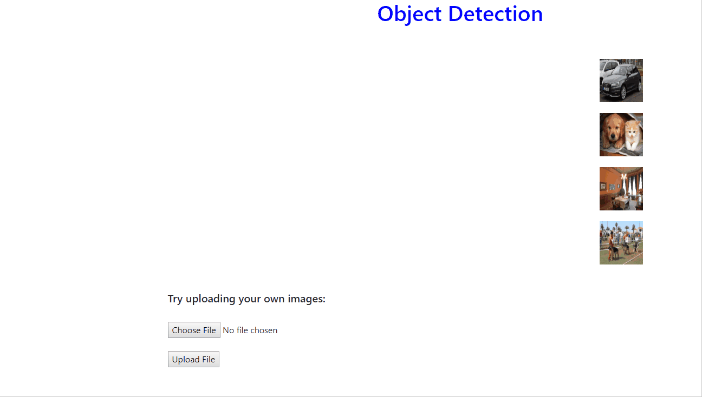
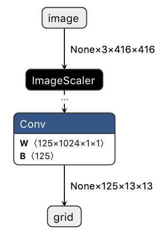

# Object Detection - ASP.NET Core Web & WPF Desktop Sample

| ML.NET version | API type    | Status     | App Type    | Data type   | Scenario         | ML Task       | Algorithms                        |
|----------------|-------------|------------|-------------|-------------|------------------|---------------|-----------------------------------|
| v1.4         | Dynamic API | Up-to-date | End-End app | image files | Object Detection | Deep Learning | ONNX: Tiny YOLOv2 & Custom Vision |

## Problem

Object detection is one of the classic problems in computer vision: Recognize what objects are inside a given image and also where they are in the image. For these cases, you can either use pre-trained models or train your own model to classify images specific to your custom domain.  This sample uses a pre-trained model by default, but you can also add your own model exported from [Custom Vision](https://www.customvision.a).

## How the sample works

This sample consists of two separate apps:

- A **WPF Core desktop app** that renders a live-stream of the device's web cam, runs the video frames through an object detection model using ML.NET, and paints bounding boxes with labels indicating the objects detected in real-time.
- An **ASP.NET Core Web app** that allows the user to upload or select an image.  The Web app then runs the image through an object detection model using ML.NET, and paints bounding boxes with labels indicating the objects detected.

The Web app shows the images listed on the right, and each image may be selected to process. Once the image is processed, it is drawn in the middle of the screen with labeled bounding boxes around each detected object as shown below.


Alternatively you can try uploading your own images as shown below.



## ONNX

The Open Neural Network eXchange i.e [ONNX](http://onnx.ai/) is an open format to represent deep learning models. With ONNX, developers can move models between state-of-the-art tools and choose the combination that is best for them. ONNX is developed and supported by a community of partners, including Microsoft.

## Pre-trained models

There are multiple pre-trained models for identifying multiple objects in the images. Both the **WPF app** and the **Web app** default to use the pre-trained model, **Tiny YOLOv2**, downloaded from the [ONNX Model Zoo](https://github.com/onnx/models/tree/master/vision/object_detection_segmentation/tiny_yolov2); a collection of pre-trained, state-of-the-art models in the ONNX format. **Tiny YOLOv2** is a real-time neural network for object detection that detects [20 different classes](./OnnxObjectDetection/ML/DataModels/TinyYoloModel.cs#L10-L6) and was trained on the [Pascal VOC](http://host.robots.ox.ac.uk/pascal/VOC/) dataset. It is made up of 9 convolutional layers and 6 max-pooling layers and is a smaller version of the more complex full [YOLOv2](https://pjreddie.com/darknet/yolov2/) network.

## Custom Vision models

This sample defaults to use the pre-trained Tiny YOLOv2 model described above.  However it was also written to support ONNX models exported from Microsoft [Custom Vision](https://www.customvision.a).

### To use your own model, use the following steps

1. [Create and train](https://docs.microsoft.com/en-us/azure/cognitive-services/custom-vision-service/get-started-build-detector) an object detector with the Custom Vision. To export the model, make sure to select a **compact** domain such as **General (compact)**. To export an existing object detector, convert the domain to compact by selecting the gear icon at the top right. In _**Settings**_, choose a compact model, save, and train your project.  
2. [Export your model](https://docs.microsoft.com/azure/cognitive-services/custom-vision-service/export-your-model) by going to the _**Performance**_ tab. Select an iteration trained with a compact domain, an "Export" button will appear. Select _Export_, _ONNX_, _ONNX1.2_, and then _Export_. Once the file is ready, select the *Download* button.
3. The export will a zip file containing several files, including some sample code, a list of labels, and the ONNX model.  Drop the .zip file into the [**OnnxModels**](./OnnxObjectDetection/ML/OnnxModels) folder in the [OnnxObjectDetection](./OnnxObjectDetection) project.
4. In Solutions Explorer, right-click the [OnnxModels](./OnnxObjectDetection/ML/OnnxModels) folder and select _Add Existing Item_. Select the .zip file you just added.
5. In Solutions Explorer, select the .zip file from the [OnnxModels](./OnnxObjectDetection/ML/OnnxModels) folder. Change the following properties for the file:
    - _Build Action -> Content_
    - _Copy to Output Directory -> Copy if newer_

Now when you build and run the app, it will used your model instead of the Tiny YOLOv2 model.

## Model input and output

In order to parse the prediction output of the ONNL model, we need to understand the format (or shape) of the input and output tensors.  To do this, we'll start by using [Netron](https://lutzroeder.github.io/netron/), a GUI visualizer for neural networks and machine learning models, to inspect the model.

Below is an example of what we'd see upon opening this sample's Tiny YOLOv2 model with Netron:



From the output above, we can see the Tiny YOLOv2 model has the following input/output formats:

### Input: 'image' 3x416x416

The first thing to notice is that the **input tensor's name** is **'image'**.  We'll need this name later when we define **input** parameter of the estimation pipeline.

We can also see that the or **shape of the input tensor** is **3x416x416**.  This tells that the bitmap image passed into the model should be 416 high x 416 wide. The '3' indicates the image(s) should be in BGR format; the first 3 'channels' are blue, green, and red, respectively.

### Output: 'data' 125x13x13

As with the input tensor, we can see **output's name** is **'data'**.  Again, we'll make note of that for when we define the **output** parameter of the estimation pipeline.

We can also see that the **shape of the output tensor** is **125x13x13**.

The '13x13' portion of 125x13x13 means that the image is divided up into a 13x13 grid of 'cells' (13 columns x 13 rows). And because we know that the input image is 416x416, we can deduce that each of these 'cells' are 32 high x 32 wide (416/13=32)

```
   ├──────────────── 416 ─────────────────┤
   ┌──┬──┬──┬──┬──┬──┬──┬──┬──┬──┬──┬──┬──┐ ┬     416/13=32
   ├──┼──┼──┼──┼──┼──┼──┼──┼──┼──┼──┼──┼──┤ │          ┌──┐
   ├──┼──┼──┼──┼──┼──┼──┼──┼──┼──┼──┼──┼──┤ │          └──┘
   ├──┼──┼──┼──┼──┼──┼──┼──┼──┼──┼──┼──┼──┤ │         32x32
   ├──┼──┼──┼──┼──┼──┼──┼──┼──┼──┼──┼──┼──┤ │
   ├──┼──┼──┼──┼──┼──┼──┼──┼──┼──┼──┼──┼──┤ │
13 ├──┼──┼──┼──┼──┼──┼──┼──┼──┼──┼──┼──┼──┤ │
   ├──┼──┼──┼──┼──┼──┼──┼──┼──┼──┼──┼──┼──┤ 416
   ├──┼──┼──┼──┼──┼──┼──┼──┼──┼──┼──┼──┼──┤ │
   ├──┼──┼──┼──┼──┼──┼──┼──┼──┼──┼──┼──┼──┤ │
   ├──┼──┼──┼──┼──┼──┼──┼──┼──┼──┼──┼──┼──┤ │
   ├──┼──┼──┼──┼──┼──┼──┼──┼──┼──┼──┼──┼──┤ │
   ├──┼──┼──┼──┼──┼──┼──┼──┼──┼──┼──┼──┼──┤ │
   └──┴──┴──┴──┴──┴──┴──┴──┴──┴──┴──┴──┴──┘ ┴
                      13
```

What about the 125? The '125' tells us that, for each of the grid cells, there are 125 'channels' (or pieces of data) returned by the model as a prediction output for that individual cell.

To understand why there are 125 channels, we first we need to understand that the model doesn't predict arbitrary boundary boxes for an object. Instead each cell is responsible for predicting 5 predetermined boundary boxes. These 5 boxes are calculated based on the offsets to each of the `anchor` boxes below:

```
┌───────────────────┐
│       ┌───┐       │
│ ┌─────┼───┼─────┐ │
│ │  ┌──┼───┼──┐  │ │
│ │  │  │┌─┐│  │  │ │
│ │  │  │└─┘│  │  │ │
│ │  └──┼───┼──┘  │ │
│ └─────┼───┼─────┘ │
│       └───┘       │
└───────────────────┘
```

So for each individual cell, the model returns 5 predictions (one for each anchor, represented by the box shapes above), and each prediction includes the following 25 parameters:

- 4 parameters indicating boundary box's location (x, y, width, height)
- 1 parameter for the box's confidence score (or objectness)
- 20 class probabilities (one probability score per class indicating the likeliness of the object being that class)

5 boxes x 25 parameters = 125 'channels'

_Note, if the model were trained to detect a different number of classes this value would be different. For example, a model that was able to detect only 3 different classes would have an output format of 40x13x13:_

- _(x, y, width, height, objectness) + 3 class probabilities = 8 parameters_
- _5 boxes x 8 parameters = 40 'channels'_

## Solution

**The projects in this solution use .NET Core 3.0.  In order to run this sample, you must install the .NET Core SDK 3.0.  To do this either:**

1. Manually install the SDK by going to [.NET Core 3.0 download page](https://aka.ms/netcore3download) and download the latest **.NET Core Installer** in the **SDK** column.
2. Or, if you're using Visual Studio 2019, go to: _**Tools > Options > Environment > Preview Features**_ and check the box next to: _**Use previews of the .NET Core SDK**_

### The solution contains three projects

- [**OnnxObjectDetection**](./OnnxObjectDetection) is a .NET Standard library used by both the WPF app and the Web app.  It contains most of the logic for running images through the model and parsing the resulting prediction.  This project also contains the ONNX model file.  With the exception of drawing the labels bounding boxes on the image/screen, all of the following code snippets are contained in this project.
- [**OnnxObjectDetectionWeb**](./OnnxObjectDetectionWeb) contains an ASP.NET Core Web App that that contains both **Razor UI pages** and an **API controller** to process and render images.
- [**OnnxObjectDetectionApp**](./OnnxObjectDetectionApp) contains an .NET CORE WPF Desktop App that uses [OpenCvSharp](https://github.com/shimat/opencvsharp) to capture the video from the device's webcam.

## Code Walkthrough

_This sample differs from the [getting-started object detection sample](https://github.com/dotnet/machinelearning-samples/tree/master/samples/csharp/getting-started/DeepLearning_ObjectDetection_Onnx) in that here we load/process the images **in-memory** whereas the getting-started sample loads the images from a **file**._

Create a class that defines the data schema to use while loading data into an `IDataView`. ML.NET supports the `Bitmap` type for images, so we'll specify `Bitmap` property decorated with the `ImageTypeAttribute` and pass in the height and width dimensions we got by [inspecting the model](#model-input-and-output), as shown below.

```csharp
public struct ImageSettings
{
    public const int imageHeight = 416;
    public const int imageWidth = 416;
}

public class ImageInputData
{
    [ImageType(ImageSettings.imageHeight, ImageSettings.imageWidth)]
    public Bitmap Image { get; set; }
}
```

### ML.NET: Configure the model

The first step is to create an empty `DataView` to obtain the schema of the data to use when configuring the model.

```csharp
var dataView = _mlContext.Data.LoadFromEnumerable(new List<ImageInputData>());
```

The second step is to define the estimator pipeline. Usually when dealing with deep neural networks, you must adapt the images to the format expected by the network.  For this reason, the code below resizes and transforms the images (pixel values are normalized across all R,G,B channels).

```csharp
var pipeline = mlContext.Transforms.ResizeImages(resizing: ImageResizingEstimator.ResizingKind.Fill, outputColumnName: onnxModel.ModelInput, imageWidth: ImageSettings.imageWidth, imageHeight: ImageSettings.imageHeight, inputColumnName: nameof(ImageInputData.Image))
                .Append(mlContext.Transforms.ExtractPixels(outputColumnName: onnxModel.ModelInput))
                .Append(mlContext.Transforms.ApplyOnnxModel(modelFile: onnxModel.ModelPath, outputColumnName: onnxModel.ModelOutput, inputColumnName: onnxModel.ModelInput));
```

Next, we'll use the input and output tensor names we got by [inspecting the model](#model-input-and-output) to define the **input** and **output** parameters of the Tiny YOLOv2 Onnx Model.

```csharp
public struct TinyYoloModelSettings
{
    public const string ModelInput = "image";
    public const string ModelOutput = "grid";
}
```

Last, create the model by fitting the `DataView`.

```csharp
var model = pipeline.Fit(dataView);
```

## Load model and create PredictionEngine

After the model is configured, we need to save the model, load the saved model, create a `PredictionEngine`, and then pass the image to the engine to detect objects using the model. This is one place that the **Web** app and the **WPF** app differ slightly.  

The **Web** app uses a `PredictionEnginePool` to efficiently manage and provide the service with a `PredictionEngine` to use to make predictions.  Internally, it is optimized so the object dependencies are cached and shared across Http requests with minimum overhead when creating those objects.

```csharp
public ObjectDetectionService(PredictionEnginePool<ImageInputData, TinyYoloPrediction> predictionEngine)
{
    this.predictionEngine = predictionEngine;
}
```

Whereas the **WPF** desktop app creates a single `PredictionEngine` and caches locally to be used for each frame prediction.  And the key point to clarify is that the calling code that instantiates the `PredictionEngine` is responsible for handling the caching (as compared to the `PredictionEnginePool`).

```csharp
public PredictionEngine<ImageInputData, TinyYoloPrediction> GetMlNetPredictionEngine()
{
    return mlModel.Model.CreatePredictionEngine<ImageInputData, TinyYoloPrediction>(mlModel);
}
```

## Detect objects in the image

When obtaining the prediction, we get a `float` array of size **21125** in the `PredictedLabels` property. This is the 125x13x13 output of the model [discussed earlier](#output-data-125x13x13). We then use the [`OnnxOutputParser`](./OnnxObjectDetection/OnnxOutputParser.cs) class to interpret and return a number of bounding boxes for each image. Again, these boxes are filtered so that we retrieve only 5 with high confidence.

```csharp
var labels = tinyYoloPredictionEngine?.Predict(imageInputData).PredictedLabels;
var boundingBoxes = outputParser.ParseOutputs(labels);
var filteredBoxes = outputParser.FilterBoundingBoxes(boundingBoxes, 5, 0.5f);
```

## Draw bounding boxes around detected objects in Image

The final step is to draw the bounding boxes around the objects.

The **Web** app draws the boxes directly onto the image using Paint API and returns the image to display it in the browser.

```csharp
var img = _objectDetectionService.DrawBoundingBox(imageFilePath);

using (MemoryStream m = new MemoryStream())
{
   img.Save(m, img.RawFormat);
   byte[] imageBytes = m.ToArray();

   // Convert byte[] to Base64 String
   base64String = Convert.ToBase64String(imageBytes);
   var result = new Result { imageString = base64String };
   return result;
}
```

Alternatively, the **WPF** app draws the bounding boxes on a [`Canvas`](https://docs.microsoft.com/en-us/dotnet/api/system.windows.controls.canvas?view=netcore-3.0) element that overlaps the streaming video playback.

```csharp
DrawOverlays(filteredBoxes, WebCamImage.ActualHeight, WebCamImage.ActualWidth);

WebCamCanvas.Children.Clear();

foreach (var box in filteredBoxes)
{
    var objBox = new Rectangle {/* ... */ };

    var objDescription = new TextBlock {/* ... */ };

    var objDescriptionBackground = new Rectangle {/* ... */ };

    WebCamCanvas.Children.Add(objDescriptionBackground);
    WebCamCanvas.Children.Add(objDescription);
    WebCamCanvas.Children.Add(objBox);
}
```

## Note on accuracy

Tiny YOLOv2 is significantly less accurate than the full YOLOv2 model, but the tiny version is sufficient for this sample app.

## Troubleshooting (Web Application)

When deploying this application on Azure via App Service, you may encounter some common issues.

1. Application returning 5xx code

    1. One reason why you may get a 5xx code after deploying the application is the platform. The web application only runs on 64-bit architectures. In Azure, change the **Platform** setting in the your respective App Service located in the **Settings > Configuration > General Settings** menu.

    1. Another reason for a 5xx code after deploying the application is the target framework for the web application is .NET Core 3.0, which is currently in preview. You can either revert the application and the referenced project to .NET Core 2.x or add an extension to your App Service. 

        - To add .NET Core 3.0 support in the Azure Portal, select the **Add** button in the **Development Tools > Extensions** section of your respective App Service. 
        - Then, select **Choose Extension** and select **ASP.NET Core 3.0 (x64) Runtime** from the list of extensions and accept the Legal Terms to proceed with adding the extension to your App Service. 

1. Relative paths

    Paths work slightly differently when working locally versus on Azure. If you manage to successfully deploy your application but clicking on one of the pre-loaded images or uploading your own image does not work, try changing the relative paths. To do so, in the *Controllers/ObjectDetectionController.cs* file, change the of `_imagesTmpFolder` inside the constructor.

    ```csharp
    _imagesTmpFolder = CommonHelpers.GetAbsolutePath(@"ImagesTemp");
    ```

    Do the same for the `imageFileRelativePath` inside the `Get` action.

    ```csharp
    string imageFileRelativePath = @"assets" + url;
    ```

    Alternatively, you can set a condition depending on the environment (dev/prod) whether to use the local version of the path or the one preferred by Azure.