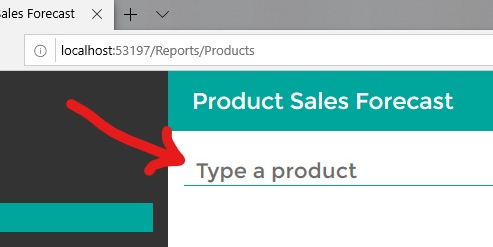

# Setting up eShopDashboard in Visual Studio and running it

## Running the Dashboard app from Visual Studio

Make sure that the eShopDashboard project is the by default startup project, and hit F5.

**Important Note:** The first time you run the application it should take a few minutes as it'll create a new SQL localdb database and populate sample data for a large volume of product items and sales historical data.

However, next application's executions should be a lot faster, though, because the databases will be ready for the app.

At this point the web page should open and be blank except for a header and sidebar. Bring up sales forecasts for any product by typing a product name in the search box:

For example searching for "bag" will bring up all products with bag in the title. Below you can see an screenshot of the dashboard once the data population has finished.

**NuGet version info:** The solution is configured to use the latest release of ML.NET (1.0-preview as of May 1, 2019) by default.  See [NuGet Configuration](NuGet-configuration.md) if you would like to use a different version.
 
## Deleting the SQL localdb database if you want to update the database schema and/or sample populated data

If you want to re-generate the database with schema changes and/or new sample data, you need to delete the database from SQL localdb, by using either Visual Studio or SQL Server Management Studio.

From Visual Studio, open the **SQL Server Object Explorer**, expand the available databases and delete the current database in a similar way than the screenshot below: 

Then, click on "Close existing connections" and hit the OK button to delete the database.

Finally, just hit F5 or Ctrl+F5 to run the sample app again, which will re-create the database and sample data. 

Remember that whenever it is recreating the database and sample data it will take a few minutes to finish the process until the app is ready to work.

