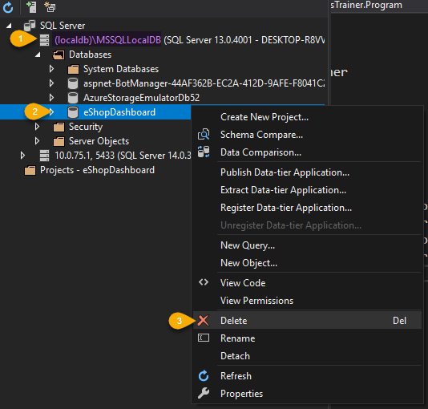
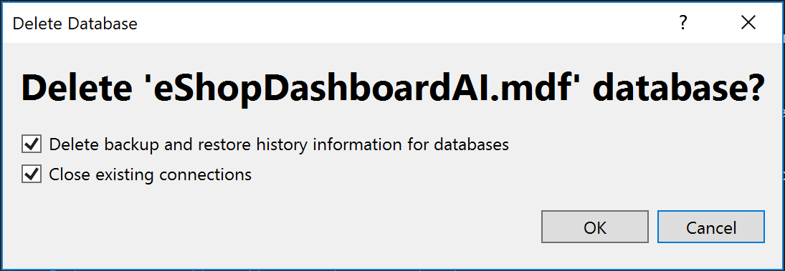

# Setting up eShopDashboard in Visual Studio and running it

## Solution

Open the solution `eShopDashboard.sln` in the root folder of the repo.

## NuGet setup 

By default, use the NuGet feed `https://api.nuget.org/v3/index.json` for the Microsoft.ML package puclicly published here: https://www.nuget.org/packages/Microsoft.ML/

If you want to use daily-drops or non major versions, you can also use the this feed: `https://dotnet.myget.org/F/dotnet-core/api/v3/index.json`

**NuGet package version**: If the project's folder is positioned within the root folder of the ML.NET samples repo, the version of the Microsoft.ML NuGet package will be specified by the file `/samples/Directory.Build.props` which contains the version, as follows:

```
<Project>

  <PropertyGroup>
    <MicrosoftMLVersion>0.9.0</MicrosoftMLVersion>
  </PropertyGroup>

</Project>
```

Then, the project files `eShopDashboard.csproj` and `eShopForecastModelsTrainer.csproj` use that property to set the Microsoft.ML NuGet package version:

```
  <!-- Other project config -->
  <ItemGroup>
    <PackageReference Include="Microsoft.ML" Version="$(MicrosoftMLVersion)" />
  </ItemGroup>
```

This is a convenient way to set the same NuGet package version number for all the samples, in a single step. But you could add a specific NuGet package to each project, if you wish.

**Build:** Build the solution to confirm there's access to the Microsoft.ML NuGet package and it is ready to run the app.

## Running the Dashboard app from Visual Studio

Make sure that the eShopDashboard project is the by default startup project, and hit F5.

**Important Note:** The first time you run the application it should take a few minutes as it'll create a new SQL localdb database and populate sample data for a large volume of product items and sales historical data.

However, next application's executions should be a lot faster, though, because the databases will be ready for the app.

Below you can see an screenshot of the dashboard once the data population finished:


 
## Deleting the SQL localdb database if you want to update the database schema and/or sample populated data

If you want to re-generate the database with schema changes and/or new sample data, you need to delete the database from SQL localdb, by using either Visual Studio or SQL Server Management Studio.

From Visual Studio, open the **SQL Server Object Explorer**, expand the available databases and delete the current database in a similar way than the screenshot below: 



Then, click on "Close existing connections" and hit the OK button to delete the database.


Finally, just hit F5 or Ctrl+F5 to run the sample app again, which will re-create the database and sample data. 

Remember that whenever it is recreating the database and sample data it will take a few minutes to finish the process until the app is ready to work.


