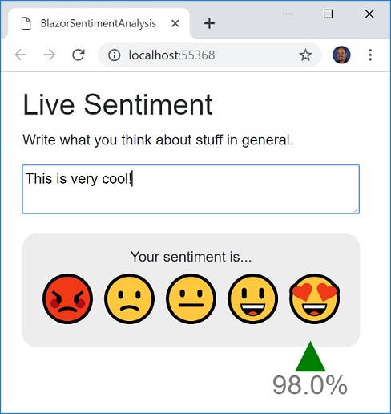

# SENTIMENT ANALYSIS: Blazor sample (ASP.NET Core 3.0) optimized for scalability and performance when running/scoring an ML.NET model (Using the new '.NET Core Integration Package for ML.NET')


| ML.NET version | Status     | App Type                  | Data type          | Scenario           | ML Task               | Algorithms            |
|----------------|------------|---------------------------|--------------------|--------------------|-----------------------|-----------------------|
| v1.4         | Up-to-date | Blazor / ASP.NET Core 3.0 | Single data sample | Sentiment Analysis | Binary Classification | Linear Classification |

# Goal

The goal is to be able to make **SENTIMENT ANALYSIS** prediction/detection of what the user is writing in a very **UI interactive app (BLAZOR based)** in the client side and running an **ML.NET model** (Sentiment analysis based on binary-classification) in the server side.

Here's a screenshot of the app while running:



From ML.NET perspective, the goal is to **optimize the ML.NET model executions in the server** by sharing the ML.NET objects used for predictions across Http requests and being able to implement very simple code to be used by the user when predicting, like the following line of code that you could write on any ASP.NET Core controller's method or custom service class:

```cs
SamplePrediction prediction = _predictionEnginePool.Predict(sampleData);
```

As simple as a single line. The object _predictionEnginePool will be injected in the controller's constructor or into you custom class._ 

Internally, it is optimized so the object dependencies are cached and shared across Http requests with minimum overhead when creating those objects.

# Architecture

Blazor allows you to run C# code in the client side, as shown in the architecture figure.


For this sample we chose to run the ML.NET model in the server side, so the model is protected within the service. However, for maximum perf and lower latency you could also run the ML.NET model in the browser (thanks to BLAZOR and WebAssembly) in a similar way you can run any model on a console .NET Core app.

Running the model in the server side allows you to protect the model plus the following benefits:

- The web app can run on a mobile device (ARM) since it is just running HTML and WebAssembly. If the ML.NET model runs in the browser, it wouldn't run on a regular mobile device because ARM is not currently supported by ML.NET.
- The 'WebAPI' service could be consumed by other remote apps


# Problem

The problem running/scoring an ML.NET model in multi-threaded applications comes when you want to do single predictions with the PredictionEngine object and you want to cache that object (i.e. as Singleton) so it is being reused by multiple Http requests (therefore it would be accessed by multiple threads). That's is a problem because **the Prediction Engine is not thread-safe** ([ML.NET issue, Nov 2018](https://github.com/dotnet/machinelearning/issues/1718)).

# Solution

## Use the new '.NET Core Integration Package' that implements Object Pooling of PredictionEngine objects for you 

**'.NET Core Integration Package' NuGet**

Package name: **Microsoft.Extensions.ML**
Package version: 0.15.1

Basically, with this component, you inject/use the `PredictionEngine` object pooling in a single line in your Startup.cs, like the following:

```CSharp
services.AddPredictionEnginePool<SampleObservation, SamplePrediction>()
        .FromFile(Configuration["MLModel:MLModelFilePath"]);
```

Then you just need to call the `Predict()` function from the injected `PredictionEnginePool`, like the following code you can implement on any controller:

```CSharp

//Predict sentiment
SamplePrediction prediction = _predictionEnginePool.Predict(sampleData);
```

It is that simple.

For a much more detailed explanation of a `PredictionEngine` Object Pool comparable to the implementation done in the new '.NET Core Integration Package', including design diagrams, read the following blog post:

**Detailed Blog Post** for further documentation:

[How to optimize and run ML.NET models on scalable ASP.NET Core WebAPIs or web apps](https://devblogs.microsoft.com/cesardelatorre/how-to-optimize-and-run-ml-net-models-on-scalable-asp-net-core-webapis-or-web-apps/)

NOTE: YOU DON'T NEED TO MAKE THE IMPLEMENTATION EXPLAINED IN THE BLOG POST.
IT IS IMPLEMENTED FOR YOU IN THE '.NET INTEGRATION PACKAGE'.
