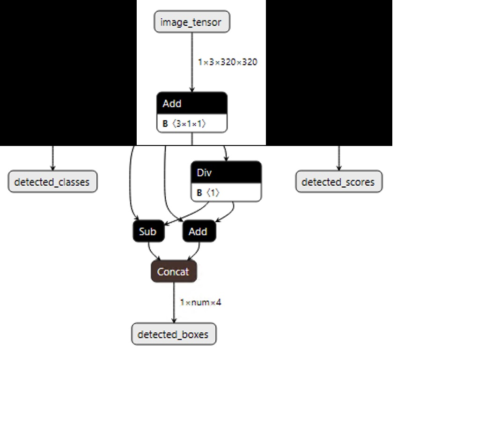

# Object Detection - ASP.NET Core Web & WPF Desktop Sample

| ML.NET version | API type    | Status     | App Type    | Data type   | Scenario         | ML Task       | Algorithms                        |
|----------------|-------------|------------|-------------|-------------|------------------|---------------|-----------------------------------|
| v1.7.1        | Dynamic API | Up-to-date | End-End app | image files | Object detection | Deep Learning | ONNX: Custom Vision |

## Problem

Objection is one of the main applicatinos of deep learning by being able to not only classify part of an image, but also show where in the image the object is with a bounding box. For deep learning scenarios, you can either use a pre-trained model or train your own model. This sample uses an object detection model exported from [Custom Vision](https://www.customvision.ai).

## How the sample works

This sample consists of a single console application that builds an ML.NET pipeline from an ONNX model downnloaded from Custom Vision and predicts as well as shows the bounding box on any images in the "test" folder.

## ONNX

The Open Neural Network eXchange i.e [ONNX](http://onnx.ai/) is an open format to represent deep learning models. With ONNX, developers can move models between state-of-the-art tools and choose the combination that is best for them. ONNX is developed and supported by a community of partners, including Microsoft.

## Model input and output

In order to parse the prediction output of the ONNX model, we need to understand the format (or shape) of the input and output tensors.  To do this, we'll start by using [Netron](https://netron.app/), a GUI visualizer for neural networks and machine learning models, to inspect the model.

Below is an example of what we'd see upon opening this sample's model with Netron:



From the output above, we can see the ONNX model has the following input/output formats:

### Input: 'data' 3x320x320

The first thing to notice is that the **input tensor's name** is **'image_tensor'**.  We'll need this name later when we define **input** parameter of the estimation pipeline.

We can also see that the or **shape of the input tensor** is **3x320x320**.  This tells that the image passed into the model should be 320 high x 320 wide. The '3' indicates the image(s) should be in BGR format; the first 3 'channels' are blue, green, and red, respectively.

### Output

We can see that the ONNX model has three outputs:
- **detected_classes**: An array of indexes that corresponds to the **labels.txt** file of what classes have been detected in the image. The labels are the tags that are added when uploading images to the Custom Vision service.
- **detected_boxes**: An array of 
- **detected_scores**: An array of scores for each detected class.

## Solution

**The projects in this solution uses .NET 6. In order to run this sample, you must install the .NET 6.0. To do this either:**

1. Manually install the SDK by going to [.NET Core 3.0 download page](https://aka.ms/netcore3download) and download the latest **.NET Core Installer** in the **SDK** column.
2. Or, if you're using Visual Studio 2019, go to: _**Tools > Options > Environment > Preview Features**_ and check the box next to: _**Use previews of the .NET Core SDK**_

## Code Walkthrough

Create a class that defines the data schema to use while loading data into an `IDataView`. ML.NET supports the `Bitmap` type for images, so we'll specify `Bitmap` property decorated with the `ImageTypeAttribute` and pass in the height and width dimensions we got by [inspecting the model](#model-input-and-output), as shown below.

```csharp
public class StopSignInput
{
    public struct ImageSettings
    {
        public const int imageHeight = 320;
        public const int imageWidth = 320;
    }

    public class StopSignInput
    {
        [ImageType(ImageSettings.imageHeight, ImageSettings.imageWidth)]
        public Bitmap Image { get; set; }
    }
}
```

### ML.NET: Configure the model

The first step is to create an empty `DataView` to obtain the schema of the data to use when configuring the model.

```csharp
var data = _mlContext.Data.LoadFromEnumerable(new List<StopSignInput>());
```

Next, we can use the input and output tensor names we got by [inspecting the model](#model-input-and-output) to define the **input** and **output** parameters of the ONNX Model. We can use this information to define the estimator pipeline. Usually, when dealing with deep neural networks, you must adapt the images to the format expected by the network. For this reason, the code below resizes and transforms the images (pixel values are normalized across all R,G,B channels). Since we have multiple outputs in our model, we can use the overload in **ApplyOnnxModel** to define a string array of output column names.

```csharp
var pipeline = context.Transforms.ResizeImages(resizing: ImageResizingEstimator.ResizingKind.Fill, outputColumnName: "image_tensor", imageWidth: ImageSettings.imageWidth, imageHeight: ImageSettings.imageHeight, inputColumnName: nameof(StopSignInput.Image))
                .Append(context.Transforms.ExtractPixels(outputColumnName: "image_tensor"))
                .Append(context.Transforms.ApplyOnnxModel(outputColumnNames: new string[] { "detected_boxes", "detected_scores", "detected_classes" }, 
                    inputColumnNames: new string[] { "image_tensor" }, modelFile: "./Model/model.onnx"));
```

Last, create the model by fitting the `DataView`.

```csharp
var model = pipeline.Fit(data);
```

## Create a PredictionEngine

After the model is configured, create a `PredictionEngine`, and then pass the image to the engine to classify images using the model.

The **Console** app uses the `CreatePredictionEngine` to make predictions. Internally, it is optimized so the object dependencies are cached and shared across Http requests with minimum overhead when creating those objects.

```csharp
var predictionEngine = context.Model.CreatePredictionEngine<StopSignInput, StopSignPrediction>(model);
```

## Detect objects in an image

When obtaining the prediction, we get a `float` array in the `PredictedLabels` property. This is the 125x13x13 output of the model [discussed earlier](#output-data-125x13x13). For each test image we get the max value of the predicted label and its corresponding index. We use that index to get the label based on the **labels.txt** file.

```csharp
var labels = File.ReadAllLines("./model/labels.txt");

var testFiles = Directory.GetFiles("./test");

Bitmap testImage;

foreach (var image in testFiles)
{
    using (var stream = new FileStream(image, FileMode.Open))
    {
        testImage = (Bitmap)Image.FromStream(stream);
    }

    var prediction = predictionEngine.Predict(new WeatherRecognitionInput { Image = testImage });

    var maxValue = prediction.PredictedLabels.Max();
    var maxIndex = prediction.PredictedLabels.ToList().IndexOf(maxValue);

    var predictedLabel = labels[maxIndex];

    Console.WriteLine($"Prediction for file {image}: {predictedLabel}");
}```
