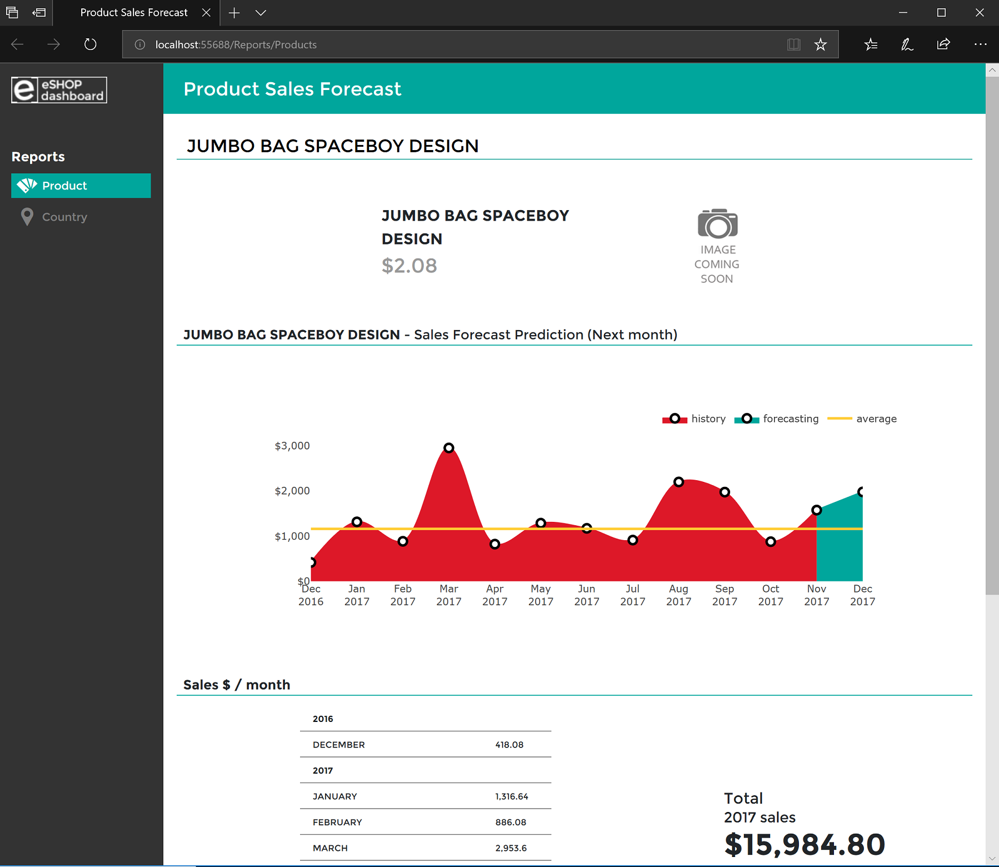

# eShopDashboardML
eShopDashboardML is a web app with Product Sales Forecast predictions using [Microsoft Machine Learning .NET (ML.NET)](https://github.com/dotnet/machinelearning).

This end-to-end sample app highlights the usage of ML.NET API by showing the following topics:

1. How to train, build and generate ML models 
   - Implemented as a [console app](src\eShopForecastModelsTrainer) using .NET Core.
2. How to predict the next month of Sales Forecasts by using the trained ML model 
   - Implemented as a single, monolithic [web app](src\eShopDashboard) using [ASP.NET Core Razor](https://docs.microsoft.com/aspnet/core/tutorials/razor-pages/). 

The app is also using a SQL Server database for regular product catalog and orders info, as many typical web apps using SQL Server. In this case, since it is an example, it is, by default, using a localdb SQL database so there's no need to setup a real SQL Server. The localdb database will be created, along with with sample populated data, the first time you run the web app.

If you want to use a real SQL Server or Azure SQL Database, you just need to change the connection string in the app.

Here's a sample screenshot of the web app and one of the forecast predictions:

## Walkthroughs on how to set it up

Learn how to set it up in Visual Studio plus further explanations on the code:

- [Setting up eShopDashboard in Visual Studio and running the web app](docs/Setting-up-eShopDashboard-in-Visual-Studio-and-running-it.md)

- [Create and Train your ML models](docs/Create-and-train-the-models-%5BOptional%5D.md) 
   - This step is optional as the web app is already configured to use a pre-trained model. But you can create your own trained model and swap the pre-trained model with your own. 

- [Walkthrough on the implemented ML.NET code](docs/ML.NET-Code-Walkthrough.md)

## Citation
eShopDashboardML dataset is based on a public Online Retail Dataset from **UCI**: http://archive.ics.uci.edu/ml/datasets/online+retail
> Daqing Chen, Sai Liang Sain, and Kun Guo, Data mining for the online retail industry: A case study of RFM model-based customer segmentation using data mining, Journal of Database Marketing and Customer Strategy Management, Vol. 19, No. 3, pp. 197–208, 2012 (Published online before print: 27 August 2012. doi: 10.1057/dbm.2012.17).

