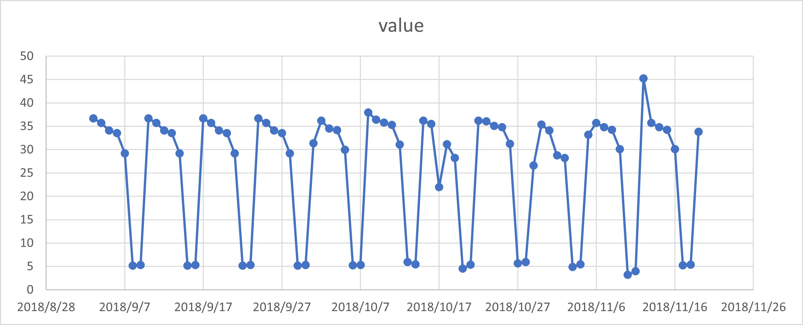
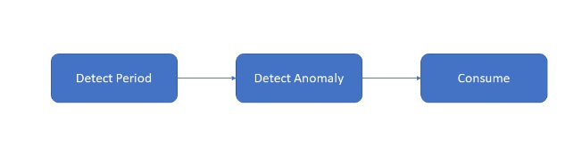

# Anomaly Detection of Numbers of Phone Calls

| ML.NET version | API type          | Status                        | App Type    | Data type | Scenario            | ML Task                   | Algorithms                  |
|----------------|-------------------|-------------------------------|-------------|-----------|---------------------|---------------------------|-----------------------------|
| v5.2         | Dynamic API | Up-to-date | Console app | .csv files | Call Numbers Anomaly Detection| Time Series - Anomaly Detection | Sr Entire Anomaly Detection, Period Detection |

In this introductory sample, you'll see how to use [ML.NET](https://www.microsoft.com/net/learn/apps/machine-learning-and-ai/ml-dotnet) to detect **anomalies** in a series of number of calls data. In the world of machine learning, this type of task is called TimeSeries Anomaly Detection.

## Problem
We are having data on number of calls over 10 weeks with daily granularity. The data itself has a periodical pattern as the volumn of calls is large is weekdays and small in weekends. We want to find those points that fall out of the regular pattern of the series. In the world of machine learning, this type of task is called Time-Series anomaly detection.

To solve this problem, we will build an ML model that takes as inputs:
* Date
* Number of calls.

and outputs the anomalies in the number of calls.

## Dataset
We have created sample dataset for number of calls. The dataset `phone_calls.csv` can be found [here](./SrCnnEntireDetection/Data/phone_calls.csv)

Format of **Phone Calls DataSet** looks like below.

| timestamp  | value |
|--------|--------------|
| 2018/9/3  | 36.69670857  |
| 2018/9/4  | 35.74160571  |
| .....  | .....  |
| 2018/10/3  | 34.49893429  |
| ...    | ....   |



The data in Phone Calls dataset is collected in real world transactions with normalization and rescale transformation.

## ML task - Time Series Anomaly Detection
Anomaly detection is the process of detecting outliers in the data. Anomaly detection in time-series refers to detecting time stamps, or points on a given input time-series, at which the time-series behaves differently from what was expected. These deviations are typically indicative of some events of interest in the problem domain: a cyber-attack on user accounts, power outage, bursting RPS on a server, memory leak, etc.

## Solution
To solve this problem, first, we should determine the period of the series. Second, we can extract the periodical component of the series and apply anomaly detection on the residual part of the series. In ML.net, we could use the detect seasonality function to find the period of a given series. Given the period, the STL algorithm decompose the time-series into three components as `Y = T + S + R`, where `Y` is the original series, `T` is the trend component, `S` is the seasonal componnent and `R` is the residual component of the series(Refer to [this](http://www.nniiem.ru/file/news/2016/stl-statistical-model.pdf) paper for more details on this algorithm). Then, SR-CNN detector is applied to detect anomaly on `R` to capture the anomalies(Refer to [this](https://arxiv.org/pdf/1906.03821.pdf) paper for more details on this algorithm).



Luckily, ML.net makes the process super simple as we can see in this sample.

### 1. Detect Period

In the first step, we invoke the `DetectSeasonality` function to obtain the period.

```CSharp
int period = mlContext.AnomalyDetection.DetectSeasonality(dataView, inputColumnName);
```

### 2. Detect Anomaly

First, we need to specify the parameters used for SrCnnEntire detector(Please refer to [here](https://docs.microsoft.com/en-us/dotnet/api/microsoft.ml.timeseriescatalog.detectentireanomalybysrcnn?view=ml-dotnet#Microsoft_ML_TimeSeriesCatalog_DetectEntireAnomalyBySrCnn_Microsoft_ML_AnomalyDetectionCatalog_Microsoft_ML_IDataView_System_String_System_String_System_Double_System_Int32_System_Double_Microsoft_ML_TimeSeries_SrCnnDetectMode_) for the details on the parameters). Then, we invoke the detector and obtain a view of the output data.
```CSharp
var options = new SrCnnEntireAnomalyDetectorOptions()
{
    Threshold = 0.3,
    Sensitivity = 64.0,
    DetectMode = SrCnnDetectMode.AnomalyAndMargin,
    Period = period,
};
var outputDataView = mlContext.AnomalyDetection.DetectEntireAnomalyBySrCnn(dataView, outputColumnName, inputColumnName, options);
```

### 3. Consume results
The result can be retrived by simply enumerate the result. `Anomaly`, `ExpectedValue`, `UpperBoundary` and `LowerBoundary` are some of the useful output columns.

```CSharp
//STEP 5: Get the detection results as an IEnumerable
var predictions = mlContext.Data.CreateEnumerable<PhoneCallsPrediction>(
    outputDataView, reuseRowObject: false);

Console.WriteLine("The anomaly detection results obtained.");
var index = 0;

Console.WriteLine("Index\tData\tAnomaly\tAnomalyScore\tMag\tExpectedValue\tBoundaryUnit\tUpperBoundary\tLowerBoundary");
foreach (var p in predictions)
{
    if (p.Prediction[0] == 1)
    {
        Console.WriteLine("{0},{1},{2},{3},{4},{5},{6},{7}  <-- alert is on, detecte anomaly", index,
            p.Prediction[0], p.Prediction[1], p.Prediction[2], p.Prediction[3], p.Prediction[4], p.Prediction[5], p.Prediction[6]);
    }
    else
    {
        Console.WriteLine("{0},{1},{2},{3},{4},{5},{6},{7}", index,
            p.Prediction[0], p.Prediction[1], p.Prediction[2], p.Prediction[3], p.Prediction[4], p.Prediction[5], p.Prediction[6]);
    }
    ++index;

}

//Index Data    Anomaly AnomalyScore    Mag ExpectedValue   BoundaryUnit UpperBoundary   LowerBoundary
//0,0,0,0.012431224740909462,36.841787256739266,32.92296779138513,41.14206982401966,32.541504689458876
//1,0,0,0.06732467206114204,35.67303618137362,32.92296779138513,39.97331874865401,31.372753614093227
//2,0,0,0.053027383620274836,34.710132999891826,33.06901172138514,39.029491313022824,30.390774686760828
//3,0,0,0.027326808903921952,33.44765248883495,33.215055651385136,37.786086547816545,29.10921842985335
//4,0,0,0.0074169435448767015,28.937110922276364,33.06901172138514,33.25646923540736,24.61775260914537
//5,0,0,0.01068288760963436,5.143895892785781,32.92296779138513,9.444178460066171,0.843613325505391
//6,0,0,0.02901575691006479,5.163325228419392,32.92296779138513,9.463607795699783,0.8630426611390014
//7,0,0,0.015220262187074987,36.76414836240396,32.92296779138513,41.06443092968435,32.46386579512357
//8,0,0,0.029223955855920452,35.77908590657007,32.92296779138513,40.07936847385046,31.478803339289676
//9,0,0,0.05014588266429284,34.547259536635245,32.92296779138513,38.847542103915636,30.246976969354854
//10,0,0,0.006478629327524482,33.55193524820608,33.06901172138514,37.871293561337076,29.23257693507508
//11,0,0,0.0144699438892775,29.091800129624648,32.92296779138513,33.392082696905035,24.79151756234426
//12,0,0,0.00941397738418861,5.154836630338823,32.92296779138513,9.455119197619213,0.8545540630584334
//13,0,0,0.01012680059746895,5.234332502492464,32.92296779138513,9.534615069772855,0.934049935212073
//14,0,0,0.0391359937506989,36.54992549471526,32.92296779138513,40.85020806199565,32.24964292743487
//15,0,0,0.01879091709088552,35.79526470980883,32.92296779138513,40.095547277089224,31.494982142528443
//16,0,0,0.04275209137629126,34.34099013096804,32.92296779138513,38.64127269824843,30.040707563687647
//17,0,0,0.024479312458949517,33.61201516582131,32.92296779138513,37.9122977331017,29.31173259854092
//18,0,0,0.010781906482188448,29.223563320561812,32.92296779138513,33.5238458878422,24.923280753281425
//19,0,0,0.006907498717766534,5.170512168851533,32.92296779138513,9.470794736131923,0.8702296015711433
//20,0,0,0.003183991678813579,5.2614938889462834,32.92296779138513,9.561776456226674,0.9612113216658926
//21,0,0,0.04256581040333137,36.37103858487317,32.92296779138513,40.67132115215356,32.07075601759278
//22,0,0,0.022860533704528126,35.813544599026855,32.92296779138513,40.113827166307246,31.513262031746464
//23,0,0,0.019266922707912835,34.05600492733225,32.92296779138513,38.356287494612644,29.755722360051863
//24,0,0,0.008008656062259012,33.65828319077884,32.92296779138513,37.95856575805923,29.358000623498448
//25,0,0,0.018746201354033914,29.381125690882463,32.92296779138513,33.681408258162854,25.080843123602072
//26,0,0,0.0141022037992637,5.261543539820418,32.92296779138513,9.561826107100808,0.9612609725400283
//27,0,0,0.013396001938040617,5.4873712582971805,32.92296779138513,9.787653825577571,1.1870886910167897
//28,1,0.4971326063712256,0.3521692757832201,36.504694001629254,32.92296779138513,40.804976568909645,32.20441143434886 < --alert is on, detecte anomaly
```
