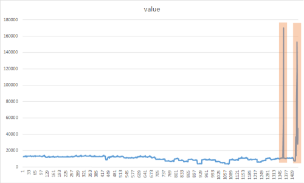
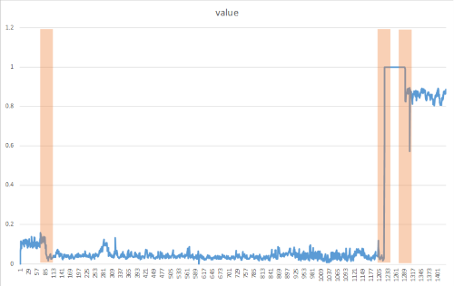

# Spike Detection and Change Point Detection of Product sales

| ML.NET version | API type          | Status                        | App Type    | Data type | Scenario            | ML Task                   | Algorithms                  |
|----------------|-------------------|-------------------------------|-------------|-----------|---------------------|---------------------------|-----------------------------|
| v1.4         | Dynamic API | Up-to-date | Console app | .csv files | Product Sales Spike Detection| Time Series - Anomaly Detection | IID Spike Detection and IID Change point Detection |

In this introductory sample, you'll see how to use [ML.NET](https://www.microsoft.com/net/learn/apps/machine-learning-and-ai/ml-dotnet) to detect **spikes** and **change points** in Product sales. In the world of machine learning, this type of task is called TimeSeries Anomaly Detection.

## Problem
We are having data on Product sales over 3 months period in which the sales are high and normal. we identify sudden spikes in Product sales so that we can use this spiked data to analyze trends in sales of Product. 

To solve this problem, we will build an ML model that takes as inputs: 
* Date-Month
* ProductSales over 3 months period

and predicts the spikes and changepoints in Product sales.

## Dataset
We have created sample dataset for Product sales. The dataset `product-sales.csv` can be found [here](./SpikeDetection/Data/product-sales.csv)

Format of **Product Sales DataSet** looks like below.

| Month  | ProductSales |
|--------|--------------|
| 1-Jan  | 271          |
| 2-Jan  | 150.9        |
| .....  | .....        |
| 1-Feb  | 199.3        |
| ...    | ....         |

The data format in Product Sales dataset is referenced from **shampoo-sales dataset** and the license for shampoo-sales dataset is available [here](./SpikeDetection/Data/SHAMPOO-SALES-LICENSE.txt).


The algorithms **IID Spike Detection** or **IID Change point Detection** are suited for dataset that is **independent and identically distributed**. In probability theory and statistics, a collection of random variables is independent and identically distributed(IID) if each random variable has the same probability distribution as the others and all are mutually independent. More information is available on wikipedia [here](https://en.wikipedia.org/wiki/Independent_and_identically_distributed_random_variables)

## ML task - Time Series Anomaly Detection
Anomaly detection is the process of detecting outliers in the data.Anomaly detection in time-series refers to detecting time stamps, or points on a given input time-series, at which the time-series behaves differently from what was expected. These deviations are typically indicative of some events of interest in the problem domain: a cyber-attack on user accounts, power outage, bursting RPS on a server, memory leak, etc.

On the other hand, an anomalous behavior can be either persistent over time or just a temporary burst.There are 2 types of anomalies in this context: **spikes** which are attributed to temporary bursts and **change points** which indicate the beginning of persistent changes in the system. 

## Spike Detection
Spikes are attributed to sudden yet temporary bursts in the values of the input time-series.  In practice, they can happen due to a variety of reasons depending on the application: outages, cyber-attacks, viral web content, etc. Therefore, in many applications, it is important to detect spikes.



## Change point Detection
​Change points mark the beginning of more persistent deviations in the behavior of time-series from what was expected.In practice, these type of changes in the behavior of time-series are usually triggered by some fundamental changes in the dynamics of the system. For example, in system telemetry monitoring, an introduction of a memory leak can cause a (slow) trend in the time-series of memory usage after certain point in time. 



## Solution
To solve this problem, you build and train an ML model on existing training data, evaluate how good it is (analyzing the obtained metrics), and lastly you can consume/test the model to predict the demand given input data variables.


However, in this example we will build and train the model to demonstrate the Time Series anomaly detection library since it detects on actual data and does not have an evaluate method.  We will then review the detected anomalies in the Prediction output column.

The process of building and training models is the same for spike detection and change point detection; the main difference is the algorithm that you use (DetectIidSpike vs. DetectIidChangePoint).

### 1. Build model

Building a model includes: 

* Creating empty IDataView with just schema of dataset.

* Creating an Estimator by applying Transformer (e.g. `IidSpikeDetector` or `IidChangePointDetector`) and setting parameters (in this case confidence level and p-value).

The initial code for Spike Detection is similar to the following:

```CSharp
CreateEmptyDataView();

//Create ML Context object
MLContext mlcontext = new MLContext();

//STEP 1: Create Esimtator   
var estimator = mlContext.Transforms.DetectIidSpike(outputColumnName: nameof(ProductSalesPrediction.Prediction), inputColumnName: nameof(ProductSalesData.numSales), confidence: 95, pvalueHistoryLength: size / 4);

```

### 2. Transform model
Note that In IID Spike detection or IID change point detection, we don't need to do training, we just need to do transformation. As you are not training the model, there is no need to load IDataView with real data, you just need schema of data. So the model is created using `Fit()` API by passing **empty IDataView object**.

```CSharp
//STEP 2:The Transformed Model.
//In IID Spike detection, we don't need to do training, we just need to do transformation. 
//As you are not training the model, there is no need to load IDataView with real data, you just need schema of data.
//So create empty data view and pass to Fit() method. 
ITransformer tansformedModel = estimator.Fit(CreateEmptyDataView());
```

### 3. Consume model
* We don't have evaluate step in TimeSeries Anomaly detection. We use the transformed model to predict the anomalies in the data.  

* Load the data to predict from (`product-sales.csv`) to an IDataView and create predictions.

```CSharp
//Load the data into IDataView.
//This dataset is used for detecting spikes or changes not for training.
IDataView dataView = mlContext.Data.LoadFromTextFile<ProductSalesData>(path: DatasetPath, hasHeader: true, separatorChar: ',');

//Apply data transformation to create predictions.
IDataView transformedData = tansformedModel.Transform(dataView);
var predictions = mlcontext.Data.CreateEnumerable<ProductSalesPrediction>(transformedData, reuseRowObject: false);
          
Console.WriteLine("Alert\tScore\tP-Value");
foreach (var p in predictions)
{
    if (p.Prediction[0] == 1)
    {
        Console.BackgroundColor = ConsoleColor.DarkYellow;
        Console.ForegroundColor = ConsoleColor.Black;
    }
    Console.WriteLine("{0}\t{1:0.00}\t{2:0.00}", p.Prediction[0], p.Prediction[1], p.Prediction[2]);
    Console.ResetColor();
}
    Console.WriteLine("");
}

//sample output
// Prediction column obtained post-transformation.
   // Alert   Score   P-Value   
    //0       122.90  0.13
    //1       336.50  0.00<-- alert is on, predicted spike
    //0       185.90  0.48
    //0       194.30  0.48
    //0       149.50  0.24
    //0       210.10  0.42
    //0       273.30  0.19
    //0       191.40  0.43
    //0       287.00  0.17
    //0       226.00  0.45
    //0       303.60  0.18
    //0       289.90  0.19
    //1       421.60  0.00 <-- alert is on, predicted spike
    //0       264.50  0.47
```

### Change Point Detection console output

```
Alert   Score   P-Value Martingale value
0       266.00  0.50    0.00
0       145.90  0.00    2.33
0       183.10  0.41    2.80
0       119.30  0.13    9.16
0       180.30  0.47    9.77
0       168.50  0.47    10.41
0       231.80  0.19    24.46
0       224.50  0.27    42.38
1       192.80  0.48    44.23  <-- alert is on, predicted changepoint
0       122.90  0.13    145.25
0       336.50  0.00    0.01
0       185.90  0.48    0.01
```
