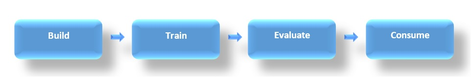

# Spam Detection for Text Messages

| ML.NET version | API type          | Status                        | App Type    | Data type | Scenario            | ML Task                   | Algorithms                  |
|----------------|-------------------|-------------------------------|-------------|-----------|---------------------|---------------------------|-----------------------------|
| v1.0.0           | Dynamic API | Might need to update project structure to match template | Console app | .tsv files | Spam detection | Two-class classification | Averaged Perceptron (linear learner) |

In this sample, you'll see how to use [ML.NET](https://www.microsoft.com/net/learn/apps/machine-learning-and-ai/ml-dotnet) to predict whether a text message is spam. In the world of machine learning, this type of prediction is known as **binary classification**.

## Problem

Our goal here is to predict whether a text message is spam (an irrelevant/unwanted message). We will use the [SMS Spam Collection Data Set](https://archive.ics.uci.edu/ml/datasets/SMS+Spam+Collection) from UCI, which contains close to 6000 messages that have been classified as being "spam" or "ham" (not spam). We will use this dataset to train a model that can take in new message and predict whether they are spam or not.

This is an example of binary classification, as we are classifying the text messages into one of two categories.

## Solution
To solve this problem, first we will build an estimator to define the ML pipeline we want to use. Then we will train this estimator on existing data, evaluate how good it is, and lastly we'll consume the model to predict whether a few examples messages are spam.



### 1. Build Model

To build the model we will:

* Define how to read the spam dataset that will be downloaded from https://archive.ics.uci.edu/ml/datasets/SMS+Spam+Collection. 

* Apply several data transformations:

    * Convert the label ("spam" or "ham") to a boolean ("true" represents spam) so we can use it with a binary classifier. 
    * Featurize the text message into a numeric vector so a machine learning trainer can use it

* Add a trainer (such as `StochasticDualCoordinateAscent`).

The initial code is similar to the following:

```CSharp
// Set up the MLContext, which is a catalog of components in ML.NET.
MLContext mlContext = new MLContext();

// Specify the schema for spam data and read it into DataView.
var data = mlContext.Data.LoadFromTextFile<SpamInput>(path: TrainDataPath, hasHeader: true, separatorChar: '\t');

// Data process configuration with pipeline data transformations 
var dataProcessPipeline = mlContext.Transforms.Conversion.MapValueToKey("Label", "Label")
                                      .Append(mlContext.Transforms.Text.FeaturizeText("FeaturesText", new Microsoft.ML.Transforms.Text.TextFeaturizingEstimator.Options
                                      {
                                          WordFeatureExtractor = new Microsoft.ML.Transforms.Text.WordBagEstimator.Options { NgramLength = 2, UseAllLengths = true },
                                          CharFeatureExtractor = new Microsoft.ML.Transforms.Text.WordBagEstimator.Options { NgramLength = 3, UseAllLengths = false },
                                      }, "Message"))
                                      .Append(mlContext.Transforms.CopyColumns("Features", "FeaturesText"))
                                      .Append(mlContext.Transforms.NormalizeLpNorm("Features", "Features"))
                                      .AppendCacheCheckpoint(mlContext);

// Set the training algorithm 
var trainer = mlContext.MulticlassClassification.Trainers.OneVersusAll(mlContext.BinaryClassification.Trainers.AveragedPerceptron(labelColumnName: "Label", numberOfIterations: 10, featureColumnName: "Features"), labelColumnName: "Label")
                                      .Append(mlContext.Transforms.Conversion.MapKeyToValue("PredictedLabel", "PredictedLabel"));
var trainingPipeLine = dataProcessPipeline.Append(trainer);
```

### 2. Evaluate model

For this dataset, we will use [cross-validation](https://en.wikipedia.org/wiki/Cross-validation_(statistics)) to evaluate our model. This will partition the data into 5 'folds', train 5 models (on each combination of 4 folds), and test them on the fold that wasn't used in training.

```CSharp
var crossValidationResults = mlContext.MulticlassClassification.CrossValidate(data: data, estimator: trainingPipeLine, numberOfFolds: 5);
```

Note that usually we evaluate a model after training it. However, cross-validation includes the model training part so we don't need to do `Fit()` first. However, we will later train the model on the full dataset to take advantage of the additional data.

### 3. Train model
To train the model we will call the estimator's `Fit()` method while providing the full training data.

```CSharp
var model = trainingPipeLine.Fit(data);
```

### 4. Consume model

After the model is trained, you can use the `Predict()` API to predict whether new text is spam. 

```CSharp
//Create a PredictionFunction from our model 
var predictor = mlContext.Model.CreatePredictionEngine<SpamInput, SpamPrediction>(model);

var input = new SpamInput { Message = "free medicine winner! congratulations" };
Console.WriteLine("The message '{0}' is {1}", input.Message, prediction.isSpam == "spam" ? "spam" : "not spam");

```
