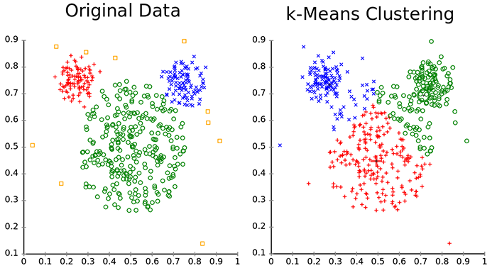

# Customer Segmentation - Clustering sample

| ML.NET version | API type          | Status                        | App Type    | Data type | Scenario            | ML Task                   | Algorithms                  |
|----------------|-------------------|-------------------------------|-------------|-----------|---------------------|---------------------------|-----------------------------|
| v1.4          | Dynamic API | Up-to-date | Console app | .csv files | Customer segmentation | Clustering | K-means++ |

## Problem

You want to **identify groups of customers with similar profile** so you could target them afterwards (like different marketing campaigns per identified customer group with similar characteristics, etc.)

The problem to solve is how you can identify different groups of customers with similar profile and interest without having any pre-existing category list. You are *not* classifying customers across a category list because your customers are not *labeled* so you cannot do that. You just need to make groups/clusters of customers that the company will use afterwards for other business purposes.

## DataSet

In this hypothetical case, the data to process is coming from 'The Wine Company'. That data is basically a historic of offers/deals (part of marketing campaigns) provided by the company in the past plus the historic of purchases made by customers.

The training dataset is located in the `assets/inputs` folder, and split between two files. The offers file contains information about past marketing campaigns with specific offers/deals:

|Offer #|Campaign|Varietal|Minimum Qty (kg)|Discount (%)|Origin|Past Peak|
|-------|--------|--------|----------------|------------|------|---------|
|1|January|Malbec|72|56|France|FALSE|
|2|January|Pinot Noir|72|17|France|FALSE|
|3|February|Espumante|144|32|Oregon|TRUE|
|4|February|Champagne|72|48|France|TRUE|
|5|February|Cabernet Sauvignon|144|44|New Zealand|TRUE|

The transactions file contains information about customer purchases (related to the mentioned offers):

|Customer Last Name|Offer #|
|------------------|-------|
|Smith|2|
|Smith|24|
|Johnson|17|
|Johnson|24|
|Johnson|26|
|Williams|18|

This dataset comes from John Foreman's book titled [Data Smart](http://www.john-foreman.com/data-smart-book.html). 

## ML Task - [Clustering](https://en.wikipedia.org/wiki/Cluster_analysis)

The ML task to solve this kind of problem is called **Clustering**.

By applying ML clustering techniques, you will be able to identify similar customers and group them in clusters without having pre-existing categories and historic labeled/categorized data. Clustering is a good way to identify groups of 'related or similar things' without having any pre-existing category list. That is precisely the main difference between *clustering* and *classification*.

The algorithm used for this task in this particular sample is *K-Means*. In short, this algorithm assign samples from the dataset to **k** clusters:
* *K-Means* does not figure out the optimal number of clusters, so this is an algorithm parameter
* *K-Means* minimizes the distance between each point and the centroid (midpoint) of the cluster
* All points belonging to the cluster have similar properties (but these properties does not necessarily directly map to the features used for training, and are often objective of further data analysis)

Plotting a chart with the clusters helps you to visually identify what number of clusters works better for your data depending on how well segregated you can identify each cluster. Once you decide on the number of clusters, you can name each cluster with your preferred names and use each customer group/cluster for any business purpose. 

The following picture shows a sample clustered data distribution, and then, how k-Means is able to re-build data clusters.



From the former figure, one question arises: how can we plot a sample formed by different features in a 2 dimensional space? This is a problem called "dimensionality reduction": each sample belongs to a dimensional space formed by each of his features (offer, campaign, etc), so we need a function that "translates" observation from the former space to another space (usually, with much less features, in our case, only two: X and Y). In this case, we will use a common technique called PCA, but there exists similar techniques, like SVD which can be used for the same purpose.


To solve this problem, first we will build an ML model. Then we will train the model on existing data, evaluate how good it is, and finally we'll consume the model to classify customers into clusters.


### 1. Build Model

#### Data Pre-Process

The first thing to do is to join the data into a single view. Because we need to compare transactions made by the users, we will build a pivot table, where the rows are the customers and the columns are the campaigns, and the cell value shows if the customer made related transaction during that campaign.

The pivot table is built executing the PreProcess function which is this case is implemented by loading the files data in memory and using Linq to join the data. But you could use any other approach depending on the size of your data, such as a relational database or any other approach:

```csharp
// inner join datasets
var clusterData = (from of in offers
                   join tr in transactions on of.OfferId equals tr.OfferId
                   select new
                   {
                       of.OfferId,
                       of.Campaign,
                       of.Discount,
                       tr.LastName,
                       of.LastPeak,
                       of.Minimum,
                       of.Origin,
                       of.Varietal,
                       Count = 1,
                   }).ToArray();

// pivot table (naive way)
var pivotDataArray =
    (from c in clusterData
     group c by c.LastName into gcs
     let lookup = gcs.ToLookup(y => y.OfferId, y => y.Count)
     select new PivotData()
     {
         C1 = (float)lookup["1"].Sum(),
         C2 = (float)lookup["2"].Sum(),
         C3 = (float)lookup["3"].Sum(),
         // ...
      };
```

The data is saved into the file `pivot.csv`, and it looks like the following table:

|C1|C2|C3|C4|C5|C6|C8|C9|C10|C11|C12|C13|C14|C15|C16|C17|C18|C19|C20|C21|C22|C23|C24|C25|C26|C27|C28|C29|C30|C31|C32|LastName|
|--|--|--|--|--|--|--|--|---|---|---|---|---|---|---|---|---|---|---|---|---|---|---|---|---|---|---|---|---|---|---|--------|
|1|0|0|1|0|0|0|0|1|0|1|0|0|1|0|0|0|0|0|0|0|0|0|0|0|1|0|0|0|0|0|0|Thomas|
|1|1|0|0|0|0|0|0|0|0|1|0|0|0|1|0|0|0|0|0|0|1|0|0|0|0|0|0|0|0|0|0|Jackson|
|1|1|0|0|0|0|0|0|0|0|0|0|0|0|0|0|0|0|0|0|0|0|0|0|0|0|0|0|0|0|0|0|Mitchell|

#### Model pipeline

Here's the code which will be used to build the model:
```csharp
//Create the MLContext to share across components for deterministic results
MLContext mlContext = new MLContext(seed: 1);  //Seed set to any number so you have a deterministic environment

// STEP 1: Common data loading configuration
var pivotDataView = mlContext.Data.LoadFromTextFile(path: pivotCsv,
                                            columns: new[]
                                                        {
                                                        new TextLoader.Column("Features", DataKind.Single, new[] {new TextLoader.Range(0, 31) }),
                                                        new TextLoader.Column(nameof(PivotData.LastName), DataKind.String, 32)
                                                        },
                                            hasHeader: true,
                                            separatorChar: ',');

// STEP 2: Configure data transformations in pipeline
var dataProcessPipeline = mlContext.Transforms.ProjectToPrincipalComponents(outputColumnName: "PCAFeatures", inputColumnName: "Features", rank: 2)
        .Append(mlContext.Transforms.Categorical.OneHotEncoding(outputColumnName: "LastNameKey", inputColumnName: nameof(PivotData.LastName), OneHotEncodingEstimator.OutputKind.Indicator));
                

// STEP 3: Create the training pipeline                
var trainer = mlContext.Clustering.Trainers.KMeans(featureColumnName: "Features", numberOfClusters: 3);
var trainingPipeline = dataProcessPipeline.Append(trainer);
```

In this case, `TextLoader` doesn't define explicitly each column, but declares a `Features` property made by the first 32 columns of the file; also declares the property `LastName` to the value of the last column.

Then, you need to apply some transformations to the data:
1) Add a PCA column, using the `mlContext.Transforms.Projection.ProjectToPrincipalComponents(outputColumnName: "PCAFeatures", inputColumnName: DefaultColumnNames.Features, rank: 2)` Estimator, passing as parameter `rank: 2`, which means that we are reducing the features from 32 to 2 dimensions (*x* and *y*)

2) Transform LastName using `OneHotEncodingEstimator`

3) Add a KMeansPlusPlusTrainer; main parameter to use with this learner is `clustersCount`, that specifies the number of clusters

### 2. Train model
After building the pipeline, we train the customer segmentation model by fitting or using the training data with the selected algorithm:
```csharp
ITransformer trainedModel = trainingPipeline.Fit(pivotDataView);
```
### 3. Evaluate model
We evaluate the accuracy of the model. This accuracy is measured using the [ClusteringEvaluator](#), and the [Accuracy](https://en.wikipedia.org/wiki/Confusion_matrix) and [AUC](https://loneharoon.wordpress.com/2016/08/17/area-under-the-curve-auc-a-performance-metric/) metrics are displayed.

```csharp
var predictions = trainedModel.Transform(pivotDataView);
var metrics = mlContext.Clustering.Evaluate(predictions, scoreColumnName: "Score", featureColumnName: "Features");

```
Finally, we save the model to local disk using the dynamic API:
```csharp
 //STEP 6: Save/persist the trained model to a .ZIP file
using (var fs = new FileStream(modelZip, FileMode.Create, FileAccess.Write, FileShare.Write))
    mlContext.Model.Save(trainedModel, pivotDataView.Schema, fs);
```
#### Model training execution

Once you open the solution in Visual Studio, the first step is to create the customer segmentation model. Start by settings the project `CustomerSegmentation.Train` as Startup project in Visual Studio, and then hit F5. A console application will appear and it will create the model (and saved in the [assets/output](./src/CustomerSegmentation.Train/assets/outputs/) folder). The output of the console will look similar to the following screenshot:


### 4. Consume the model

The model created during last step is used in the project `CustomerSegmentation.Predict`. Basically, we load the model, then the data file and finally we call Transform to execute the model on the data.

In this case, the model is not predicting any value (like a regression task) or cassifying anything (like a classification task) but building possible clusters/groups of customers based on their information.  

The code below is how you use the model to create those clusters:

```csharp
var data = _mlContext.Data.LoadFromTextFile(path:_pivotDataLocation,
                            columns: new[]
                                        {
                                          new TextLoader.Column("Features", DataKind.Single, new[] {new TextLoader.Range(0, 31) }),
                                          new TextLoader.Column(nameof(PivotData.LastName), DataKind.String, 32)
                                        },
                            hasHeader: true,
                            separatorChar: ',');

//Apply data transformation to create predictions/clustering
var tranfomedDataView = _trainedModel.Transform(data);
var predictions = _mlContext.Data.CreateEnumerable <ClusteringPrediction>(tranfomedDataView, false)
                            .ToArray();
```

Additionally, the method `SaveCustomerSegmentationPlotChart()` saves an scatter plot drawing the samples in each assigned cluster, using the [OxyPlot](http://www.oxyplot.org/) library.

#### Run the model and identify the clusters

To run the previous code, set the project `CustomerSegmentation.Predict` as Startup project in Visual Studio and hit F5.


After executing the predict console app, a plot will be generated in the assets/output folder, showing the cluster distribution (similar to the following figure):


In that chart you can identify 3 clusters. In this case, two of them are better differenciated (Cluster 1 in Blue and cluster 2 in Green). However, the cluster number 3 is only partially differenciated and part of the customers are overlapping the cluster number 2, which can also happen with groups of customers.
