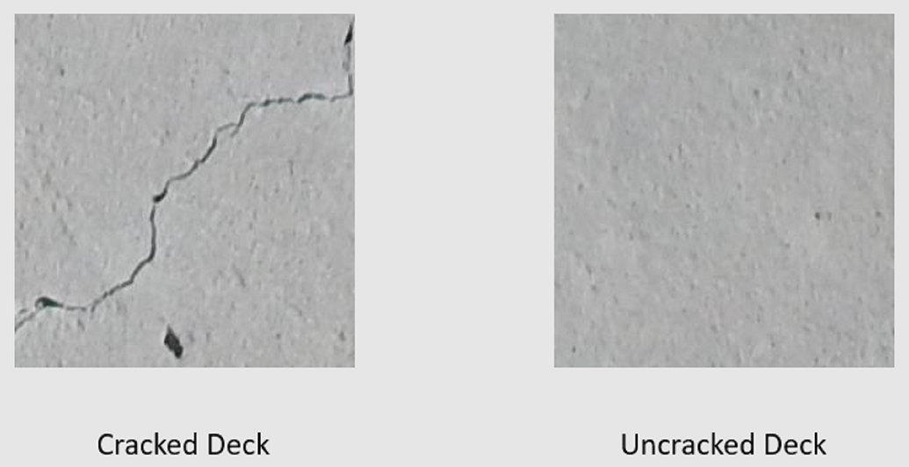

# Image Classification Model Training (two categories) - Preferred API (Based on native TensorFlow transfer learning)

| ML.NET version | API type          | Status                        | App Type    | Data type | Scenario            | ML Task                   | Algorithms                  |
|----------------|-------------------|-------------------------------|-------------|-----------|---------------------|---------------------------|-----------------------------|
| Microsoft.ML.Dnn 0.16.0-preview2 | Dynamic API | Up-to-date | Console app | Image files | Image classification | Image classification with TensorFlow model retrain based on transfer learning  | InceptionV3 or ResNetV2 |

For a detailed explanation of how to build this application, see the accompanying [tutorial](https://docs.microsoft.com/en-us/dotnet/machine-learning/tutorials/image-classification-api-transfer-learning) on the Microsoft Docs site.

## Understanding the problem

Image classification is a computer vision problem. Image classification takes an image as input and categorizes it into a prescribed class. This sample shows a .NET Core console application that trains a custom deep learning model using transfer learning, a pretrained image classification TensorFlow model and the ML.NET Image Classification API to classify images of concrete surfaces into one of two categories, cracked or uncracked.



## Dataset

> The datasets for this tutorial are from Maguire, Marc; Dorafshan, Sattar; and Thomas, Robert J., "SDNET2018: A concrete crack image dataset for machine learning applications" (2018). Browse all Datasets. Paper 48. https://digitalcommons.usu.edu/all_datasets/48

SDNET2018 is an image dataset that contains annotations for cracked and non-cracked concrete structures (bridge decks, walls, and pavement).

The data is organized in three subdirectories:

- D contains bridge deck images
- P contains pavement images
- W contains wall images

Each of these subdirectories contains two additional prefixed subdirectories:

- C is the prefix used for cracked surfaces
- U is the prefix used for uncracked surfaces

In this sample, only bridge deck images are used.

## Prepare Data

1. Unzip the *assets.zip* directory in the project directory.
1. Copy the subdirectories into the *assets* directory.
1. Define the image data schema containing the image path and category the image belongs to. Create a class called `ImageData`.

```csharp
class ImageData
{
    public string ImagePath { get; set; }

    public string Label { get; set; }
}
```

1. Define the input schema by creating the `ModelInput` class. The only columns/properties used for training and making predictions are the `Image` and `LabelAsKey`. The `ImagePath` and `Label` columns are there for convenience to access the original file name and text representation of the category it belongs to respectively.

```csharp
class ModelInput
{
    public byte[] Image { get; set; }
    
    public UInt32 LabelAsKey { get; set; }

    public string ImagePath { get; set; }

    public string Label { get; set; }
}
```

1. Define the output schema by creating the `ModelInput` class.

```csharp
class ModelOutput
{
    public string ImagePath { get; set; }

    public string Label { get; set; }

    public string PredictedLabel { get; set; }
}
```

## Load the data

1.  Before loading the data, it needs to be formatted into a list of `ImageInput` objects. To do so, create a data loading utility method `LoadImagesFromDirectory`.

```csharp
public static IEnumerable<ImageData> LoadImagesFromDirectory(string folder, bool useFolderNameAsLabel = true)
{
    var files = Directory.GetFiles(folder, "*",
        searchOption: SearchOption.AllDirectories);

    foreach (var file in files)
    {
        if ((Path.GetExtension(file) != ".jpg") && (Path.GetExtension(file) != ".png"))
            continue;

        var label = Path.GetFileName(file);

        if (useFolderNameAsLabel)
            label = Directory.GetParent(file).Name;
        else
        {
            for (int index = 0; index < label.Length; index++)
            {
                if (!char.IsLetter(label[index]))
                {
                    label = label.Substring(0, index);
                    break;
                }
            }
        }

        yield return new ImageData()
        {
            ImagePath = file,
            Label = label
        };
    }
}
```

1. Inside of your application, use the `LoadImagesFromDirectory` method to load the data.

```csharp
IEnumerable<ImageData> images = LoadImagesFromDirectory(folder: assetsRelativePath, useFolderNameAsLabel: true);
IDataView imageData = mlContext.Data.LoadFromEnumerable(images);
```

## Preprocess the data

1. Add variance to the data by shuffling it.

```csharp
IDataView shuffledData = mlContext.Data.ShuffleRows(imageData);
```

1. Machine learning models expect input to be in numerical format. Therefore, some preprocessing needs to be done on the data prior to training. First, the label or value to predict is converted into a numerical value. Then, the images are loaded as a `byte[]`.

```csharp
var preprocessingPipeline = mlContext.Transforms.Conversion.MapValueToKey(
        inputColumnName: "Label",
        outputColumnName: "LabelAsKey")
    .Append(mlContext.Transforms.LoadRawImageBytes(
        outputColumnName: "Image",
        imageFolder: assetsRelativePath,
        inputColumnName: "ImagePath"));
```

1. Fit the data to the preprocessing pipeline.

```csharp
IDataView preProcessedData = preprocessingPipeline
                    .Fit(shuffledData)
                    .Transform(shuffledData);
```

1. Create train/validation/test datasets to train and evaluate the model.

```csharp
TrainTestData trainSplit = mlContext.Data.TrainTestSplit(data: preProcessedData, testFraction: 0.3);
TrainTestData validationTestSplit = mlContext.Data.TrainTestSplit(trainSplit.TestSet);

IDataView trainSet = trainSplit.TrainSet;
IDataView validationSet = validationTestSplit.TrainSet;
IDataView testSet = validationTestSplit.TestSet;
```

## Define the training pipeline

```csharp
var classifierOptions = new ImageClassificationTrainer.Options()
{
    FeatureColumnName = "Image",
    LabelColumnName = "LabelAsKey",
    ValidationSet = validationSet,
    Arch = ImageClassificationTrainer.Architecture.ResnetV2101,
    MetricsCallback = (metrics) => Console.WriteLine(metrics),
    TestOnTrainSet = false,
    ReuseTrainSetBottleneckCachedValues = true,
    ReuseValidationSetBottleneckCachedValues = true,
    WorkspacePath=workspaceRelativePath
};

var trainingPipeline = mlContext.MulticlassClassification.Trainers.ImageClassification(classifierOptions)
    .Append(mlContext.Transforms.Conversion.MapKeyToValue("PredictedLabel"));
```

## Train the model

Apply the data to the training pipeline. 

```
ITransformer trainedModel = trainingPipeline.Fit(trainSet);
```

## Use the model
1. Create a utility method to display predictions.

```csharp
private static void OutputPrediction(ModelOutput prediction)
{
    string imageName = Path.GetFileName(prediction.ImagePath);
    Console.WriteLine($"Image: {imageName} | Actual Value: {prediction.Label} | Predicted Value: {prediction.PredictedLabel}");
}
```

### Classify a single image

1. Make predictions on the test set using the trained model. Create a utility method called `ClassifySingleImage`. 

```csharp
public static void ClassifySingleImage(MLContext mlContext, IDataView data, ITransformer trainedModel)
{
    PredictionEngine<ModelInput, ModelOutput> predictionEngine = mlContext.Model.CreatePredictionEngine<ModelInput, ModelOutput>(trainedModel);

    ModelInput image = mlContext.Data.CreateEnumerable<ModelInput>(data,reuseRowObject:true).First();

    ModelOutput prediction = predictionEngine.Predict(image);

    Console.WriteLine("Classifying single image");
    OutputPrediction(prediction);
}
```

1. Use the `ClassifySingleImage` inside of your application.

```csharp
ClassifySingleImage(mlContext, testSet, trainedModel);
```

### Classify multiple images

1. Make predictions on the test set using the trained model. Create a utility method called `ClassifyImages`. 

```csharp
public static void ClassifyImages(MLContext mlContext, IDataView data, ITransformer trainedModel)
{
    IDataView predictionData = trainedModel.Transform(data);

    IEnumerable<ModelOutput> predictions = mlContext.Data.CreateEnumerable<ModelOutput>(predictionData, reuseRowObject: true).Take(10);

    Console.WriteLine("Classifying multiple images");
    foreach (var prediction in predictions)
    {
        OutputPrediction(prediction);
    }
}
```

1. Use the `ClassifyImages` inside of your application.

```csharp
ClassifySingleImage(mlContext, testSet, trainedModel);
```

## Run the application

Run your console app. The output should be similar to that below. You may see warnings or processing messages, but these messages have been removed from the following results for clarity. For brevity, the output has been condensed.

### Bottleneck phase

```text
Phase: Bottleneck Computation, Dataset used:      Train, Image Index: 279
Phase: Bottleneck Computation, Dataset used:      Train, Image Index: 280
Phase: Bottleneck Computation, Dataset used: Validation, Image Index:   1
Phase: Bottleneck Computation, Dataset used: Validation, Image Index:   2
```

### Training phase

```text
Phase: Training, Dataset used: Validation, Batch Processed Count:   6, Epoch:  21, Accuracy:  0.6797619
Phase: Training, Dataset used: Validation, Batch Processed Count:   6, Epoch:  22, Accuracy:  0.7642857
Phase: Training, Dataset used: Validation, Batch Processed Count:   6, Epoch:  23, Accuracy:  0.7916667
```

### Classification Output

```text
Classifying single image
Image: 7001-220.jpg | Actual Value: UD | Predicted Value: UD

Classifying multiple images
Image: 7001-220.jpg | Actual Value: UD | Predicted Value: UD
Image: 7001-163.jpg | Actual Value: UD | Predicted Value: UD
Image: 7001-210.jpg | Actual Value: UD | Predicted Value: UD
Image: 7004-125.jpg | Actual Value: CD | Predicted Value: UD
Image: 7001-170.jpg | Actual Value: UD | Predicted Value: UD
Image: 7001-77.jpg | Actual Value: UD | Predicted Value: UD
```

## Improve the model

- More Data: The more examples a model learns from, the better it performs. Download the full [SDNET2018 dataset](https://digitalcommons.usu.edu/cgi/viewcontent.cgi?filename=2&article=1047&context=all_datasets&type=additional) and use it to train. 
- Augment the data: A common technique to add variety to the data is to augment the data by taking an image and applying different transforms (rotate, flip, shift, crop). This adds more varied examples for the model to learn from.
- Train for a longer time: The longer you train, the more tuned the model will be. Increasing the number of epochs may improve the performance of your model.
- Experiment with the hyper-parameters: In addition to the parameters used in this tutorial, other parameters can be tuned to potentially improve performance. Changing the learning rate, which determines the magnitude of updates made to the model after each epoch may improve performance.
- Use a different model architecture: Depending on what your data looks like, the model that can best learn its features may differ. If you're not satisfied with the performance of your model, try changing the architecture.