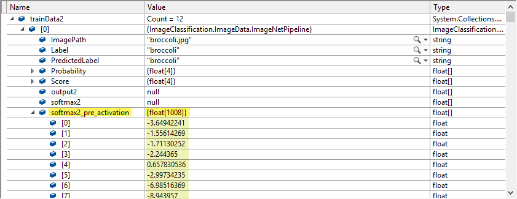
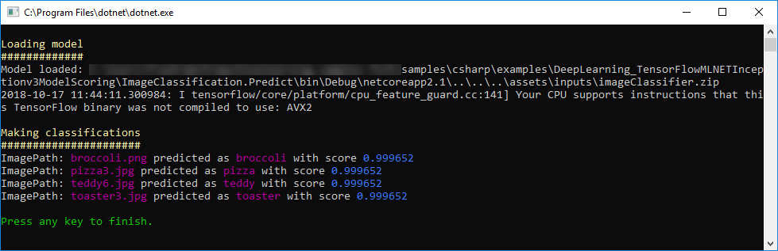

# Image Classification


| ML.NET version | API type          | Status                        | App Type    | Data type | Scenario            | ML Task                   | Algorithms                  |
|----------------|-------------------|-------------------------------|-------------|-----------|---------------------|---------------------------|-----------------------------|
| v0.7.0           | Dynamic API | Needs to update to v0.8 | Console app | .tsv + image files | Image classification | featurization + classification  | deep neural network + SDCA |


## Problem 
Image classification is a common problem which has been solved quite a while using Machine Learning techniques. In this sample, we will review an approach that mixes new techniques (deep learning) and old school (SDCA) techniques.

In this model, we use the [Inception model](https://storage.googleapis.com/download.tensorflow.org/models/inception5h.zip) as a *featurizer* (the model is already stored in the [assets folder](./ImageClassification.Train/assets/inputs/inception/) ). This means that the model will process input images through the neural network, and then it will use the output of the tensor which precedes the classification. This tensor contains the *image features*, which allows to identify an image.

Finally, these image features will be feed to an SDCA algorithm which will learn how to classify different sets of image features.

## DataSet
There are two data sources: the `tsv` file and the image files.  The [tsv file](./ImageClassification.Train/assets/inputs/data/tags.tsv) contains two columns: the first one is defined as `ImagePath` and the second one is the `Label` corresponding to the image. As you can observe, the file does not have a header row, and looks like this:
```tsv
broccoli.jpg	broccoli
pizza.jpg	pizza
pizza2.jpg	pizza
teddy2.jpg	teddy
teddy3.jpg	teddy
teddy4.jpg	teddy
toaster.jpg	toaster
toaster2.png	toaster
```
The training and testing images are located in the assets folders. These images belong to Wikimedia Commons.
> *[Wikimedia Commons](https://commons.wikimedia.org/w/index.php?title=Main_Page&oldid=313158208), the free media repository.* Retrieved 10:48, October 17, 2018 from:  
> https://commons.wikimedia.org/wiki/Pizza  
> https://commons.wikimedia.org/wiki/Toaster  
> https://commons.wikimedia.org/wiki/Teddy_bear  

## ML Task - [Image Classification](https://en.wikipedia.org/wiki/Outline_of_object_recognition)
To solve this problem, first we will build an ML model. Then we will train the model on existing data, evaluate how good it is, and lastly we'll consume the model to classify a new image.


### 1. Build Model
Building the model includes the following steps:
* Loading the tsv file
* Image loading and transformation (resize and normalize pixel values, as required by the deep neural network)
* Image *featurization* using the deep neural network
* Image classification using SDCA

The `TextLoader.CreateReader()` is used to define the schema of the text file that will be used to load images in the training model.
```csharp
 var loader = new TextLoader(env,
 new TextLoader.Arguments
 {
     Column = new[] {
         new TextLoader.Column("ImagePath", DataKind.Text, 0),
         new TextLoader.Column("Label", DataKind.Text, 1)
     }
 });
```
The following step is to define the estimator pipe. Usually, when dealing with deep neural networks, you must adapt the images to the format expected by the network. This is the reason images are resized and then transformed (mainly, pixel values are normalized across all R,G,B channels).
```csharp
 var pipeline = new ValueToKeyMappingEstimator(env, "Label", "LabelTokey") 
    .Append(new ImageLoadingEstimator(env, imagesFolder, ("ImagePath", "ImageReal")))
    .Append(new ImageResizingEstimator(env, "ImageReal", "ImageReal", ImageNetSettings.imageHeight, ImageNetSettings.imageWidth))
    .Append(new ImagePixelExtractingEstimator(env, new[] { new ImagePixelExtractorTransform.ColumnInfo("ImageReal", "input", interleave: ImageNetSettings.channelsLast, offset: ImageNetSettings.mean) }))
    .Append(new TensorFlowEstimator(env, featurizerModelLocation, new[] { "input" }, new[] { "softmax2_pre_activation" }))
    .Append(new SdcaMultiClassTrainer(env, "softmax2_pre_activation", "LabelTokey"))
    .Append(new KeyToValueEstimator(env, ("PredictedLabel", "PredictedLabelValue")));
```

### 2. Train model
In order to begin the training, we declare a datasource and then execute `Fit` on the built pipeline:
```csharp
 var data = loader.Read(new MultiFileSource(dataLocation));
 var model = pipeline.Fit(data);

```
As a reference, In the following screenshot, you can check the DataView used to train the SDCA; this DataView includes the property named `softmax2_pre_activation` (also known as *image features*), which content is produced by the `ApplyTensorFlowGraph` function.  



### 3. Evaluate model
After the training, we evaluate the model using the training data. The `Evaluate` function needs a `IDataView` as parameter, so we apply `Transform` to the model, and then take the `AsDynamic` value.
```csharp
 var sdcaContext = new MulticlassClassificationContext(env);
 ConsoleWriteHeader("Classification metrics");
 var metrics = sdcaContext.Evaluate(trainData, label: "LabelTokey", predictedLabel: "PredictedLabel");
 Console.WriteLine($"LogLoss is: {metrics.LogLoss}");
 Console.WriteLine($"PerClassLogLoss is: {String.Join(" , ", metrics.PerClassLogLoss.Select(c => c.ToString()))}");
```

Finally, we save the model:
```csharp
using (var f = new FileStream(outputModelLocation, FileMode.Create))
    model.SaveTo(env, f);
```

#### Model training
You should proceed as follows in order to train a model your model:
1) Set `ImageClassification.Train` as starting project in Visual Studio
2) Press F5 in Visual Studio. After some seconds, the process will finish and the output should be similar to the following screenshot:


### 4. Consume model
First, we need to load the model created during Model training
```csharp
ITransformer loadedModel;
using (var f = new FileStream(modelLocation, FileMode.Open))
    loadedModel = TransformerChain.LoadFrom(env, f);
```

Then, we proceed to create a predictor function, and make predictions:
```csharp
var predictor = loadedModel.MakePredictionFunction<ImageNetData, ImageNetPrediction>(env);
var pred = predictor.Predict(testImage);
```
The prediction function receives as parameter an object of type `ImageNetData` (containing 2 properties: `ImagePath` and `Label`). Then returns and object of type `ImagePrediction`, which holds the `PredictedLabel` and `Score` (*probability* value between 0 and 1) properties.

#### Model testing
1) Copy the model produced by the training model (located at [ImageClassification.Train](./ImageClassification.Train/)/[assets](./ImageClassification.Train/assets/)/[outputs](./ImageClassification.Train/assets/outputs/)/[imageClassifier.zip](./ImageClassification.Train/assets/outputs/imageClassifier.zip) ) to the prediction project (at [ImageClassification.Predict](./ImageClassification.Predict/)/[assets](./ImageClassification.Predict/assets/)/[inputs](./ImageClassification.Predict/assets/inputs/)/[imageClassifier.zip](./ImageClassification.Predict/assets/inputs/imageClassifier.zip) ).
2) Set VS default startup project: Set `ImageClassification.Predict` as starting project in Visual Studio. 
3) Press F5 in Visual Studio. After some seconds, the process will finish and the output should be similar to the following screenshot:

