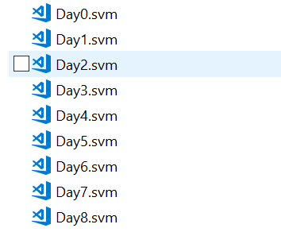

# Large Datasets - URL classification

| ML.NET version | API type          | Status                        | App Type    | Data type | Scenario            | ML Task                   | Algorithms                  |
|----------------|-------------------|-------------------------------|-------------|-----------|---------------------|---------------------------|-----------------------------|
| v1.4           | Dynamic API | Up-to-date | Console app | .txt files | Large datasets | Binary classification | FieldAwareFactorizationMachine |

In this introductory sample, you'll see how to use [ML.NET](https://www.microsoft.com/net/learn/apps/machine-learning-and-ai/ml-dotnet) to deal with **large datasets containing millions of records and thousands/millions of features**. ML.Net API can handle upto **1TB** of data. 

In this sample we are using URL dataset to classify whether an URL is malicious or not. In the world of machine learning, this type of classification is known as **binary classification**.

## Dataset
The dataset used is this: [URL Reputation Data Set] (https://archive.ics.uci.edu/ml/datasets/URL+Reputation)
This dastaset is collection of 120-days data which contains **2.3 million records** and **3.2 million features**.

* The first column is **Label** column where
  - +1 corresponds to Malicious URL
  - -1 corresponds to Benign URL
* Remaining columns are **features** which are arranged in [sparse matrix](https://en.wikipedia.org/wiki/Sparse_matrix) format. 

If you download and extract the dataset it contains 120 files for 120 days as shown below. The filename is in DayX.svm format. where 'X' is day number from 1-120.



The data in each file looks like below.

```CSharp
-1 4:0.0788382 5:0.124138 6:0.117647 11:0.428571 16:0.1 17:0.749633 18:0.843029 19:0.197344 21:0.142856 22:0.142857 23:0.142857 28:1 33:0.0555556 41:0.1 54:1 56:1 64:1 70:1 72:1 74:1 76:1 82:1 84:1 86:1 88:1 90:1 92:1 94:1 96:1 102:1 104:1 106:1 108:1 110:1 112:1 155:1 190:1 204:1 359:1 360:1 361:1 1306:1 1309:1 1310:1 1311:1 2408:1 2921:1 2923:1 7000:1 7001:1 7002:1 7005:1 7006:1 7007:1 7009:1 7010:1 7759:1 7762:1 155153:1 155154:1 155155:1 155156:1 155157:1 155158:1 155159:1 155160:1 155161:1 155163:1 155164:1 155165:1 155166:1 155168:1 155169:1 155170:1 155172:1 155173:1 155174:1 155175:1 155176:1 155177:1 155178:1 155179:1 155180:1 155181:1 155182:1 155183:1 155194:1 155195:1 155196:1 155197:1 155198:1 155199:1 155200:1 155201:1 155202:1 155203:1 155204:1 155205:1 155206:1 155207:1 155208:1 155209:1 155210:1 155211:1 155212:1 155213:1 945789:1 1988571:1 2139257:1 2987739:1 3224681:1
```

## Problem
The main problem here is to deal with a dataset with **many columns** with **sparse data** (millions of columns per row, however only around 200 columns have data, per row).

## Solution
As the columns in dataset are in **sparse format**, the **sparse format** requires a new column to be the **number of features**. So we need to prepare the data by adding a new column with the value as **total number of features in the dataset**. The column should be added before all of the features i.e second column in this case.  Then we will build an ML model and will train the model on existing data, evaluate how good it is, and lastly we'll consume the model to predict a sentiment for new reviews.


### 1. Build model

**Download Data:**

* In this sample, we are downloading the dataset using **HttpClient** as the dataset is very large. The downloaded data path will be "your_project_directory/Data/OriginalUrlData/url_svmlight"

```CSharp
//STEP 1: Download dataset
DownloadDataset(originalDataDirectoryPath);
```

**Prepare Data:**
* As the downloaded dataset contains feature columns in **sparse matrix format**, we need to prepare the dataset by adding a new column that is **total number of features in dataset**   before the  features columns(second column in this case) so that the dataset is compatable   for ML.Net API for training and evaluation. As our dataset contains **3231961** features, all the rows in all files contain **3231961**  as second column value after preparation.

**Note:** As the preparation of data takes some time around 2-3 minutes, this step does not run every time if the data is already trasformed. If you need this to be run everytime then remove the condition if (Directory.GetFiles(preparedDataPath).Length == 0) inside PrepareDataset() method.

```CSharp
//Step 2: Prepare data by adding second column with value total number of features.
PrepareDataset(originalDataPath, preparedDataPath);
```
**Original data:**
```CSharp
-1 4:0.0788382 5:0.124138 6:0.117647 11:0.428571 16:0.1.....
```

**Preapred data**
```CSharp
-1 3231961 4:0.0788382 5:0.124138 6:0.117647 11:0.428571 16:0.1.....
```	

* Define the schema of dataset using **UrlData** class. 

```CSharp
public class UrlData
    {
        [LoadColumn(0)]
        public string LabelColumn;
        
        [LoadColumn(1, 3231961)]
        [VectorType(3231961)]
        public float[] FeatureVector;
    }
```
* Load the data into dataview using Text Loader. 

* To load multiple files from a folder, you need specify wild card character like *. For more information on how to load multiple files check this [ML.Net API documentation](https://docs.microsoft.com/en-us/dotnet/machine-learning/how-to-guides/load-data-ml-net#load-data-from-multiple-files) 

**Note:** As columns in dataset are sparse format we need to set **allowSparse** parameter to **true**.

```CSharp
//STEP 3: Common data loading configuration
var fullDataView = mlContext.Data.LoadFromTextFile<UrlData>(path: Path.Combine(preparedDataPath, "*"),
                                                      hasHeader: false,
                                                      allowSparse: true);
```                                               

* split the full dataview into 80-20 ratio to train and test data

```CSharp
//Step 4: Divide the whole dataset into 80% training and 20% testing data.
TrainTestData trainTestData = mlContext.Data.TrainTestSplit(fullDataView, testFraction: 0.2, seed: 1);
IDataView trainDataView = trainTestData.TrainSet;
IDataView testDataView = trainTestData.TestSet;
```
* ML.Net API accepts Label value in **Boolean** format. Our dataset contains Label value in **string** format. So map the string values of label into to boolean values.

```CSharp
//Step 5: Map label value from string to bool
var UrlLabelMap = new Dictionary<string, bool>();
UrlLabelMap["+1"] = true; //Malicious url
UrlLabelMap["-1"] = false; //Benign 
var dataProcessingPipeLine = mlContext.Transforms.Conversion.MapValue("LabelKey", UrlLabelMap, "LabelColumn");
```

* Choosing a trainer/learning algorithm (such as `FieldAwareFactorizationMachine`) to train the model with. 

```CSharp
//Step 6: Append trainer to pipeline
 var trainingPipeLine = dataProcessingPipeLine.Append(
                mlContext.BinaryClassification.Trainers.FieldAwareFactorizationMachine(labelColumnName: "LabelKey", featureColumnName: "FeatureVector")); 
```

### 2. Train model
Training the model is a process of running the chosen algorithm on a training data (with known sentiment values) to tune the parameters of the model. It is implemented in the `Fit()` method from the Estimator object. 

To perform training you need to call the `Fit()` method while providing the training dataset in a DataView object.

```CSharp
//Step 7: Train the model
ITransformer trainedModel = pipeline.Fit(trainDataView);
```

Note that ML.NET works with data with a lazy-load approach, so in reality no data is really loaded in memory until you actually call the method .Fit().

### 3. Evaluate model

We need this step to conclude how accurate our model operates on new data. To do so, the model from the previous step is run against another dataset that was not used in training (`testDataView`). This dataset also contains known sentiments. 

`Evaluate()` compares the predicted values for the test dataset and produces various metrics, such as accuracy, you can explore.

```CSharp
var predictions = trainedModel.Transform(testDataView);
var metrics = mlContext.BinaryClassification.Evaluate(data: predictions, labelColumnName: "Label", scoreColumnName: "Score");
```

### 4. Consume model

After the model is trained, you can use the `Predict()` API check if a URL is malicious or benign. Here I have taken first 4 rows from the testDataView for prediction as it is difficult to create a sample data with millions of features manually.

```CSharp
// Create prediction engine related to the loaded trained model
var predEngine = mlContext.Model.CreatePredictionEngine<UrlData, UrlPrediction>(mlModel);                 

var sampleDatas = CreateSingleDataSample(mlContext, trainDataView);
foreach (var sampleData in sampleDatas)
{
    UrlPrediction predictionResult = predEngine.Predict(sampleData);
    Console.WriteLine($"Single Prediction --> Actual value: {sampleData.LabelColumn} | Predicted value: {predictionResult.Prediction}");
}

```


