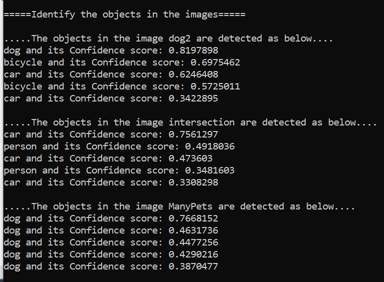

# Object Detection

| ML.NET version | API type          | Status                        | App Type    | Data type | Scenario            | ML Task                   | Algorithms                  |
|----------------|-------------------|-------------------------------|-------------|-----------|---------------------|---------------------------|-----------------------------|
| v1.3.1           | Dynamic API | Up-to-date | Console app | .tsv + image files | Object Detection | Deep Learning  | Tiny Yolo2 ONNX model |

## Problem 
Object detection is one of the classical problems in computer vision: Recognize what the objects are inside a given image and also where they are in the image. For these cases, you can either use pre-trained models or train your own model to classify images specific to your custom domain. 

 
## DataSet
There are two data sources: the `tsv` file and the image files.  The [tsv file](./ObjectDetectionConsoleApp/assets/images/tags.tsv) contains two columns: the first one is defined as `ImagePath` and the second one is the `Label` corresponding to the image. As you can observe, the file does not have a header row, and looks like this:
```tsv
dog2.jpg	dog2
Intersection-Counts.jpg	intersection
ManyPets.jpg	ManyPets
```
The images are located in the [assets](./ObjectDetectionConsoleApp/assets/images) folder. These images have been downloaded some images from internet 

## Pre-trained model
There are multiple models which are pre-trained for identifying multiple objects in the images. here we are using the pretrained model, **Tiny Yolo2** in  **ONNX** format. This model is a real-time neural network for object detection that detects 20 different classes. It is made up of 9 convolutional layers and 6 max-pooling layers and is a smaller version of the more complex full [YOLOv2](https://pjreddie.com/darknet/yolov2/) network.

The Open Neural Network eXchange i.e [ONNX](http://onnx.ai/) is an open format to represent deep learning models. With ONNX, developers can move models between state-of-the-art tools and choose the combination that is best for them. ONNX is developed and supported by a community of partners.

The model is downloaded from the [ONNX Model Zoo](https://github.com/onnx/models/tree/master/tiny_yolov2) which is a is a collection of pre-trained, state-of-the-art models in the ONNX format.

The Tiny YOLO2 model was trained on the [Pascal VOC](http://host.robots.ox.ac.uk/pascal/VOC/) dataset. Below are the model's prerequisites. 

**Model input and output**

**Input**

Input image of the shape (3x416x416)  

**Output**

Output is a (1x125x13x13) array   

**Pre-processing steps**

Resize the input image to a (3x416x416) array of type float32.

**Post-processing steps**

The output is a (125x13x13) tensor where 13x13 is the number of grid cells that the image gets divided into. Each grid cell corresponds to 125 channels, made up of the 5 bounding boxes predicted by the grid cell and the 25 data elements that describe each bounding box (5x25=125). For more information on how to derive the final bounding boxes and their corresponding confidence scores, refer to this [post](http://machinethink.net/blog/object-detection-with-yolo/).


##  Solution
The console application project `ObjectDetection` can be used to to identify objects in the sample images based on the **Tiny Yolo2 ONNX** model. 

Again, note that this sample only uses/consumes a pre-trained ONNX model with ML.NET API. Therefore, it does **not** train any ML.NET model. Currently, ML.NET supports only for scoring/detecting with existing ONNX trained models. 

You need to follow next steps in order to execute the classification test:

1) **Set VS default startup project:** Set `ObjectDetection` as starting project in Visual Studio.
2)  **Run the training model console app:** Hit F5 in Visual Studio. At the end of the execution, the output will be similar to this screenshot:



##  Code Walkthrough
There is a single project in the solution named `ObjectDetection`, which is responsible for loading the model in Tiny Yolo2 ONNX format and then detects objects in the images.

### ML.NET: Model Scoring

Define the schema of data in a class type and refer that type while loading data using TextLoader. Here the class type is **ImageNetData**. 

```fsharp
[<CLIMutable>]
type ImageNetData =
    {
        [<LoadColumn(0)>]
        ImagePath : string
        [<LoadColumn(1)>]
        Label : string
    }
```


The first step is to load the data using TextLoader

```fsharp
let data = mlContext.Data.LoadFromTextFile<ImageNetData>(imagesFolder, hasHeader=true
```

The image file used to load images has two columns: the first one is defined as `ImagePath` and the second one is the `Label` corresponding to the image. 

It is important to highlight that the label in the `ImageNetData` class is not really used when scoring with the Tiny Yolo2 Onnx model. It is used when to print the labels on the console. 

```csv
dog2.jpg	dog2
Intersection-Counts.jpg	intersection
ManyPets.jpg	ManyPets
```
As you can observe, the file does not have a header row.

The second step is to define the estimator pipeline. Usually, when dealing with deep neural networks, you must adapt the images to the format expected by the network. This is the reason images are resized and then transformed (mainly, pixel values are normalized across all R,G,B channels).

```fsharp
let pipeline = 
	EstimatorChain()
		.Append(mlContext.Transforms.LoadImages("image", imageFolder = imagesFolder, inputColumnName = "ImagePath"))
		.Append(mlContext.Transforms.ResizeImages("image", imageWidth = imageWidth, imageHeight = imageHeight, inputColumnName = "image"))
		.Append(mlContext.Transforms.ExtractPixels("image"))
		.Append(mlContext.Transforms.ApplyOnnxModel(modelFile = modelFilePath, outputColumnNames = [|"grid"|], inputColumnNames = [|"image"|]))
```
You also need to check the neural network, and check the names of the input / output nodes. In order to inspect the model, you can use tools like [Netron](https://github.com/lutzroeder/netron), which is automatically installed with [Visual Studio Tools for AI](https://visualstudio.microsoft.com/downloads/ai-tools-vs/). 
These names are used later in the definition of the estimation pipe: in the case of the inception network, the input tensor is named 'image' and the output is named 'grid'

Define the **input** and **output** parameters of the Tiny Yolo2 Onnx Model.

```fsharp
[<Literal>]
let InputTensorName = "image"
[<Literal>]
let OutputTensorName = "grid"
```


Finally, we extract the prediction engine after *fitting* the estimator pipeline. The prediction engine receives as parameter an object of type `ImageNetData` (containing 2 properties: `ImagePath` and `Label`), and then returns and object of type `ImagePrediction`.  

```
let model = pipeline.Fit(data)
mlContext.Model.CreatePredictionEngine<ImageNetData, ImageNetPrediction>(model)
```
When obtaining the prediction, we get an array of floats in the property `PredictedLabels`. The array is a float array of size **21125**. This is the output of model i,e 125x13x13 as discussed earlier. This output is interpreted by YoloMlPraser class and returns a number of bounding boxes for each image. Again these boxes are filtered so that we retrieve only 5 bounding boxes which have better confidence(how much certain that a box contains the obejct) for each object of the image. On console we display the label value of each bounding box.

**Note** The Tiny Yolo2 model is not having much accuracy compare to full YOLO2 model. As this is a sample program we are using Tiny version of Yolo model i.e Tiny_Yolo2


