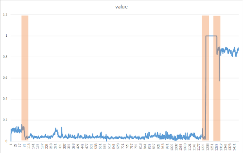

# Spike Detection and Change Point Detection of Shampoo sales

| ML.NET version | API type          | Status                        | App Type    | Data type | Scenario            | ML Task                   | Algorithms                  |
|----------------|-------------------|-------------------------------|-------------|-----------|---------------------|---------------------------|-----------------------------|
| v1.3.1         | Dynamic API | Up-to-date | Console app | .csv files | Shampoo  sales Spike detection| Time Series - Anomaly Detection | IID Spike Detection and IID Change point Detection |

In this introductory sample, you'll see how to use [ML.NET](https://www.microsoft.com/net/learn/apps/machine-learning-and-ai/ml-dotnet) to detect **spikes** and **Change points** in shampoo sales. In the world of machine learning, this type of task is called TimeSeries Anomaly Detection.

## Problem
We are having data on shampoo sales over 3 years period in which the sales are high and normal. we identify sudden spikes in shampoo sales so that we can use this spiked data to analyze trends in sales of shampoo. 
We find the change point from 

To solve this problem, we will build an ML model that takes as inputs: 
* Year-Month
* Sales of shampoo over 3 years period

and predicts the spikes in shampoo sales.

## Dataset
The dataset is available at this [DataMart](https://datamarket.com/data/set/22r0/sales-of-shampoo-over-a-three-year-period#!ds=22r0&display=line)

The algorithms **IID Spike Detection** or **IID Change point Detection** are suited for dataset that is **independent and identically distributed**. In probability theory and statistics, a collection of random variables is independent and identically distributed(IID) if each random variable has the same probability distribution as the others and all are mutually independent. More information is available on wikipedia [here](https://en.wikipedia.org/wiki/Independent_and_identically_distributed_random_variables)

## ML task - Time Series Anomaly Detection
Anomaly detection is the process of detecting outliers in the data.Anomaly detection in time-series refers to detecting time stamps, or points on a given input time-series, at which the time-series behaves differently from what was expected. These deviations are typically indicative of some events of interest in the problem domain: a cyber-attack on user accounts, power outage, bursting RPS on a server, memory leak, etc.

On the other hand, an anomalous behavior can be either persistent over time or just a temporary burst.There are 2 types of anomalies in this context: **spikes** which are attributed to temporary bursts and **change points** which indicate the beginning of persistent changes in the system. 

## Spike Detection
Spikes are attributed to sudden yet temporary bursts in the values of the input time-series.  In practice, they can happen due to a variety of reasons depending on the application: outages, cyber-attacks, viral web content, etc. Therefore, in many applications, it is important to detect spikes.


## Change point Detection
​Change points mark the beginning of more persistent deviations in the behavior of time-series from what was expected.In practice, these type of changes in the behavior of time-series are usually triggered by some fundamental changes in the dynamics of the system. For example, in system telemetry monitoring, an introduction of a memory leak can cause a (slow) trend in the time-series of memory usage after certain point in time. 



## Solution
To solve this problem, you build and train an ML model on existing training data, evaluate how good it is (analyzing the obtained metrics), and lastly you can consume/test the model to predict the demand given input data variables.


However, in this example we will build and train the model to demonstrate the Time Series anomaly detection library since it detects on actual data and does not have an evaluate method.  We will then review the detected anomalies in the Prediction output column.

The process of building and training models is the same for spike detection and change point detection; the main difference is the algorithm that you use (DetectIidSpike vs. DetectIidChangePoint).

### 1. Build model

Building a model includes: Building a model includes: 

* Define the data's schema maped to the datasets to load ('shampoo-sales.csv`) with a TextLoader.

* Create an Estimator by choosing a trainer/learning algorithm (such as `DetectIIDSpike`) to train the model with. 

The initial code is similar to the following:


```fsharp
// Create MLContext to be shared across the model creation workflow objects 
let mlcontext = MLContext()

//STEP 1: Common data loading configuration
let dataView = mlcontext.Data.LoadFromTextFile<ShampooSalesData>(path=datasetPath, hasHeader=true, separatorChar=',')

//STEP 2: Set the training algorithm    
let trainingPipeLine =
	mlcontext.Transforms.DetectIidSpike("Prediction", "numSales", confidence=95, pvalueHistoryLength=size / 4)
```

### 2. Train model
Training the model is a process of running the chosen algorithm on a training data to tune the parameters of the model. It is implemented in the `Fit()` API.

 To perform training we just call the `Fit()` method while providing the while providing the training dataset (`shampoo-sales.csv` file) in a DataView object.
```fsharp
let trainedModel = trainingPipeLine.Fit(dataView)
```

### 3. Consume model
We don't have evaulate step in TimeSeries Anomaly detection. We use the trained model to predict the anomalies in the data.  

```fsharp
//Apply data transformation to create predictions.
let transformedData = trainedModel.Transform(dataView)
let predictions = mlcontext.Data.CreateEnumerable<ShampooSalesPrediction>(transformedData, reuseRowObject=false)
	   
printfn "Alert\tScore\tP-Value"

predictions
|> Seq.iter 
	(fun p ->
		if p.Prediction.[0] = 1.0 then
			Console.BackgroundColor <- ConsoleColor.DarkYellow
			Console.ForegroundColor <- ConsoleColor.Black
		printfn "%f\t%.2f\t%.2f" p.Prediction.[0] p.Prediction.[1] p.Prediction.[2]
		Console.ResetColor()
	)
}

//sample output
// Prediction column obtained post-transformation.
   // Alert   Score   P-Value   
    //0       122.90  0.13
    //1       336.50  0.00<-- alert is on, predicted spike
    //0       185.90  0.48
    //0       194.30  0.48
    //0       149.50  0.24
    //0       210.10  0.42
    //0       273.30  0.19
    //0       191.40  0.43
    //0       287.00  0.17
    //0       226.00  0.45
    //0       303.60  0.18
    //0       289.90  0.19
    //1       421.60  0.00 <-- alert is on, predicted spike
    //0       264.50  0.47
```

### Change Point Detection console output

```
Alert   Score   P-Value Martingale value
0       266.00  0.50    0.00
0       145.90  0.00    2.33
0       183.10  0.41    2.80
0       119.30  0.13    9.16
0       180.30  0.47    9.77
0       168.50  0.47    10.41
0       231.80  0.19    24.46
0       224.50  0.27    42.38
1       192.80  0.48    44.23  <-- alert is on, predicted changepoint
0       122.90  0.13    145.25
0       336.50  0.00    0.01
0       185.90  0.48    0.01
```
