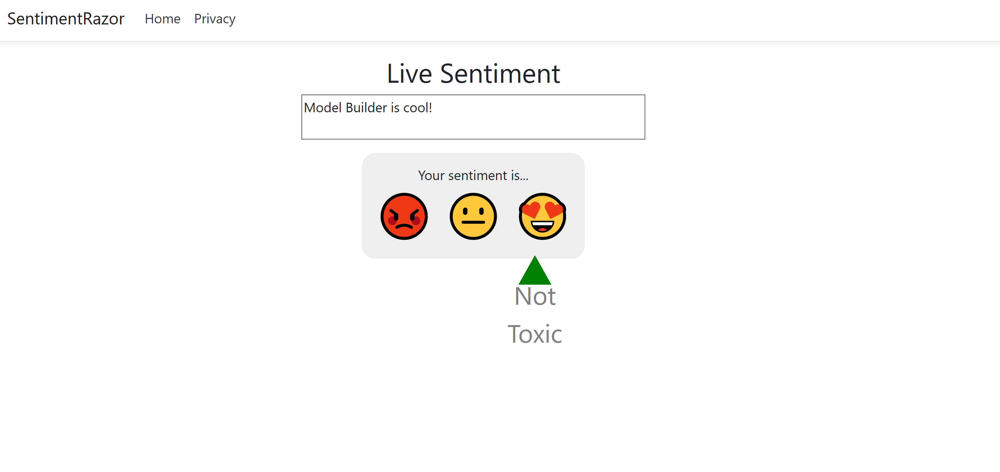

# Sentiment Analysis: Razor Pages sample optimized for scalability and performance when running/scoring an ML.NET model built with Model Builder (Using the new '.NET Core Integration Package for ML.NET')


| ML.NET version | Status                        | App Type    | Data type | Scenario            | ML Task                   | Algorithms                  |
|----------------|-------------------------------|-------------|-----------|---------------------|---------------------------|-----------------------------|
| v1.3.1           | Up-to-date | Razor Pages | Single data sample | Sentiment Analysis | Binary classification | Linear Classification |

## Goal

Create a *Razor Pages* web application that hosts an ML.NET binary classification machine learning model trained using *Model Builder* to analyze the sentiment of comments from a website.



## Application

- SentimentRazor: A .NET Core Razor Pages web application that uses a binary classification model to analyze sentiment from comments made on the website. 
- SentimentRazorML.ConsoleApp: A .NET Core Console application that contains the model training and test prediction code.
- SentimentRazorML.Model: A .NET Standard class library containing the data models that define the schema of input and output model data as well as the persisted version of the best performing model during training.

### The data

Each row in the [*wikipedia-detox-250-line-data.tsv*](https://raw.githubusercontent.com/dotnet/machinelearning/master/test/data/wikipedia-detox-250-line-data.tsv) dataset represents a different review left by a user on Wikipedia. The first column represents the sentiment of the text (0 is non-toxic, 1 is toxic), and the second column represents the comment left by the user. The columns are separated by tabs. The data looks like the following:

| Sentiment | SentimentText |
| :---: | :---: |
1 | ==RUDE== Dude, you are rude upload that carl picture back, or else.
1 | == OK! ==  IM GOING TO VANDALIZE WILD ONES WIKI THEN!!!
0 | I hope this helps.

### The model

The goal of the application is to predict whether a comment's sentiment belongs to one of two categories (toxic/not-toxic). The Machine Learning Task to use in this scenario is binary classification. The model in this application was trained using Model Builder.

[Model Builder](https://marketplace.visualstudio.com/items?itemName=MLNET.07) is an intuitive graphical Visual Studio extension to build, train, and deploy custom machine learning models.

Model Builder uses automated machine learning (AutoML) to explore different machine learning algorithms and settings to help you find the one that best suits your scenario.

You don't need machine learning expertise to use Model Builder. All you need is some data, and a problem to solve. Model Builder generates the code to add the model to your .NET application.

In this solution, both the *SentimentRazorML.ConsoleApp* and *SentimentRazorML.Model* projects are autogenerated by Model Builder. 

### The web application

Users interact with the application through a Razor Pages website. In a text box on the main page of the application, a user enters a comment which triggers a handler on the page's model to use the input to predict the sentiment of the comment using the trained model. 

#### Challenges

A challenge when making a single prediction with an ML.NET model in multi-threaded applications is that the PredictionEngine is not thread-safe. 

#### Solutions

For improved performance and thread safety, use the `PredictionEnginePool` service, which creates an `ObjectPool` of `PredictionEngine` objects for application use. To use it within your application, add the `Microsoft.Extensions.ML` NuGet package to your project and register the `PredictionEnginPool` as you would any other dependency inside the `Startup` class of the *SentimentRazorML* project. 

```csharp
services.AddPredictionEnginePool<ModelInput, ModelOutput>()
        .FromFile(_modelPath);
```

Then, inside the handler or action where the prediction is to be made, call use `Predict` method like you would with a `PredictionEngine`.

```csharp
var prediction = _predictionEnginePool.Predict(input);
```

## Try a different dataset

If you want to try out the application with a dataset that produces better results such as the UCI Sentiment Labeled Sentences dataset, you can make the following adjustments. 

### Get the data

1. Download [UCI Sentiment Labeled Sentences dataset ZIP file](https://archive.ics.uci.edu/ml/machine-learning-databases/00331/sentiment%20labelled%20sentences.zip) anywhere on your computer, and unzip it.	
1. Open PowerShell and navigate to the unzipped folder in the previous step	
1. By default, the file does not have column names. To add column names to the training data, use the following PowerShell commands:	

    ```powershell	
    echo "Comment`tSentiment" | sc yelp_labelled_columns.tsv; cat yelp_labelled.tsv | sc yelp_labelled_columns.tsv	
    ```

The output generated by the previous commands is a new file called *yelp_labelled_columns.tsv* containing the original data with the respective column names. 

Each row in the *yelp_labelled_columns.tsv* dataset represents a different restaurant review left by a user on Yelp. The first column represents the comment left by the user, and the second column represents the sentiment of the text (0 is negative, 1 positive). The columns are separated by tabs. The data looks like the following:

| Comment | Sentiment |
| :---: | :---: |
Wow... Loved this place.| 1	
Crust is not good.	    | 0	
Not tasty and the texture was just nasty. | 0

### Train and use the model

1. Use model builder to train a binary classification model using the new dataset. 
2. Update the `OnGetAnalyzeSentiment` handler in the *Index.cshtml.cs* file.

```csharp
public IActionResult OnGetAnalyzeSentiment([FromQuery] string text)
{
        if (String.IsNullOrEmpty(text)) return Content("Neutral");
        var input = new ModelInput { Comment = text };
        var prediction = _predictionEnginePool.Predict(input);
        var sentiment = Convert.ToBoolean(prediction.Prediction) ? "Positive" : "Negative";
        return Content(sentiment);
}
```

3. Update the `updateSentiment` function in the *site.js* file

```javascript
function updateSentiment() {

var userInput = $("#Message").val();

getSentiment(userInput)
        .then((sentiment) => {
        switch (sentiment) {
                case "Positive":
                updateMarker(100.0,sentiment);
                break;
                case "Negative":
                updateMarker(0.0,sentiment);
                break;
                default:
                updateMarker(45.0, "Neutral");
        }
        });
}
```
