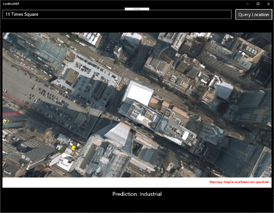

# Image Classification in Azure with Model Builder

| ML.NET version | Status                        | App Type    | Data type | Scenario            | ML Task                   | Algorithms                  |
|----------------|-------------------------------|-------------|-----------|---------------------|---------------------------|-----------------------------|
| v1.5.0-preview           | Up-to-date | UWP & ASP.NET Core WebAPI | Single data sample | Image Classification | Image Classification | ResNet50 |

## Goal

Train a deep learning image classification model in Azure. The model classifies land use by analyzing satellite images.

## Application

- **LandUseAPI**: A C# ASP.NET Core Web API that hosts the trained ML.NET.
- **LandUseML.ConsoleApp**: A C# .NET Core console application that provides starter code to build the prediction pipeline and make predictions.
- **LandUseML.Model**: A C# .NET Standard application that contains the data models that define the schema of input and output model data as well as the following assets:  

    - bestModel.onnx: A serialized version of the model in Open Neural Network Exchange (ONNX) format. ONNX is an open source format for AI models that supports interoperability between frameworks like ML.NET, PyTorch and TensorFlow.
    - bestModelMap.json: A list of categories used when making predictions to map the model output to a text category.
    - MLModel.zip: A serialized version of the ML.NET prediction pipeline that uses the serialized version of the model bestModel.onnx to make predictions and maps outputs using the bestModelMap.json file.

- **LandUseUWP**: Universal Windows Platform (UWP) application that consumes the model to classify satellite map images of locations provided by the user.

## The data

The dataset used in this sample is a subset of the RGB [EuroSAT dataset](https://github.com/phelber/EuroSAT). The original dataset is from:

- Eurosat: A novel dataset and deep learning benchmark for land use and land cover classification. Patrick Helber, Benjamin Bischke, Andreas Dengel, Damian Borth. IEEE Journal of Selected Topics in Applied Earth Observations and Remote Sensing, 2019.
- Introducing EuroSAT: A Novel Dataset and Deep Learning Benchmark for Land Use and Land Cover Classification. Patrick Helber, Benjamin Bischke, Andreas Dengel. 2018 IEEE International Geoscience and Remote Sensing Symposium, 2018.


The subset of the dataset contains 10 different image categories. Each category has 2000 images. The categories are the following:

- Annual Crop
- Forest
- Herbaceous Vegetation
- Highway
- Industrial
- Pasture
- Permanent Crop
- Residential
- River
- SeaLake

The original RGB version of the dataset which contains 27,000 images is also available for [download](http://madm.dfki.de/files/sentinel/EuroSAT.zip).

## The model

The goal of the application is to categorize what a plot of land is used for using satellite images. The Machine Learning task to use in this scenario is image classification. The model in this application was trained using Model Builder.

[Model Builder](https://marketplace.visualstudio.com/items?itemName=MLNET.07) is an intuitive graphical Visual Studio extension to build, train, and deploy custom machine learning models.

Model Builder uses automated machine learning (AutoML) to explore different machine learning algorithms and settings to help you find the one that best suits your scenario.

You don't need machine learning expertise to use Model Builder. All you need is some data, and a problem to solve. Model Builder generates the code to add the model to your .NET application.

In this solution, both the `LandUseML.ConsoleApp` and `LandUseML.Model` projects are autogenerated by Model Builder.

## The web application

The model is served by the `LandUseAPI` ASP.NET Core Web API project.

The API uses a `PredictionEngine` to make predictions. `PredictionEngine` is a convenience API that uses the model to make predictions on a single data instance. Using dependency injetion, a singleton instance of `PredictionEngine` is registered inside the `ConfigureServices` method of the *Startup.cs* file.

```csharp
services.AddSingleton<PredictionEngine<ModelInput, ModelOutput>>(sp =>
{
    // Initialize MLContext
    MLContext ctx = new MLContext();

    // Register NormalizeMapping
    ctx.ComponentCatalog.RegisterAssembly(typeof(NormalizeMapping).Assembly);

    // Register LabelMapping
    ctx.ComponentCatalog.RegisterAssembly(typeof(LabelMapping).Assembly);

    // Define model path
    var modelPath = Path.Join(Path.GetDirectoryName(Assembly.GetEntryAssembly().Location), "MLModel.zip");

    //Load model
    ITransformer mlModel = ctx.Model.Load(modelPath, out var modelInputSchema);

    // Create prediction engine
    var predEngine = ctx.Model.CreatePredictionEngine<ModelInput,ModelOutput>(mlModel);

    return predEngine;
});
```

Inside the `ClassificationController`, the `PredictionEngine` is injected

```csharp
private readonly PredictionEngine<ModelInput, ModelOutput> _predictionEngine;
private readonly object _predictionEngineLock = new object();

public ClassificationController(PredictionEngine<ModelInput, ModelOutput> predictionEngine)
{
    _predictionEngine = predictionEngine;
}
```

Then, a method inside the controller accepts incoming image data via an HTTP POST request and uses the `PredictioneEngine` to classify the image.

```csharp
[HttpPost]
public async Task<string> ClassifyImage([FromBody] Dictionary<string, string> input)
{
    string prediction;
    string imagePath = Path.Join(Path.GetDirectoryName(Assembly.GetEntryAssembly().Location), "inputimage.jpeg");

    // Get raw image bytes
    var imageBytes = Convert.FromBase64String(input["data"]);

    using (var ms = new MemoryStream(imageBytes))
    {
        // Save the image to a file
        using (var img = await Task.Run(() => Image.FromStream(ms)))
            await Task.Run(() => img.Save(imagePath));
    }

    lock (_predictionEngineLock)
    {
        // Use Prediction to classify image
        ModelOutput output = _predictionEngine.Predict(new ModelInput { ImageSource = imagePath });
        prediction = output.Prediction;
    }

    return prediction;
}
```

## The desktop application



The desktop application provides an interface for users to query locations anywhere around the world. Once a user enters an address into the text bar, the `QueryLocation_Clicked` event handler inside of the *MainPage.xaml.cs* file executes a series of operations. One of those operations is making an HTTP POST request to the **LandUseAPI** ASP.NET Core Web API to classify the satellite image of the address the user provides.

```csharp
private async void QueryLocation_Click(object sender, RoutedEventArgs e)
{
    // 1. Get coordinates for address
    var coordinates = await GetCoordinatesAsync(AddressBar.Text);

    // 2. Update map with new coordinates
    await UpdateMapLocationAsync(SatelliteMap, coordinates);

    // 3. Take snapshot of map control
    var satelliteImage = await GetMapAsImageAsync();

    // 4. Call ASP.NET Core Web API to classify image
    PredictionText.Text = "Inspecting Image";
    var prediction = await ClassifyImageAsync(satelliteImage);

    // 5. Display prediction
    PredictionText.Text = $"Prediction: {prediction}";
}
```

## Running the application

1. In the Visual Studio toolbar menu, open the **Debug Target** context menu.
1. Choose the **LandUseAPI** debug target.
1. Click the **Debug Target** button to start the web API server.
1. Once the LandUseAPI application is running, in Solution Explorer, right-click the **LandUseUWP** project and select **Debug > Start New Instance**.
1. When the UWP application launches, replace the default text in the address bar with "11 Times Square".
1. Select the **Query Location** button. The image is inspected and the text **Prediction: Industrial** should appear below the map.