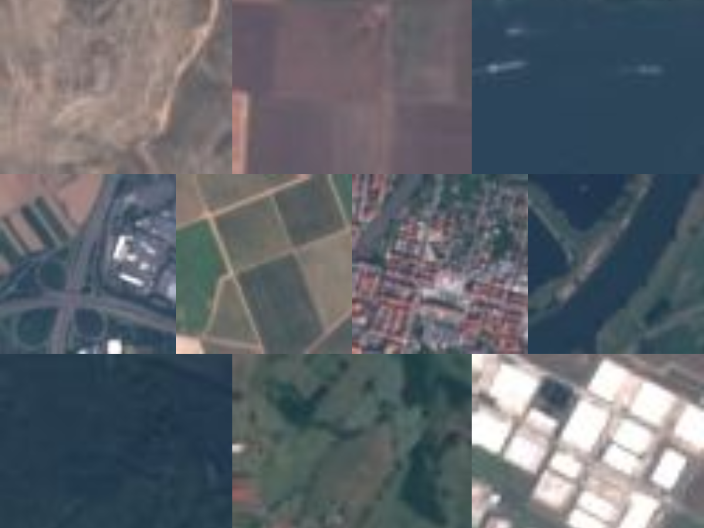

# Image Classification in Azure with Model Builder

| ML.NET version | Status                        | App Type    | Data type | Scenario            | ML Task                   | Algorithms                  |
|----------------|-------------------------------|-------------|-----------|---------------------|---------------------------|-----------------------------|
| v1.6           | Up-to-date | Console & ASP.NET Core WebAPI | Single data sample | Image Classification | Image Classification | ResNet50 |

## Goal

Train a deep learning image classification model in Azure. The model classifies land use by analyzing satellite images.

## Application

- **LandUse**: A C# class library to initialize Model Builder and train the model.
- **LandUseML_Console**: A C# .NET Core console application that provides a console application to make predictions on an image file.
- **LandUseML_WebApi**: A C# .NET Standard application that defines a POST method to allow a web call to make a prediction.  

Both the Console and Web API projects have the following assets:

- LandUse.consumption.cs: A C# file that allows predictions to be made.
- LandUse.training.cs: A C# file that shows how the training process was done to create the ML.NET model file.
- LandUse.map.json: A list of categories used when making predictions to map the model output to a text category.
- MLModel.zip: A serialized version of the ML.NET prediction pipeline that uses the serialized version of the model LandUse.onnx to make predictions and maps outputs using the LandUse.map.json file.

## The data

The dataset used in this sample is a subset of the RGB [EuroSAT dataset](https://github.com/phelber/EuroSAT). The original dataset is from:

- Eurosat: A novel dataset and deep learning benchmark for land use and land cover classification. Patrick Helber, Benjamin Bischke, Andreas Dengel, Damian Borth. IEEE Journal of Selected Topics in Applied Earth Observations and Remote Sensing, 2019.
- Introducing EuroSAT: A Novel Dataset and Deep Learning Benchmark for Land Use and Land Cover Classification. Patrick Helber, Benjamin Bischke, Andreas Dengel. 2018 IEEE International Geoscience and Remote Sensing Symposium, 2018.

The subset of the dataset contains 10 different image categories. Each category has 2000 images. The categories are the following:

- Annual Crop
- Forest
- Herbaceous Vegetation
- Highway
- Industrial
- Pasture
- Permanent Crop
- Residential
- River
- SeaLake

The original RGB version of the dataset which contains 27,000 images is also available for [download](http://madm.dfki.de/files/sentinel/EuroSAT.zip).

## The model

The goal of the application is to categorize what a plot of land is used for using satellite images. The Machine Learning task to use in this scenario is image classification. The model in this application was trained using Model Builder.

[Model Builder](https://docs.microsoft.com/dotnet/machine-learning/how-to-guides/install-model-builder) is an intuitive graphical Visual Studio extension to build, train, and deploy custom machine learning models.

Model Builder uses automated machine learning (AutoML) to explore different machine learning algorithms and settings to help you find the one that best suits your scenario.

You don't need machine learning expertise to use Model Builder. All you need is some data, and a problem to solve. Model Builder generates the code to add the model to your .NET application.

In this solution, both the `LandUseML.ConsoleApp` and `LandUseML.Model` projects are autogenerated by Model Builder.
