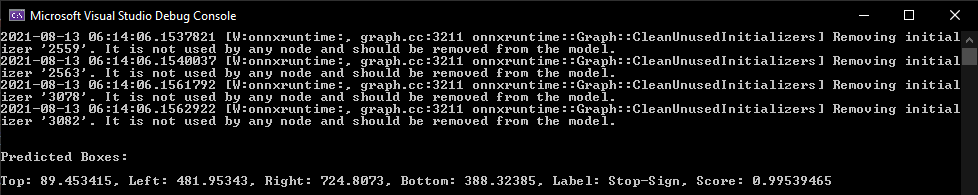

# Stop Sign Object Detection

| ML.NET version | Status                        | App Type    | Data type | Scenario            | ML Task                   | Algorithms                  |
|----------------|-------------------------------|-------------|-----------|---------------------|---------------------------|-----------------------------|
| v1.6         | Up-to-date | Console App | Images | Stop sign detection | Object Detection | Azure AutoML Algorithm |

For a detailed explanation of how to build this application, see the accompanying [tutorial](https://docs.microsoft.com/en-us/dotnet/machine-learning/tutorials/object-detection-model-builder) on the Microsoft Docs site.

## Goal

Create a C# .NET Core Console application that uses an object detection machine learning model trained using Model Builder to determine if there is a stop sign within the image and give its bounding boxes.

## Application

- StopSignDetection:  A C# .NET Core Console application that uses an ML.NET model to find stop signs in images and, if any are found, returns their bounding boxes to where they are located in the image.
- StopSignDetectionML.ConsoleApp: A .NET Core Console application that contains the model training and test prediction code.

## The data

The Stop Sign dataset consists of 50 images downloaded from Unsplash, each of which contain at least one stop sign.

You can download the dataset [here](https://aka.ms/mlnet-object-detection-tutorial-assets). The download includes of the raw image data files.

## The model

The goal of the application is to predict whether an image includes a stop sign and, if any are found, gives their bounding boxes to where the stop sign is located in the image. The Machine Learning Task to use in this scenario is multiclass classification. The model in this application was trained using Model Builder.

[Model Builder](https://docs.microsoft.com/en-us/dotnet/machine-learning/how-to-guides/install-model-builder) is an intuitive graphical Visual Studio extension to build, train, and deploy custom machine learning models.

Model Builder Azure Machine Learning to train the object detection model.

You don't need machine learning expertise to use Model Builder. All you need is some data, and a problem to solve. Model Builder generates the code to add the model to your .NET application.

In this solution, both the `StopSignDetectionML.ConsoleApp` and `StopSignDetection` projects are autogenerated by Model Builder.
